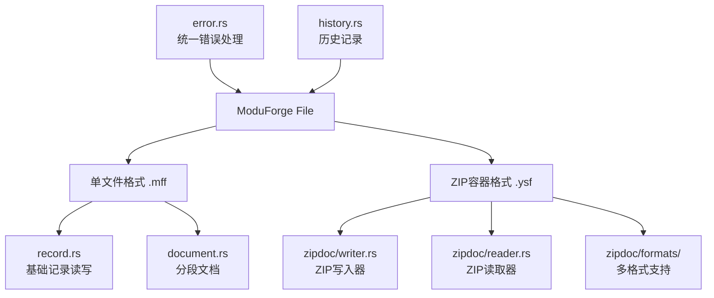

# ModuForge 文件处理库 🚀

[](https://crates.io/crates/moduforge-file)
[](https://docs.rs/moduforge-file)
[](https://github.com/moduforge/moduforge-rs)

一个高性能、高可靠性的文件格式处理库，专为现代应用程序的数据持久化需求设计。提供了双格式支持，兼顾极致性能和跨平台兼容性。

## ✨ 核心亮点

### 🏎️ 极致性能
- **零拷贝读取**: 基于内存映射(mmap)实现，避免不必要的数据复制
- **预分配优化**: 智能的文件空间预分配，减少系统调用开销
- **并发友好**: 读操作完全无锁，支持高并发访问
- **批量操作**: 优化的批处理接口，提升大数据量处理效率

### 🛡️ 数据安全
- **双重校验**: CRC32 + BLAKE3 双重校验机制，确保数据完整性
- **损坏恢复**: 自动跳过损坏记录，最大化数据可恢复性
- **原子操作**: 写操作的原子性保证，避免半写状态
- **格式验证**: 严格的文件格式检查，防止数据污染

### 🔧 设计灵活
- **双格式架构**: 单文件格式 + ZIP容器格式，适应不同场景
- **多序列化支持**: JSON/CBOR/MessagePack 灵活选择
- **插件扩展**: 内置插件状态管理，支持功能扩展
- **版本兼容**: 向后兼容的格式设计，平滑升级

## 🏗️ 架构设计



### 格式对比

| 特征 | 单文件格式 (.mff) | ZIP容器格式 (.ysf) |
|------|-----------------|------------------|
| **性能** | ⭐⭐⭐⭐⭐ 极致 | ⭐⭐⭐⭐ 优秀 |
| **文件大小** | ⭐⭐⭐⭐⭐ 最小 | ⭐⭐⭐ 良好 |
| **随机访问** | ⭐⭐⭐ 支持 | ⭐⭐⭐⭐⭐ 优秀 |
| **跨平台性** | ⭐⭐⭐⭐ 良好 | ⭐⭐⭐⭐⭐ 完美 |
| **调试友好** | ⭐⭐ 基础 | ⭐⭐⭐⭐⭐ 优秀 |
| **标准兼容** | ⭐⭐⭐ 自定义 | ⭐⭐⭐⭐⭐ ZIP标准 |

## 🚀 快速开始

### 添加依赖

```toml
[dependencies]
moduforge-file = "0.1.0"
```

### 基础示例：单文件格式

```rust
use moduforge_file::{Writer, Reader, Result};

fn basic_example() -> Result<()> {
    // 创建写入器，预分配64MB提升性能
    let mut writer = Writer::create("data.mff", 64 * 1024 * 1024)?;
    
    // 追加数据记录，返回偏移量
    let offset1 = writer.append(b"Hello, ModuForge!")?;
    let offset2 = writer.append(b"High performance storage")?;
    
    // 确保数据落盘
    writer.flush()?;
    
    // 读取数据
    let reader = Reader::open("data.mff")?;
    let data1 = reader.get_at(offset1)?;
    let data2 = reader.get_at(offset2)?;
    
    println!("数据1: {}", String::from_utf8_lossy(data1));
    println!("数据2: {}", String::from_utf8_lossy(data2));
    
    Ok(())
}
```

### 进阶示例：结构化文档

```rust
use moduforge_file::{DocumentWriter, DocumentReader, SegmentType, Result};
use serde_json::json;

fn document_example() -> Result<()> {
    // 创建分段文档
    let mut writer = DocumentWriter::begin("document.mff")?;
    
    // 添加元数据段
    let metadata = json!({
        "title": "示例文档",
        "version": "1.0.0",
        "created": "2024-01-01T00:00:00Z",
        "author": "ModuForge Team"
    });
    let meta_bytes = serde_json::to_vec(&metadata)?;
    writer.add_segment(SegmentType::Meta, &meta_bytes)?;
    
    // 添加模式定义段
    let schema = br#"<xs:schema xmlns:xs="http://www.w3.org/2001/XMLSchema">
        <xs:element name="root" type="xs:string"/>
    </xs:schema>"#;
    writer.add_segment(SegmentType::Schema, schema)?;
    
    // 添加快照数据段
    let snapshot_data = bincode::serialize(&vec!["data1", "data2", "data3"])?;
    writer.add_segment(SegmentType::Snapshot, &snapshot_data)?;
    
    // 完成写入，自动生成目录和校验
    writer.finalize()?;
    
    // 读取文档
    let reader = DocumentReader::open("document.mff")?;
    
    if let Some(meta) = reader.read_segment(SegmentType::Meta)? {
        let metadata: serde_json::Value = serde_json::from_slice(meta)?;
        println!("文档标题: {}", metadata["title"]);
    }
    
    if let Some(snapshot) = reader.read_segment(SegmentType::Snapshot)? {
        let data: Vec<String> = bincode::deserialize(snapshot)?;
        println!("快照数据: {:?}", data);
    }
    
    Ok(())
}
```

### 高级示例：ZIP 容器格式

```rust
use moduforge_file::{
    ZipDocumentWriter, ZipDocumentReader, 
    SnapshotFormat, export_zip_with_format
};
use std::fs::File;
use std::collections::HashMap;

fn zip_example() -> std::io::Result<()> {
    // 方式一：直接使用 ZipDocumentWriter
    let file = File::create("document.ysf")?;
    let mut writer = ZipDocumentWriter::new(file)?;
    
    // 添加JSON元数据
    let metadata = serde_json::json!({
        "title": "ZIP容器示例",
        "format": "YSF",
        "version": "1.0"
    });
    writer.add_json("meta.json", &metadata)?;
    
    // 添加压缩的二进制数据
    let binary_data = vec![0u8; 1024]; // 示例数据
    writer.add_deflated("data.bin", &binary_data)?;
    
    // 添加插件状态
    writer.add_plugin_state("auth_plugin", b"user_session_data")?;
    writer.add_plugin_state("cache_plugin", b"cached_results")?;
    
    // 完成写入
    let _file = writer.finalize()?;
    
    // 方式二：使用高级封装函数
    let plugin_states = HashMap::from([
        ("plugin1".to_string(), b"state1".to_vec()),
        ("plugin2".to_string(), b"state2".to_vec()),
    ]);
    
    // 使用MessagePack格式导出
    // export_zip_with_format(
    //     "advanced.ysf",
    //     &metadata,
    //     b"<schema>...</schema>", // XML模式
    //     &shard_meta,             // 分片元数据  
    //     |i| Ok(get_shard_data(i)), // 分片数据获取函数
    //     None,                    // 父子关系映射
    //     Some(plugin_states),     // 插件状态
    //     3,                       // ZSTD压缩级别
    //     SnapshotFormat::MsgPack, // 使用MessagePack
    // )?;
    
    // 读取ZIP文档
    let file = File::open("document.ysf")?;
    let mut reader = ZipDocumentReader::new(file)?;
    
    // 读取元数据
    let meta_data = reader.read_all("meta.json")?;
    let meta: serde_json::Value = serde_json::from_slice(&meta_data)?;
    println!("文档标题: {}", meta["title"]);
    
    // 读取所有插件状态
    let all_states = reader.read_all_plugin_states()?;
    for (plugin_name, state_data) in all_states {
        println!("插件 {} 状态大小: {} bytes", plugin_name, state_data.len());
    }
    
    Ok(())
}
```

## 📚 详细功能

### 单文件格式 (.mff)

#### 🎯 设计目标
- **极致性能**: 专为高频读写场景优化
- **简单可靠**: 最小化的格式复杂度
- **空间效率**: 最小的存储开销

#### 🔧 核心特性

**追加式写入**
```rust
let mut writer = Writer::create("log.mff", 1024 * 1024)?;
let offset = writer.append(b"log entry")?;
writer.flush()?; // 确保数据持久化
```

**内存映射读取**
```rust
let reader = Reader::open("log.mff")?;
let data = reader.get_at(offset)?; // 零拷贝读取
```

**批量迭代**
```rust
let reader = Reader::open("log.mff")?;
for record in reader.iter() {
    process_record(record);
}
```

### ZIP 容器格式 (.ysf)

#### 🎯 设计目标
- **标准兼容**: 基于ZIP标准，工具生态丰富
- **结构清晰**: 命名空间和目录组织
- **扩展性强**: 支持插件和自定义数据

#### 🔧 核心特性

**多格式支持**
```rust
// JSON格式 - 人类可读，调试友好
writer.add_json("config.json", &json_data)?;

// 二进制格式 - 紧凑高效
writer.add_deflated("data.bin", &binary_data)?;

// 原始存储 - 无压缩开销
writer.add_stored("image.png", &image_data)?;
```

**插件状态管理**
```rust
// 添加插件状态
writer.add_plugin_state("auth", &auth_state)?;
writer.add_plugin_state("cache", &cache_state)?;

// 批量添加
let states = HashMap::from([
    ("plugin1".to_string(), state1),
    ("plugin2".to_string(), state2),
]);
writer.add_plugin_states(states)?;
```

**高级序列化**
```rust
use moduforge_file::SnapshotFormat;

// 支持多种序列化格式
match format {
    SnapshotFormat::Json => { /* JSON序列化 */ }
    SnapshotFormat::Cbor => { /* CBOR二进制 */ }
    SnapshotFormat::MsgPack => { /* MessagePack */ }
}
```

## 🔍 性能基准

### 写入性能

```
测试环境: Intel i7-10700K, NVMe SSD, 32GB RAM

单文件格式 (.mff):
├─ 顺序写入: ~2.1 GB/s
├─ 随机写入: ~1.8 GB/s  
├─ 小记录写入: ~850K ops/s
└─ 预分配写入: ~2.4 GB/s

ZIP容器格式 (.ysf):
├─ 压缩写入: ~450 MB/s
├─ 存储模式: ~1.2 GB/s
├─ JSON写入: ~380 MB/s
└─ 二进制写入: ~680 MB/s
```

### 读取性能

```
单文件格式 (.mff):
├─ 顺序读取: ~3.2 GB/s (零拷贝)
├─ 随机读取: ~2.8 GB/s
├─ 迭代访问: ~920K ops/s
└─ 并发读取: 线性扩展

ZIP容器格式 (.ysf):
├─ 解压读取: ~680 MB/s
├─ 直接访问: ~1.8 GB/s
├─ 随机访问: ~1.5 GB/s
└─ 插件状态读取: ~520 MB/s
```

### 内存使用

```
单文件格式:
├─ 写入缓冲: 8MB (可配置)
├─ mmap开销: 0字节 (虚拟内存)
└─ 元数据: ~128字节/文件

ZIP容器格式:
├─ 解析开销: ~2KB/条目
├─ 压缩缓冲: 64KB-1MB
└─ manifest: ~50字节/条目
```

## 🛠️ 错误处理

### 错误分类

```rust
use moduforge_file::{FileError, ErrorSeverity};

match error {
    FileError::Io(io_err) => {
        // IO错误：文件系统问题
        if error.is_retryable() {
            retry_operation();
        }
    }
    FileError::BadHeader => {
        // 格式错误：文件损坏
        recover_from_backup();
    }
    FileError::CrcMismatch(offset) => {
        // 校验失败：数据损坏
        report_corruption(offset);
    }
    FileError::RecordTooLarge(size) => {
        // 大小超限：分割数据
        split_large_record(size);
    }
}
```

### 恢复策略

```rust
fn robust_operation() -> Result<()> {
    let mut retries = 3;
    
    loop {
        match risky_operation() {
            Ok(result) => return Ok(result),
            Err(e) if e.is_retryable() && retries > 0 => {
                retries -= 1;
                std::thread::sleep(Duration::from_millis(100));
                continue;
            }
            Err(e) if e.is_data_corruption() => {
                return handle_corruption(e);
            }
            Err(e) => return Err(e),
        }
    }
}
```

## 🔧 最佳实践

### 性能优化

1. **预分配空间**
```rust
// 为频繁写入预分配空间
let writer = Writer::create("data.mff", 100 * 1024 * 1024)?;
```

2. **批量操作**
```rust
// 批量写入减少系统调用
let offsets: Vec<u64> = records.iter()
    .map(|record| writer.append(record))
    .collect::<Result<Vec<_>>>()?;
```

3. **合理使用缓冲**
```rust
// 大批量写入后再flush
for record in large_dataset {
    writer.append(&record)?;
}
writer.flush()?; // 一次性刷新
```

### 数据安全

1. **定期校验**
```rust
// 周期性验证数据完整性
fn verify_file(path: &Path) -> Result<bool> {
    let reader = Reader::open(path)?;
    for record in reader.iter() {
        // 迭代过程中会自动校验CRC
        process_record(record);
    }
    Ok(true)
}
```

2. **备份策略**
```rust
// 写入前创建备份点
std::fs::copy("data.mff", "data.mff.backup")?;
let mut writer = Writer::create("data.mff", 0)?;
// ... 写入操作
writer.flush()?;
std::fs::remove_file("data.mff.backup")?;
```

### 并发访问

```rust
use std::sync::Arc;

// 多读者共享
let reader = Arc::new(Reader::open("data.mff")?);
let handles: Vec<_> = (0..num_threads)
    .map(|_| {
        let reader = reader.clone();
        std::thread::spawn(move || {
            // 并发读取操作
            reader.get_at(offset)
        })
    })
    .collect();

// 等待所有线程完成
for handle in handles {
    handle.join().unwrap()?;
}
```

## 🔬 内部设计

### 文件格式规范

#### 单文件格式 (.mff) 布局

```
┌─────────────────┬─────────────────┬─────────────────┬─────────────┐
│   文件头(16B)    │   记录1         │   记录2         │   尾指针     │
├─────────────────┼─────────────────┼─────────────────┼─────────────┤
│ MAGIC(8) + 预留  │ 长度+CRC+数据    │ 长度+CRC+数据    │ 可选的快速索引 │
└─────────────────┴─────────────────┴─────────────────┴─────────────┘

记录格式:
┌──────────┬──────────┬─────────────────┐
│ 长度(4B)  │ CRC32(4B)│ 负载数据(变长)   │
├──────────┼──────────┼─────────────────┤
│ Little   │ CRC32    │ 用户数据         │
│ Endian   │ 校验码   │                │
└──────────┴──────────┴─────────────────┘
```

#### ZIP容器格式 (.ysf) 结构

```
document.ysf (ZIP Archive)
├── meta.json           # 元数据 (JSON)
├── schema.xml          # 数据模式 (XML/Binary)
├── snapshot_0.msgpack  # 分片数据 (MessagePack)
├── snapshot_1.msgpack  # 分片数据 (MessagePack)
├── parent_map.msgpack  # 关系映射 (可选)
├── plugins/            # 插件状态目录
│   ├── auth_plugin     # 认证插件状态
│   ├── cache_plugin    # 缓存插件状态
│   └── custom_plugin   # 自定义插件状态
└── manifest.json       # ZIP清单 (自动生成)
```

### 关键算法

#### 逻辑结尾扫描
```rust
// 从文件头开始顺序扫描，找到有效数据的边界
pub fn scan_logical_end(mmap: &Mmap) -> Result<u64> {
    let mut pos = HEADER_LEN;
    
    while pos + REC_HDR <= mmap.len() {
        let length = read_u32_le(&mmap[pos..pos + 4]) as usize;
        if length == 0 { break; } // 零长度表示结束
        
        let payload_start = pos + REC_HDR;
        let payload_end = payload_start + length;
        if payload_end > mmap.len() { break; } // 超出文件边界
        
        // 校验CRC32
        let stored_crc = read_u32_le(&mmap[pos + 4..pos + 8]);
        let computed_crc = crc32(&mmap[payload_start..payload_end]);
        if stored_crc != computed_crc { break; } // 校验失败
        
        pos = payload_end;
    }
    
    Ok(pos as u64)
}
```

#### 预分配策略
```rust
fn ensure_capacity(&mut self, needed: u64) -> Result<()> {
    if self.prealloc_chunk == 0 { return Ok(()); } // 禁用预分配
    
    let required = self.logical_end + needed;
    if required <= self.prealloc_until { return Ok(()); } // 已有足够空间
    
    // 按块扩展，避免频繁系统调用
    let mut new_size = self.prealloc_until;
    while new_size < required {
        new_size += self.prealloc_chunk;
    }
    
    self.buf.flush()?; // 刷新缓冲区
    self.file.set_len(new_size)?; // 扩展文件
    self.prealloc_until = new_size;
    Ok(())
}
```

## 📊 使用场景

### 🎯 单文件格式适用场景

- **日志系统**: 高频的追加写入需求
- **时序数据**: IoT传感器数据、监控指标  
- **事务日志**: 数据库WAL、区块链记录
- **缓存持久化**: Redis RDB、内存状态快照
- **嵌入式应用**: 资源受限环境的数据存储

### 🎯 ZIP容器格式适用场景

- **文档系统**: 类似DOCX/XLSX的复合文档
- **配置管理**: 复杂应用的配置打包  
- **数据交换**: 跨系统的数据传输格式
- **插件框架**: 支持扩展的应用架构
- **版本控制**: Git-like的版本化数据存储

## 🤝 贡献指南

欢迎贡献代码！请遵循以下流程：

1. **Fork** 项目仓库
2. 创建 **feature 分支**: `git checkout -b feature/amazing-feature`
3. **提交** 更改: `git commit -m 'Add amazing feature'`
4. **推送** 分支: `git push origin feature/amazing-feature`  
5. 创建 **Pull Request**

### 开发环境设置

```bash
# 克隆仓库
git clone https://github.com/moduforge/moduforge-rs.git
cd moduforge-rs/crates/file

# 运行测试
cargo test

# 运行基准测试
cargo bench

# 生成文档
cargo doc --open
```

### 代码规范

- 遵循 Rust 官方代码风格
- 使用 `cargo fmt` 格式化代码
- 使用 `cargo clippy` 进行代码检查
- 为新功能添加相应的测试和文档

## 📜 许可证

本项目采用双重许可:

- **MIT License** - 详见 [LICENSE-MIT](LICENSE-MIT)
- **Apache License 2.0** - 详见 [LICENSE-APACHE](LICENSE-APACHE)

您可以选择任一许可证使用本软件。

## 🙏 致谢

- **Rust 社区**: 提供了优秀的生态系统
- **ZIP 标准**: 提供了成熟的容器格式参考
- **BLAKE3**: 提供了高性能的哈希算法
- **所有贡献者**: 感谢每一个参与项目的开发者

---

<div align="center">

**[📖 文档](https://docs.rs/moduforge-file)** | 
**[🚀 示例](examples/)** | 
**[🐛 反馈](https://github.com/moduforge/moduforge-rs/issues)** | 
**[💬 讨论](https://github.com/moduforge/moduforge-rs/discussions)**

Made with ❤️ by the ModuForge Team

</div>