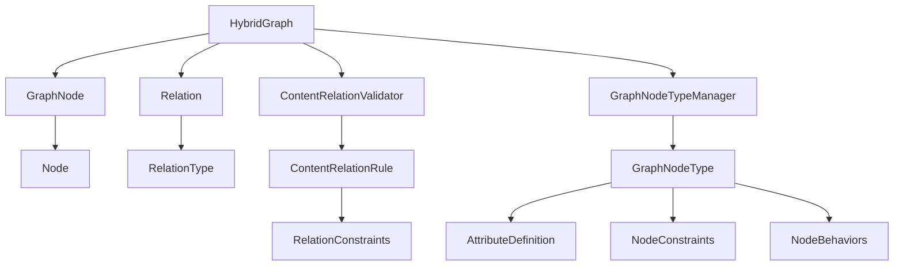

# ModuForge-RS 图结构模型设计

## 概述

本文档描述了 ModuForge-RS 框架中新的图结构模型设计，该设计结合了 Petgraph 和 Im 的优势，支持更复杂的节点关系和内容验证。

## 设计目标

### 1. 扩展关系类型
- 从单一的父子关系扩展到多种关系类型
- 支持引用、依赖、关联、包含、继承等复杂关系
- 支持循环引用和自引用（在受控条件下）

### 2. 增强内容验证
- 基于规则的内容关系验证
- 支持属性约束、数量约束、条件约束
- 支持循环检测和深度限制

### 3. 提升性能
- 使用 Petgraph 的高效图算法
- 使用 Im 的不可变数据结构
- 支持分片存储和缓存优化

### 4. 保持兼容性
- 向后兼容现有的树形结构
- 支持渐进式迁移
- 保持现有的 API 接口

## 核心组件

### 1. 混合图结构 (HybridGraph)

```rust
pub struct HybridGraph {
    /// Petgraph 图结构，用于算法和遍历
    graph: StableDiGraph<GraphNode, Relation>,
    /// Im 映射，用于快速查找和不可变操作
    node_map: ImHashMap<NodeId, NodeIndex>,
    /// 关系索引，按类型分组
    relation_index: ImHashMap<RelationType, ImVector<EdgeIndex>>,
    /// 根节点ID
    root_id: Option<NodeId>,
    /// 图元数据
    metadata: ImHashMap<String, serde_json::Value>,
}
```

**优势：**
- Petgraph 提供高效的图算法（拓扑排序、最短路径、循环检测等）
- Im 提供不可变数据结构和快速查找
- 双重索引支持按关系类型快速查询

### 2. 关系类型系统 (RelationType)

```rust
pub enum RelationType {
    /// 父子关系（树形结构）
    ParentChild,
    /// 引用关系（节点引用）
    Reference,
    /// 依赖关系（依赖其他节点）
    Dependency,
    /// 关联关系（一般关联）
    Association,
    /// 包含关系（包含其他节点）
    Contains,
    /// 继承关系（继承自其他节点）
    Inherits,
    /// 实现关系（实现接口）
    Implements,
    /// 组合关系（组合其他节点）
    Composition,
    /// 聚合关系（聚合其他节点）
    Aggregation,
    /// 自定义关系
    Custom(String),
}
```

**特点：**
- 支持多种语义关系
- 可扩展的自定义关系
- 支持有向和无向关系

### 3. 内容关系验证器 (ContentRelationValidator)

```rust
pub struct ContentRelationValidator {
    /// 关系规则集合
    rules: ImHashMap<String, ContentRelationRule>,
    /// 规则索引（按源类型分组）
    source_index: ImHashMap<String, ImVector<String>>,
    /// 规则索引（按目标类型分组）
    target_index: ImHashMap<String, ImVector<String>>,
}
```

**功能：**
- 基于规则的关系验证
- 支持属性约束、数量约束、条件约束
- 高效的规则索引和查询

### 4. 图节点类型系统 (GraphNodeType)

```rust
pub struct GraphNodeType {
    /// 节点类型名称
    pub name: String,
    /// 节点属性定义
    pub attributes: ImHashMap<String, AttributeDefinition>,
    /// 内容关系规则
    pub content_rules: ImVector<ContentRelationRule>,
    /// 节点约束
    pub constraints: NodeConstraints,
    /// 节点行为定义
    pub behaviors: NodeBehaviors,
}
```

**特点：**
- 完整的属性定义系统
- 灵活的内容关系规则
- 丰富的节点约束和行为定义

## 架构设计

### 1. 分层架构

```
┌─────────────────────────────────────┐
│           应用层 (Application)       │
├─────────────────────────────────────┤
│           业务层 (Business)          │
├─────────────────────────────────────┤
│           服务层 (Service)           │
├─────────────────────────────────────┤
│           模型层 (Model)             │
│  ┌─────────────┬─────────────────┐  │
│  │   HybridGraph                │  │
│  │   (图结构)                   │  │
│  └─────────────┴─────────────────┘  │
│  ┌─────────────┬─────────────────┐  │
│  │ ContentRelationValidator      │  │
│  │ (关系验证)                    │  │
│  └─────────────┴─────────────────┘  │
│  ┌─────────────┬─────────────────┐  │
│  │ GraphNodeTypeManager          │  │
│  │ (类型管理)                    │  │
│  └─────────────┴─────────────────┘  │
└─────────────────────────────────────┘
```

### 2. 组件关系



## 使用示例

### 1. 基本使用

```rust
use mf_model::{
    graph::{HybridGraph, Relation, RelationType},
    content_relation::{ContentRelationManager, ContentRelationRule},
    node_type_graph::{GraphNodeType, GraphNodeTypeManager},
};

// 创建图
let mut graph = HybridGraph::new();

// 创建节点类型
let document_type = GraphNodeType::new("document".to_string())
    .with_description("文档根节点".to_string());

// 创建节点
let document_node = document_type.create_node(
    Some("doc_1".to_string()),
    None,
    ImVector::new(),
)?;

// 添加节点到图
graph.add_node(document_node)?;

// 添加关系
let relation = Relation::new(RelationType::ParentChild);
graph.add_relation(&"doc_1".into(), &"para_1".into(), relation)?;
```

### 2. 关系验证

```rust
// 创建关系管理器
let mut relation_manager = ContentRelationManager::new();

// 定义关系规则
let rule = ContentRelationRule {
    name: "document_paragraph_rule".to_string(),
    source_type: "document".to_string(),
    target_type: "paragraph".to_string(),
    relation_type: RelationType::ParentChild,
    constraints: RelationConstraints::new()
        .with_count(Some(1), None),
    priority: 1,
    enabled: true,
};

// 添加规则
relation_manager.add_rule(rule)?;

// 验证关系
let validation_result = relation_manager.validate_relation(
    &source_node,
    &target_node,
    &relation,
)?;
```

### 3. 图算法

```rust
// 检查循环
let has_cycles = graph.has_cycles();

// 拓扑排序
let sorted_nodes = graph.topological_sort()?;

// 最短路径
let path = graph.shortest_path(&source_id, &target_id);

// 获取所有后代
let descendants = graph.get_descendants(&node_id);
```

## 性能优化

### 1. 分片存储
- 使用分片技术减少内存碎片
- 支持并行访问和更新
- 优化大规模图的性能

### 2. 缓存策略
- LRU 缓存用于频繁访问的节点
- 关系索引缓存
- 验证结果缓存

### 3. 算法优化
- 使用 Petgraph 的高效算法
- 批量操作优化
- 惰性求值

## 迁移策略

### 1. 渐进式迁移
- 保持现有 Tree 结构
- 逐步引入 HybridGraph
- 提供兼容性适配器

### 2. 数据转换
```rust
// 从 Tree 转换到 HybridGraph
impl From<Tree> for HybridGraph {
    fn from(tree: Tree) -> Self {
        let mut graph = HybridGraph::new();
        
        // 添加所有节点
        for (node_id, node) in tree.nodes.iter() {
            graph.add_node(node.clone())?;
        }
        
        // 添加父子关系
        for (child_id, parent_id) in tree.parent_map.iter() {
            let relation = Relation::new(RelationType::ParentChild);
            graph.add_relation(parent_id, child_id, relation)?;
        }
        
        graph
    }
}
```

### 3. API 兼容性
- 保持现有 API 接口
- 提供新的扩展接口
- 支持混合使用

## 扩展性设计

### 1. 插件系统
- 支持自定义关系类型
- 支持自定义验证规则
- 支持自定义图算法

### 2. 序列化支持
- 完整的序列化/反序列化
- 支持版本兼容性
- 支持增量更新

### 3. 事件系统
- 节点变更事件
- 关系变更事件
- 验证事件

## 测试策略

### 1. 单元测试
- 每个组件的独立测试
- 边界条件测试
- 错误处理测试

### 2. 集成测试
- 组件间交互测试
- 端到端工作流测试
- 性能测试

### 3. 兼容性测试
- 与现有系统的兼容性
- 数据迁移测试
- API 兼容性测试

## 未来规划

### 1. 短期目标
- 完善图算法支持
- 优化性能
- 增强验证规则

### 2. 中期目标
- 支持分布式图
- 支持图数据库集成
- 支持可视化工具

### 3. 长期目标
- 支持机器学习集成
- 支持实时协作
- 支持大规模图处理

## 总结

新的图结构模型设计为 ModuForge-RS 提供了：

1. **更强的表达能力**：支持多种关系类型和复杂约束
2. **更好的性能**：结合 Petgraph 和 Im 的优势
3. **更高的扩展性**：支持插件和自定义扩展
4. **更好的兼容性**：保持与现有系统的兼容性

这个设计为框架的未来发展奠定了坚实的基础，支持更复杂的应用场景和更高的性能要求。