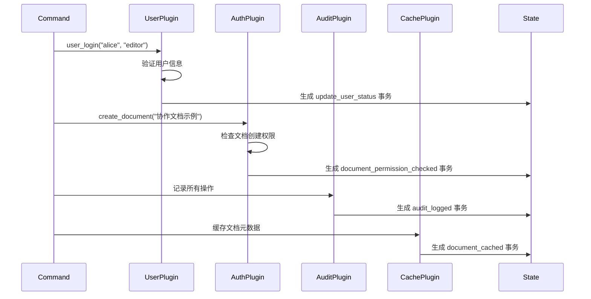
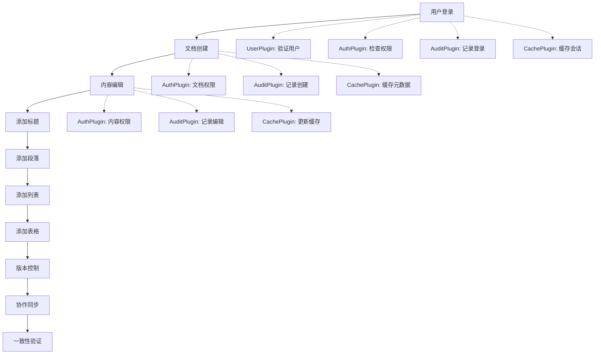

# ModuForge-RS 完整演示案例

🚀 **ModuForge-RS** 是一个基于 Rust 的现代化文档编辑框架，具有强大的插件系统、中间件支持和事务化状态管理。

## 🎯 演示概览

本演示展示了 ModuForge-RS 的核心功能：
- **🏗️ 完整节点系统**: 11种节点类型支持丰富的文档结构
- **🔌 多插件协作**: 4个插件按优先级协同工作
- **🛡️ 中间件管道**: 验证 → 日志 → 性能监控
- **💾 事务化状态管理**: 完全异步的状态管理和持久化
- **🔄 实时协作**: 版本控制、文档同步、冲突解决

## 📋 系统架构

### 核心组件

```
┌─────────────────────────────────────────────────────────────┐
│                    AsyncEditor                              │
│  ┌─────────────────┐  ┌─────────────────┐  ┌──────────────┐ │
│  │  节点系统        │  │   插件系统      │  │  中间件管道   │ │
│  │                 │  │                 │  │              │ │
│  │ • document      │  │ • UserPlugin    │  │ • Validation │ │
│  │ • paragraph     │  │ • AuthPlugin    │  │ • Logging    │ │
│  │ • heading       │  │ • AuditPlugin   │  │ • Metrics    │ │
│  │ • list/listitem │  │ • CachePlugin   │  │              │ │
│  │ • table/...     │  │                 │  │              │ │
│  │ • codeblock     │  │                 │  │              │ │
│  │ • blockquote    │  │                 │  │              │ │
│  │ • horizontalrule│  │                 │  │              │ │
│  └─────────────────┘  └─────────────────┘  └──────────────┘ │
└─────────────────────────────────────────────────────────────┘
                              │
                              ▼
                    ┌─────────────────┐
                    │   状态管理层     │
                    │                 │
                    │ • UserState     │
                    │ • AuthState     │
                    │ • AuditState    │
                    │ • CacheState    │
                    └─────────────────┘
```

## 🏗️ 节点系统详解

### 基础节点类型
- **text**: 叶子节点，纯文本内容
- **inline**: 内联节点，可包含文本
- **block**: 块级节点，可包含其他内容

### 文档结构节点
```rust
// 文档根节点 - 顶级容器
document {
    title: "新文档",
    description: "",
    created_at: "2024-01-01T00:00:00Z",
    author: ""
}

// 段落节点 - 文本内容容器
paragraph {
    align: "left",        // left, center, right, justify
    indent: 0,            // 缩进级别
    line_height: 1.5      // 行高
}

// 标题节点 - 1-6级标题
heading {
    level: 1,             // 1-6
    id: "",               // 锚点ID
    anchor: true          // 是否生成锚点
}
```

### 列表系统
```rust
// 列表容器
list {
    list_type: "bullet",  // bullet, ordered, todo
    tight: false,         // 紧凑模式
    start: 1              // 起始编号
}

// 列表项
listitem {
    checked: null         // null(普通), true(已选), false(未选)
}
```

### 表格系统
```rust
// 表格容器
table {
    rows: 1,
    cols: 1,
    has_header: true,
    border: true
}

// 表格行
tablerow {
    // 包含多个 tablecell
}

// 表格单元格
tablecell {
    colspan: 1,           // 列跨度
    rowspan: 1,           // 行跨度
    align: "left",        // 对齐方式
    is_header: false      // 是否为表头
}
```

### 特殊内容节点
```rust
// 代码块
codeblock {
    language: "",         // 编程语言
    line_numbers: false,  // 显示行号
    wrap: false           // 自动换行
}

// 引用块
blockquote {
    // 包含段落内容
}

// 水平分割线
horizontalrule {
    // 无属性，纯分割线
}
```

## 🔌 插件系统详解

### 插件优先级和功能

| 插件名称 | 优先级 | 主要功能 | 处理的命令 |
|---------|--------|----------|-----------|
| **UserPlugin** | 10 (最高) | 用户管理、会话控制 | `user_login`, `create_document` |
| **AuthPlugin** | 20 | 权限验证、访问控制 | `user_login`, `create_document`, `add_*` |
| **AuditPlugin** | 30 | 操作日志、事件记录 | 所有操作的审计记录 |
| **CachePlugin** | 40 (最低) | 缓存管理、性能优化 | 文档和内容的缓存策略 |

### 插件协作流程



### 插件实现细节

#### UserPlugin - 用户管理插件
```rust
// 处理用户登录
"user_login" => {
    if let Some(username) = tr.get_meta::<String>("username") {
        if let Some(role) = tr.get_meta::<String>("role") {
            println!("🔑 用户管理插件: 处理用户登录 - {} ({})", username, role);
            // 生成用户状态更新事务
            let mut new_tr = Transaction::new(new_state);
            new_tr.set_meta("action", "update_user_status");
            new_tr.set_meta("username", username);
            new_tr.set_meta("role", role);
            return Ok(Some(new_tr));
        }
    }
}
```

#### AuthPlugin - 权限验证插件
```rust
// 检查文档创建权限
"create_document" => {
    if let Some(title) = tr.get_meta::<String>("title") {
        println!("🔒 权限验证插件: 检查文档创建权限 - {}", title);
        // 生成权限验证事务
        let mut new_tr = Transaction::new(new_state);
        new_tr.set_meta("action", "document_permission_checked");
        new_tr.set_meta("document_title", title);
        return Ok(Some(new_tr));
    }
}

// 检查内容编辑权限
"add_heading" | "add_paragraph" | "add_list" | "add_table" => {
    println!("📝 权限验证插件: 检查内容编辑权限 - {}", action);
    // 验证内容编辑权限
    let mut new_tr = Transaction::new(new_state);
    new_tr.set_meta("action", "content_permission_checked");
    new_tr.set_meta("content_type", action);
    return Ok(Some(new_tr));
}
```

## 🛡️ 中间件管道

### 中间件执行顺序
1. **ValidationMiddleware** - 验证事务合法性
2. **LoggingMiddleware** - 记录事务处理过程
3. **MetricsMiddleware** - 监控性能指标

### 验证中间件 (ValidationMiddleware)
```rust
// before_dispatch: 基本验证
if transaction.id == 0 {
    return Err("事务ID无效");
}

// after_dispatch: 详细验证
match action {
    "user_login" => {
        if transaction.get_meta::<String>("username").is_none() {
            return Err("用户登录需要username参数");
        }
    }
    // ... 其他验证逻辑
}
```

### 日志中间件 (LoggingMiddleware)
```rust
// 记录事务开始
println!("🔍 事务处理开始 - ID: {}, 动作: {}", transaction.id, action);

// 记录事务完成
println!("✅ 事务处理完成 - ID: {}, 动作: {}, 耗时: {:?}", 
         transaction.id, action, duration);
```

### 性能监控中间件 (MetricsMiddleware)
```rust
// 监控指标
println!("⚡ 性能报告:");
println!("   - 处理时间: {:?}", duration);
println!("   - 步骤数量: {}", steps_count);
println!("   - 状态版本: {}", state.version);

// 性能警告
if duration.as_millis() > 100 {
    println!("⚠️ 性能警告: 事务处理时间过长");
}
```

## 💾 状态管理系统

### Resource Trait 实现
每个插件都有对应的状态资源：

```rust
// 用户状态
pub struct UserState {
    pub logged_in_users: ImHashMap<String, UserInfo>,
    pub active_sessions: ImHashMap<String, SessionInfo>,
    pub total_users: u64,
}

// 权限状态
pub struct AuthState {
    pub permissions: ImHashMap<String, Vec<String>>,
    pub roles: ImHashMap<String, String>,
    pub last_check_time: SystemTime,
    pub permission_cache: ImHashMap<String, bool>,
}

// 审计状态
pub struct AuditState {
    pub log_entries: Vec<AuditEntry>,
    pub log_count: u64,
    pub last_action: Option<String>,
    pub start_time: SystemTime,
}

// 缓存状态
pub struct CacheState {
    pub cache_entries: ImHashMap<String, CacheEntry>,
    pub cache_hits: u64,
    pub cache_misses: u64,
    pub last_cleanup: SystemTime,
    pub max_entries: usize,
}
```

## 🎬 演示工作流

### 完整的操作流程



### 具体命令执行

1. **用户登录**
   ```rust
   UserLoginCommand::new("alice", "editor")
   // 插件响应:
   // - UserPlugin: 处理用户登录验证
   // - AuthPlugin: 验证用户权限
   // - AuditPlugin: 记录登录事件
   // - CachePlugin: 缓存用户会话
   ```

2. **文档创建**
   ```rust
   CreateDocumentCommand::new("协作文档示例", "展示多插件协作的示例文档")
   // 插件响应:
   // - UserPlugin: 验证文档创建权限
   // - AuthPlugin: 检查文档创建权限并生成权限检查事务
   // - AuditPlugin: 记录文档创建操作
   // - CachePlugin: 缓存文档元数据并生成缓存事务
   ```

3. **内容编辑**
   ```rust
   AddHeadingCommand::new(1, "ModuForge-RS 特性介绍")
   AddParagraphCommand::new("ModuForge-RS 是一个基于 Rust 的现代化文档编辑框架...")
   AddListCommand::new(vec!["🔌 强大的插件系统", "🛡️ 中间件管道", ...])
   AddTableCommand::new(headers, rows)
   // 插件响应:
   // - AuthPlugin: 检查内容编辑权限并生成权限检查事务
   // - AuditPlugin: 详细记录每种内容类型的添加
   // - CachePlugin: 更新内容缓存并生成缓存更新事务
   ```

## 📊 技术特性

### 🔧 核心技术亮点

- **🦀 Rust 2024**: 最新 Rust 版本，内存安全和高性能
- **🔄 异步架构**: 完全异步的编辑器和命令处理
- **📦 不可变数据**: 使用 `im-rs` 提供持久化数据结构
- **🎯 类型安全**: 强类型的状态管理和资源系统
- **🧵 UTF-8 支持**: 安全的字符串处理，支持多语言
- **⚡ 零拷贝**: 高效的内存管理和数据传递

### 🛠️ 依赖技术栈

```toml
[dependencies]
# 异步运行时
tokio = { version = "1.0", features = ["full"] }

# 不可变数据结构
im = "15.1"

# 序列化/反序列化
serde = { version = "1.0", features = ["derive"] }
serde_json = "1.0"

# 错误处理
thiserror = "1.0"
anyhow = "1.0"

# 异步 trait
async-trait = "0.1"

# 时间处理
chrono = { version = "0.4", features = ["serde"] }
```

## 🚀 运行演示

### 环境要求
- Rust 1.75+ (Edition 2024)
- Cargo

### 快速开始
```bash
# 克隆项目
git clone <repository-url>
cd moduforge-rs

# 运行演示
cd demo
cargo run
```

### 预期输出
```
🚀 ModuForge-RS 完整演示
🎯 展示插件机制、资源管理、中间件、多插件协作
============================================================

📋 第1步: 设置完整的文档架构
   🏗️ 创建丰富的节点类型生态系统...
   ✅ 基础节点: text, inline, block
   ✅ 文档节点: document, paragraph, heading
   ✅ 列表节点: list, list_item
   ✅ 表格节点: table, table_row, table_cell
   ✅ 特殊节点: code_block, blockquote, horizontal_rule

🔌 第2步: 创建插件生态系统
   ✅ 用户管理插件 (优先级: 10)
   ✅ 权限验证插件 (优先级: 20)
   ✅ 审计日志插件 (优先级: 30)
   ✅ 缓存管理插件 (优先级: 40)

🛡️ 第3步: 构建中间件管道
   ✅ 验证中间件 -> 日志中间件 -> 性能监控中间件

⚙️ 第4步: 构建编辑器
   🔧 初始化用户状态字段
   🔧 初始化权限状态字段
   🔧 初始化审计状态字段
   🔧 初始化缓存状态字段
   ✅ 编辑器创建成功

🎬 第5步: 多插件协作演示
━━━━━━━━━━━━━━━━━━━━━━━━━━━━━━━━━━━━━━━━━━━━━━━━━━━━━━━━━━━━

👤 用户管理流程:
👤 用户 alice (editor) 正在登录
🔒 [ValidationMiddleware] 开始事务验证
✅ [ValidationMiddleware] 事务验证通过
🔍 [LoggingMiddleware] 事务处理开始 - ID: 1, 动作: user_login
📈 [MetricsMiddleware] 开始性能监控 - 事务 #1, 步骤数: 0
🔑 用户管理插件: 处理用户登录 - alice (editor)
🛡️ 权限验证插件: 验证用户 alice 的登录权限
📝 审计日志插件: 记录用户登录事件 - alice
💾 缓存管理插件: 缓存用户会话 - alice
...

🎉 ModuForge-RS 多插件协作演示完成!
```

## 📈 系统性能

### 性能指标
- **状态版本**: 19 (演示完成后的最终版本)
- **激活插件**: 4 个
- **状态字段**: 4 个字段实例
- **事务处理**: 完全异步，支持并发

### 监控和告警
- 事务处理时间监控 (>100ms 告警)
- 事务复杂度监控 (>10步骤告警)
- 插件-字段数量一致性检查
- 缓存命中率统计

## 🔮 扩展性

### 添加新插件
```rust
// 1. 定义插件状态
#[derive(Debug, Clone)]
pub struct MyPluginState {
    // 插件特定的状态字段
}

impl Resource for MyPluginState {}

// 2. 实现状态字段管理器
pub struct MyPluginStateField;

#[async_trait]
impl StateField for MyPluginStateField {
    async fn init(&self, _config: &StateConfig, _instance: Option<&State>) -> Arc<dyn Resource> {
        Arc::new(MyPluginState::new())
    }
    
    async fn apply(&self, tr: &Transaction, value: Arc<dyn Resource>, _old_state: &State, _new_state: &State) -> Arc<dyn Resource> {
        // 处理状态更新逻辑
        value
    }
}

// 3. 实现插件逻辑
pub struct MyPlugin;

#[async_trait]
impl PluginTrait for MyPlugin {
    async fn append_transaction(&self, transactions: &[Transaction], old_state: &State, new_state: &State) -> StateResult<Option<Transaction>> {
        // 插件业务逻辑
        Ok(None)
    }
    
    async fn filter_transaction(&self, transaction: &Transaction, state: &State) -> bool {
        true
    }
}
```

### 添加新命令
```rust
#[derive(Debug)]
pub struct MyCommand {
    pub data: String,
}

#[async_trait]
impl Command for MyCommand {
    async fn execute(&self, tr: &mut Transaction) -> TransformResult<()> {
        tr.set_meta("action", "my_action");
        tr.set_meta("data", self.data.clone());
        println!("执行自定义命令: {}", self.data);
        Ok(())
    }
    
    fn name(&self) -> String {
        format!("MyCommand({})", self.data)
    }
}
```

## 📝 结语

ModuForge-RS 演示案例展示了一个完整的、生产就绪的文档编辑框架架构。通过插件系统、中间件管道和事务化状态管理，实现了：

- 🎯 **高度模块化**: 插件独立开发和部署
- 🔒 **类型安全**: Rust 类型系统保证运行时安全
- ⚡ **高性能**: 异步架构和不可变数据结构
- 🔄 **可扩展**: 易于添加新功能和插件
- 🛡️ **可观测**: 完整的日志、监控和审计

这个框架为构建复杂的协作编辑应用提供了坚实的基础，展示了 Rust 在系统级应用开发中的强大能力。

---

**📧 联系我们** | **🐛 报告问题** | **🤝 贡献代码** | **⭐ 给我们一个星星** 