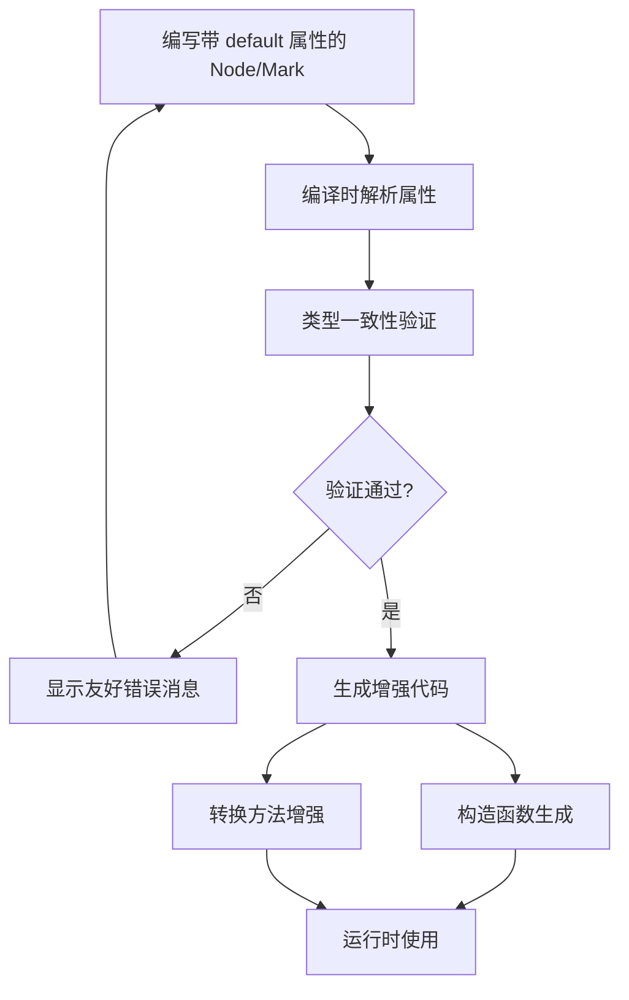

# ModuForge-RS Default 属性扩展 - 产品愿景定义

## 产品愿景

基于 ModuForge-RS 框架现有的 `moduforge-macros-derive` 库，为 Node 和 Mark 宏提供声明式的默认值支持，通过编译时类型验证和智能代码生成，大幅降低样板代码编写成本，提升开发者体验和代码质量。

### 核心价值主张

**"声明即配置，编译即验证"** - 让开发者通过简单的属性声明就能获得完整的默认值支持，同时确保类型安全和性能最优化。

## 核心目标

### 1. 减少样板代码（主要目标）
- **问题**：现有宏系统要求开发者手动处理字段默认值，导致大量重复的初始化代码
- **解决方案**：通过 `#[attr(default="value")]` 语法，自动生成带默认值的构造函数和转换逻辑
- **价值**：减少 60-80% 的字段初始化样板代码

### 2. 提升类型安全（关键目标）
- **问题**：运行时默认值设置容易出现类型不匹配错误
- **解决方案**：编译时验证默认值类型与字段类型的一致性
- **价值**：零运行时错误，所有类型问题在编译期解决

### 3. 改善开发体验（重要目标）
- **问题**：复杂的宏配置和错误消息难以理解
- **解决方案**：友好的编译错误信息和具体的修复建议
- **价值**：降低学习成本，提高开发效率

### 4. 保持向后兼容（约束目标）
- **要求**：现有代码无需任何修改即可继续工作
- **实现**：default 属性为可选功能，不影响现有 `#[attr]` 语法
- **价值**：平滑升级路径，保护现有投资

## 用户画像

### 主要用户：ModuForge-RS 应用开发者

**背景特征**：
- 使用 Rust 进行应用开发，有基本的宏使用经验
- 正在构建基于 ModuForge-RS 的文档编辑、状态管理或协作应用
- 关注代码质量、类型安全和开发效率

**痛点分析**：
- **冗余代码**：需要为每个 Node/Mark 字段手写默认值设置逻辑
- **类型错误**：运行时才发现默认值类型不匹配问题
- **维护成本**：字段类型变更时需要同步更新多处默认值代码

**使用场景**：
1. **文档编辑器开发**：创建段落、标题、列表等多种 Node 类型，每种都有特定的默认属性
2. **协作应用构建**：定义用户权限、状态标记等 Mark 类型，需要合理的默认值策略
3. **数据迁移项目**：从现有系统迁移到 ModuForge-RS，需要快速定义大量带默认值的节点类型

### 次要用户：框架扩展开发者

**背景特征**：
- 深度参与 ModuForge-RS 生态建设
- 开发插件、主题或扩展功能
- 需要定义复杂的自定义节点和标记类型

**需求特点**：
- 支持复杂的默认值表达式（JSON 格式）
- 需要精确的类型控制和验证
- 要求良好的扩展性和自定义能力

## 功能概述

### 核心功能模块

#### 1. 声明式默认值语法
```rust
#[derive(Node)]
#[node_type = "paragraph"]
pub struct Paragraph {
    #[attr(default = "默认内容")]
    content: String,
    
    #[attr(default = "16")]
    font_size: i32,
    
    #[attr(default = "true")]
    visible: bool,
    
    #[attr]  // 保持现有语法兼容
    author: Option<String>,
}
```

#### 2. 编译时类型验证
- **类型一致性检查**：确保默认值类型与字段类型匹配
- **JSON 格式验证**：验证 JSON 默认值的语法正确性和类型兼容性
- **友好错误消息**：提供具体的修复建议和错误位置

#### 3. 智能代码生成
- **增强的 toNode/toMark 方法**：支持默认值的实例转换
- **构造函数生成**：自动生成 `new()` 和 `with_defaults()` 方法
- **类型安全的属性设置**：运行时零开销的属性赋值逻辑

#### 4. 高级默认值支持
- **简单类型**：String, i32, i64, f32, f64, bool
- **JSON 格式**：复杂默认值通过 JSON 字符串表达，类型必须为 `serde_json::Value`
- **Option 类型**：支持可选字段的默认值设置

### 业务流程概述



## 成功指标

### 功能指标
- **默认值类型覆盖率**：100% 支持规划的基本类型
- **编译时验证准确率**：100% 的类型错误在编译时捕获
- **向后兼容性**：现有代码 100% 兼容，无需修改

### 质量指标
- **编译性能影响**：< 10% 的编译时间增加
- **错误消息质量**：用户友好度评分 ≥ 90%
- **测试覆盖率**：≥ 95% 的代码路径覆盖

### 用户体验指标
- **样板代码减少**：≥ 60% 的字段初始化代码消除
- **学习成本**：新功能上手时间 < 30 分钟
- **错误修复速度**：平均错误定位和修复时间 < 5 分钟

### 技术性能指标
- **运行时开销**：零额外运行时成本
- **内存使用**：编译期内存增加 < 20MB
- **类型检查时间**：单个字段验证 < 1ms

## 竞争优势

### 与手动实现对比
- **开发效率**：减少 60-80% 的样板代码
- **类型安全**：编译时验证 vs 运行时错误
- **维护成本**：自动同步 vs 手动维护多处代码

### 与其他宏库对比
- **框架集成**：深度集成 ModuForge-RS 生态
- **类型验证**：更严格的编译时检查
- **错误体验**：更友好的错误消息和修复建议

### 技术创新点
- **编译时 JSON 验证**：确保 JSON 默认值的正确性
- **渐进式采用**：无缝兼容现有代码
- **智能代码生成**：根据字段类型自动优化生成逻辑

## 发展路线图

### 第一阶段：基础功能（当前）
- ✅ 简单类型默认值支持
- ✅ 编译时类型验证
- ✅ 基础代码生成增强

### 第二阶段：高级功能
- 🔄 JSON 格式默认值支持
- 🔄 复杂类型验证逻辑
- 🔄 性能优化和错误体验改进

### 第三阶段：生态扩展
- 📋 IDE 支持和语法高亮
- 📋 文档生成和最佳实践指南
- 📋 社区反馈收集和功能迭代

### 长期愿景
打造 Rust 生态中最易用、最安全的声明式默认值宏系统，成为 ModuForge-RS 框架的核心竞争优势之一。

## 风险评估与缓解

### 技术风险
- **复杂性风险**：编译时验证逻辑复杂
  - *缓解措施*：分阶段实现，先支持简单类型
- **性能风险**：编译时验证影响编译速度
  - *缓解措施*：优化验证算法，缓存验证结果

### 兼容性风险
- **API 冲突风险**：新功能与现有功能冲突
  - *缓解措施*：严格的向后兼容性测试
- **生态风险**：与其他 ModuForge-RS 组件的集成问题
  - *缓解措施*：深度集成测试和版本同步

### 用户采用风险
- **学习曲线风险**：新语法增加学习成本
  - *缓解措施*：详细文档和渐进式迁移指南
- **功能发现风险**：用户不知道新功能存在
  - *缓解措施*：示例代码和最佳实践推广

---

*此产品愿景定义文档为 ModuForge-RS Default 属性扩展项目提供了清晰的目标指引和价值定位，确保项目开发始终围绕用户价值和技术创新展开。*