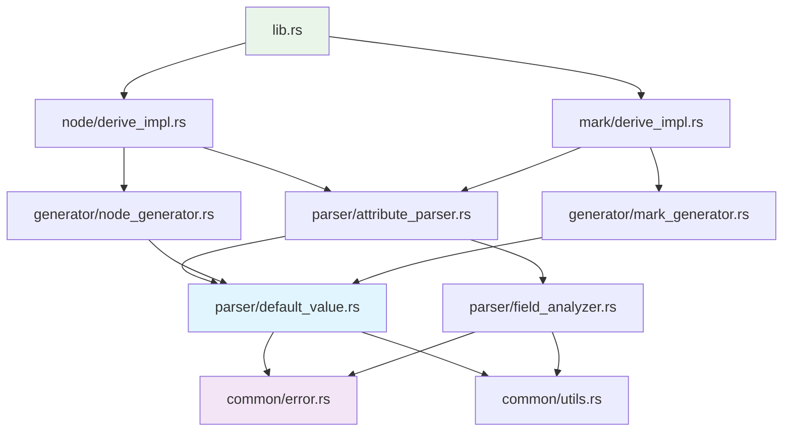

# ModuForge-RS Default 属性扩展 - 项目结构设计

## 项目结构概览

基于现有 `crates/derive` 目录的深度分析，本扩展将遵循现有的模块化架构，通过**单一职责原则**和**开闭原则**实现无缝扩展。

### 目录结构设计

```
crates/derive/
├── Cargo.toml                      # 依赖配置（无需新增外部依赖）
├── src/
│   ├── lib.rs                      # 主入口（最小修改，保持向后兼容）
│   ├── common/                     # 公共模块（扩展错误类型和工具函数）
│   │   ├── mod.rs                  # 模块声明
│   │   ├── constants.rs            # 常量定义
│   │   ├── error.rs                # 错误类型扩展 ⭐
│   │   └── utils.rs                # 工具函数扩展 ⭐
│   ├── parser/                     # 解析器模块（核心扩展区域）
│   │   ├── mod.rs                  # 模块声明
│   │   ├── attribute_parser.rs     # 属性解析器扩展 ⭐
│   │   ├── field_analyzer.rs       # 字段分析器增强 ⭐
│   │   ├── validation.rs           # 验证逻辑
│   │   └── default_value.rs        # 默认值处理器 🆕
│   ├── converter/                  # 转换器模块（现有基础设施）
│   │   ├── mod.rs                  # 模块声明
│   │   ├── type_converter.rs       # 类型转换器
│   │   ├── builtin_converters.rs   # 内置转换器
│   │   └── converter_registry.rs   # 转换器注册表
│   ├── generator/                  # 代码生成器模块（增强现有功能）
│   │   ├── mod.rs                  # 模块声明
│   │   ├── node_generator.rs       # Node 生成器增强 ⭐
│   │   └── mark_generator.rs       # Mark 生成器增强 ⭐
│   ├── node/                       # Node 相关模块
│   │   └── derive_impl.rs          # Node 派生实现增强 ⭐
│   └── mark/                       # Mark 相关模块
│       └── derive_impl.rs          # Mark 派生实现增强 ⭐
└── tests/                          # 测试目录（扩展测试用例）
    ├── integration_tests.rs        # 集成测试增强 ⭐
    ├── error_message_tests.rs      # 错误消息测试增强 ⭐
    └── default_value_tests.rs      # 默认值专项测试 🆕

图例：
⭐ = 需要扩展的现有文件
🆕 = 需要新增的文件
```

## 模块划分与职责边界

### 核心扩展模块

#### 1. parser/default_value.rs 🆕
**职责**：默认值解析、验证和类型检查的核心逻辑
**遵循原则**：单一职责原则 - 专门处理默认值相关逻辑

```rust
//! 默认值处理器模块
//!
//! 负责解析、验证和处理 #[attr(default="value")] 属性中的默认值。
//! 严格遵循单一职责原则，专门处理默认值相关的所有逻辑。

/// 默认值表示
#[derive(Debug, Clone, PartialEq)]
pub struct DefaultValue {
    /// 原始字符串值
    pub raw_value: String,
    /// 解析后的值类型
    pub value_type: DefaultValueType,
    /// 是否为 JSON 格式
    pub is_json: bool,
    /// 目标字段类型
    pub target_type: String,
}

/// 默认值类型枚举
#[derive(Debug, Clone, PartialEq)]
pub enum DefaultValueType {
    String(String),
    Integer(i64),
    Float(f64),
    Boolean(bool),
    Json(serde_json::Value),
    Null,
}

/// 默认值解析器
pub struct DefaultValueParser;

/// 默认值验证器接口
pub trait DefaultValueValidator {
    fn validate(&self, default_value: &DefaultValue, field_type: &Type) -> MacroResult<()>;
    fn supports_type(&self, field_type: &Type) -> bool;
    fn priority(&self) -> i32;
}

/// 默认值验证器注册表
pub struct ValidatorRegistry {
    validators: Vec<Box<dyn DefaultValueValidator>>,
}
```

#### 2. parser/attribute_parser.rs ⭐ 扩展
**现有职责**：解析所有宏属性
**扩展职责**：解析和提取 default 参数

```rust
// 现有 FieldConfig 的扩展
#[derive(Debug, Clone)]
pub struct FieldConfig {
    // === 现有字段保持不变 ===
    pub name: String,
    pub type_name: String,
    pub is_optional: bool,
    pub is_attr: bool,
    pub field: Field,
    
    // === 新增字段（保持向后兼容）===
    /// 默认值配置（None 表示无默认值，保持现有行为）
    pub default_value: Option<DefaultValue>,
}

impl AttributeParser {
    // === 现有方法保持不变 ===
    
    // === 新增方法 ===
    /// 解析字段的 default 参数
    /// 
    /// 从 #[attr(default="value")] 中提取并验证默认值
    fn parse_default_parameter(attr: &Attribute) -> MacroResult<Option<String>> {
        // 解析 default="value" 参数
    }
    
    /// 增强的字段属性解析
    /// 
    /// 在现有解析基础上添加默认值支持
    fn parse_field_attributes_enhanced(input: &DeriveInput) -> MacroResult<Vec<FieldConfig>> {
        // 调用现有解析逻辑
        // 扩展默认值解析
    }
}
```

### 增强现有模块

#### 3. common/error.rs ⭐ 扩展
**现有职责**：宏错误类型定义
**扩展职责**：添加默认值相关错误类型

```rust
/// 宏处理错误类型扩展
#[derive(Error, Debug)]
pub enum MacroError {
    // === 现有错误类型保持不变 ===
    MissingAttribute { /* ... */ },
    InvalidAttributeValue { /* ... */ },
    UnsupportedFieldType { /* ... */ },
    ParseError { /* ... */ },
    GenerationError { /* ... */ },
    ValidationError { /* ... */ },
    SyntaxError(#[from] syn::Error),
    
    // === 新增默认值相关错误 ===
    
    /// 默认值类型不匹配错误
    #[error("默认值类型不匹配: 字段 '{field_name}' 类型为 '{field_type}'，但默认值 '{default_value}' 不兼容")]
    DefaultValueTypeMismatch {
        field_name: String,
        field_type: String,
        default_value: String,
        expected_type: String,
        span: Option<Span>,
    },
    
    /// JSON 默认值格式错误
    #[error("JSON 默认值格式错误: {reason}")]
    InvalidJsonDefaultValue {
        reason: String,
        value: String,
        field_name: String,
        span: Option<Span>,
    },
    
    /// JSON 类型约束错误
    #[error("JSON 默认值只能用于 serde_json::Value 类型字段")]
    JsonValueTypeRequired {
        field_name: String,
        actual_type: String,
        span: Option<Span>,
    },
    
    /// 默认值解析错误
    #[error("默认值解析失败: {reason}")]
    DefaultValueParseError {
        reason: String,
        value: String,
        field_name: String,
        span: Option<Span>,
    },
}

impl MacroError {
    // === 现有方法保持不变 ===
    
    // === 新增便利构造方法 ===
    pub fn default_value_type_mismatch<T: Spanned>(
        field_name: &str,
        field_type: &str,
        default_value: &str,
        expected_type: &str,
        spanned: &T,
    ) -> Self {
        // 创建类型不匹配错误，包含详细信息和修复建议
    }
    
    pub fn invalid_json_default<T: Spanned>(
        reason: &str,
        value: &str,
        field_name: &str,
        spanned: &T,
    ) -> Self {
        // 创建 JSON 格式错误，包含修复建议
    }
    
    /// 为默认值错误提供专门的修复建议
    pub fn default_value_suggestion(&self) -> String {
        match self {
            Self::DefaultValueTypeMismatch { field_type, expected_type, .. } => {
                format!(
                    "请确保默认值类型与字段类型匹配：\n\
                    - 字段类型: {}\n\
                    - 期望的默认值类型: {}\n\
                    - 示例: #[attr(default = \"correct_value\")]",
                    field_type, expected_type
                )
            }
            Self::JsonValueTypeRequired { field_name, actual_type, .. } => {
                format!(
                    "JSON 默认值只能用于 serde_json::Value 类型：\n\
                    - 当前字段 '{}' 类型: {}\n\
                    - 解决方案1: 将字段类型改为 serde_json::Value\n\
                    - 解决方案2: 使用简单字符串作为默认值",
                    field_name, actual_type
                )
            }
            _ => self.suggestion(), // 委托给现有逻辑
        }
    }
}
```

#### 4. generator/node_generator.rs ⭐ 增强
**现有职责**：生成 Node 相关代码
**扩展职责**：支持默认值的代码生成

```rust
impl NodeGenerator {
    // === 现有方法保持不变 ===
    pub fn generate_to_node_method(&self) -> MacroResult<TokenStream2> {
        // 增强：支持默认值的 to_node 实现
        self.generate_to_node_with_defaults()
    }
    
    // === 新增方法 ===
    
    /// 生成支持默认值的 to_node 方法
    fn generate_to_node_with_defaults(&self) -> MacroResult<TokenStream2> {
        let struct_name = &self.input.ident;
        let node_type = self.config.node_type.as_ref().unwrap();
        
        // 分离有默认值和无默认值的字段
        let (fields_with_defaults, fields_without_defaults): (Vec<_>, Vec<_>) = self.config
            .attr_fields
            .iter()
            .partition(|f| f.default_value.is_some());
        
        // 生成字段设置代码
        let field_setters = self.generate_field_setters_with_defaults(
            &fields_with_defaults,
            &fields_without_defaults
        )?;
        
        Ok(quote! {
            pub fn to_node(&self) -> mf_core::node::Node {
                #imports
                #spec_code
                
                // 设置字段属性（支持默认值）
                #field_setters
                
                mf_core::node::Node::create(#node_type, spec)
            }
        })
    }
    
    /// 生成构造函数 - 使用所有默认值
    pub fn generate_new_with_defaults_method(&self) -> MacroResult<TokenStream2> {
        let struct_name = &self.input.ident;
        
        // 检查是否有字段具有默认值
        let has_defaults = self.config.attr_fields
            .iter()
            .any(|f| f.default_value.is_some());
            
        if !has_defaults {
            // 如果没有默认值字段，不生成此方法
            return Ok(quote! {});
        }
        
        let field_initializers = self.generate_default_field_initializers()?;
        
        Ok(quote! {
            /// 使用所有默认值创建实例
            pub fn new() -> Self {
                Self {
                    #field_initializers
                }
            }
        })
    }
    
    /// 生成字段的默认值初始化代码
    fn generate_default_field_initializers(&self) -> MacroResult<TokenStream2> {
        let mut initializers = Vec::new();
        
        for field_config in &self.config.attr_fields {
            let field_name = syn::parse_str::<Ident>(&field_config.name)?;
            
            let initializer = if let Some(default_value) = &field_config.default_value {
                // 有默认值的字段
                self.generate_default_value_expression(default_value, field_config)?
            } else {
                // 无默认值的字段使用 Default::default()
                quote! { Default::default() }
            };
            
            initializers.push(quote! {
                #field_name: #initializer
            });
        }
        
        Ok(quote! {
            #(#initializers),*
        })
    }
    
    /// 根据默认值类型生成相应的表达式
    fn generate_default_value_expression(
        &self,
        default_value: &DefaultValue,
        field_config: &FieldConfig
    ) -> MacroResult<TokenStream2> {
        match &default_value.value_type {
            DefaultValueType::String(s) => Ok(quote! { #s.to_string() }),
            DefaultValueType::Integer(i) => {
                // 根据字段类型生成适当的整数转换
                let field_type = &field_config.type_name;
                match field_type.as_str() {
                    "i32" => Ok(quote! { #i as i32 }),
                    "i64" => Ok(quote! { #i }),
                    "u32" => Ok(quote! { #i as u32 }),
                    "u64" => Ok(quote! { #i as u64 }),
                    _ => Ok(quote! { #i as #field_type }),
                }
            },
            DefaultValueType::Float(f) => Ok(quote! { #f }),
            DefaultValueType::Boolean(b) => Ok(quote! { #b }),
            DefaultValueType::Json(json) => {
                let json_str = serde_json::to_string(json).unwrap();
                Ok(quote! { serde_json::from_str(#json_str).unwrap() })
            },
            DefaultValueType::Null => {
                if field_config.is_optional {
                    Ok(quote! { None })
                } else {
                    Err(MacroError::validation_error(
                        "null 默认值只能用于 Option 类型字段",
                        &field_config.field
                    ))
                }
            }
        }
    }
}
```

## 依赖关系设计

### 模块依赖图



### 依赖原则

#### 1. 依赖倒置原则 (DIP)
```rust
// 高层模块 (AttributeParser) 依赖抽象接口
pub trait DefaultValueValidator {
    fn validate(&self, default_value: &DefaultValue, field_type: &Type) -> MacroResult<()>;
}

// 低层模块实现具体验证逻辑
pub struct StringValidator;
impl DefaultValueValidator for StringValidator { /* ... */ }

pub struct JsonValidator;
impl DefaultValueValidator for JsonValidator { /* ... */ }
```

#### 2. 接口隔离原则 (ISP)
```rust
// 专门的默认值处理接口
pub trait DefaultValueProcessor {
    fn process(&self, field: &FieldConfig) -> MacroResult<ProcessedField>;
}

// 专门的代码生成接口
pub trait DefaultValueCodeGenerator {
    fn generate_initializer(&self, default_value: &DefaultValue) -> MacroResult<TokenStream2>;
}

// 避免单个大接口，按职责分离
```

## 配置管理

### 配置文件组织

#### 1. Cargo.toml 配置变更
```toml
[package]
name = "moduforge-macros-derive"
version = {workspace=true}
edition = {workspace=true}
description = "ModuForge-RS 宏扩展模块，提供 Node 和 Mark 的派生宏，支持默认值属性"

[lib]
name = "mf_derive"
proc-macro = true

[dependencies]
# === 现有依赖保持不变 ===
syn = { version = "2.0", features = ["full"] }
quote = "1.0"
proc-macro2 = "1.0"
serde = { version = "1.0", features = ["derive"] }
serde_json = "1.0"  # 已存在，用于 JSON 默认值解析
once_cell = "1.19"  # 已存在，用于缓存
thiserror = "1.0"   # 已存在，用于错误处理

# ModuForge-RS 内部依赖（已存在）
anyhow = {workspace=true}
moduforge-model = { workspace = true }
moduforge-state = { workspace = true }
moduforge-transform = { workspace = true }
moduforge-core = { workspace = true }
imbl = { workspace = true }

# === 无需新增外部依赖 ===

[dev-dependencies]
# === 现有测试依赖保持不变 ===
uuid = { version = "1.0", features = ["v4", "serde"] }
serde_json = "1.0"
tokio = { version = "1.0", features = ["full"] }

# === 新增测试依赖（用于默认值功能测试）===
trybuild = "1.0"      # 用于编译时错误测试
```

#### 2. 功能开关配置
```rust
// src/common/constants.rs 扩展

/// 默认值功能相关常量
pub mod default_values {
    /// 支持的简单类型列表
    pub const SUPPORTED_SIMPLE_TYPES: &[&str] = &[
        "String", "str", "&str",
        "i8", "i16", "i32", "i64", "i128", "isize",
        "u8", "u16", "u32", "u64", "u128", "usize",
        "f32", "f64",
        "bool",
    ];
    
    /// JSON 类型标识
    pub const JSON_VALUE_TYPES: &[&str] = &[
        "serde_json::Value",
        "Value",
        "JsonValue",
    ];
    
    /// 默认值属性名称
    pub const DEFAULT_ATTR_NAME: &str = "default";
    
    /// 编译时验证开关
    pub const ENABLE_COMPILE_TIME_VALIDATION: bool = true;
    
    /// 友好错误消息开关
    pub const ENABLE_FRIENDLY_ERROR_MESSAGES: bool = true;
}
```

### 环境变量配置

```rust
// src/common/utils.rs 扩展

/// 环境变量配置读取
pub mod env_config {
    use once_cell::sync::Lazy;
    
    /// 是否启用详细的编译时日志
    pub static VERBOSE_COMPILATION: Lazy<bool> = Lazy::new(|| {
        std::env::var("MODUFORGE_DERIVE_VERBOSE")
            .map(|v| v == "1" || v.to_lowercase() == "true")
            .unwrap_or(false)
    });
    
    /// 是否启用性能统计
    pub static ENABLE_PERFORMANCE_STATS: Lazy<bool> = Lazy::new(|| {
        std::env::var("MODUFORGE_DERIVE_PERF")
            .map(|v| v == "1" || v.to_lowercase() == "true")
            .unwrap_or(false)
    });
    
    /// 最大允许的默认值字符串长度
    pub static MAX_DEFAULT_VALUE_LENGTH: Lazy<usize> = Lazy::new(|| {
        std::env::var("MODUFORGE_DERIVE_MAX_DEFAULT_LENGTH")
            .and_then(|v| v.parse().ok())
            .unwrap_or(1024)
    });
}
```

## 测试架构

### 测试组织结构

#### 1. tests/default_value_tests.rs 🆕
```rust
//! 默认值功能专项测试
//!
//! 覆盖默认值解析、验证、代码生成的所有场景

mod basic_types {
    //! 基本类型默认值测试
    
    #[test]
    fn test_string_default_value() { /* ... */ }
    
    #[test]
    fn test_integer_default_value() { /* ... */ }
    
    #[test]
    fn test_boolean_default_value() { /* ... */ }
    
    #[test]
    fn test_float_default_value() { /* ... */ }
}

mod json_values {
    //! JSON 默认值测试
    
    #[test]
    fn test_valid_json_default() { /* ... */ }
    
    #[test]
    fn test_invalid_json_syntax() { /* ... */ }
    
    #[test]
    fn test_json_type_constraint() { /* ... */ }
}

mod option_types {
    //! Option 类型默认值测试
    
    #[test]
    fn test_option_string_default() { /* ... */ }
    
    #[test]
    fn test_option_null_default() { /* ... */ }
    
    #[test]
    fn test_option_value_default() { /* ... */ }
}

mod error_cases {
    //! 错误情况测试
    
    #[test]
    fn test_type_mismatch_error() { /* ... */ }
    
    #[test]
    fn test_json_type_error() { /* ... */ }
    
    #[test]
    fn test_invalid_syntax_error() { /* ... */ }
}

mod code_generation {
    //! 代码生成测试
    
    #[test]
    fn test_generated_new_method() { /* ... */ }
    
    #[test]
    fn test_generated_to_node_method() { /* ... */ }
    
    #[test]
    fn test_mixed_default_and_regular_fields() { /* ... */ }
}

mod performance {
    //! 性能测试
    
    #[test]
    fn test_compilation_time() { /* ... */ }
    
    #[test]
    fn test_memory_usage() { /* ... */ }
    
    #[bench]
    fn bench_default_value_parsing() { /* ... */ }
}
```

#### 2. tests/integration_tests.rs ⭐ 扩展
```rust
// 现有集成测试保持不变

// 新增默认值集成测试
mod default_value_integration {
    use syn::parse_quote;
    use crate::*;
    
    #[test]
    fn test_complete_node_with_defaults() {
        let input = parse_quote! {
            #[derive(Node)]
            #[node_type = "paragraph"]
            pub struct Paragraph {
                #[attr(default = "默认内容")]
                content: String,
                
                #[attr(default = "16")]
                font_size: i32,
                
                #[attr(default = "true")]
                visible: bool,
                
                #[attr]
                author: Option<String>,
            }
        };
        
        // 测试完整的编译和代码生成过程
        let result = process_derive_node_with_recovery(input);
        assert!(result.is_ok());
        
        // 验证生成的代码包含预期的方法
        let generated = result.unwrap();
        let code_str = generated.to_string();
        
        assert!(code_str.contains("pub fn new()"));
        assert!(code_str.contains("pub fn to_node()"));
        assert!(code_str.contains("默认内容"));
        assert!(code_str.contains("16"));
        assert!(code_str.contains("true"));
    }
    
    #[test]
    fn test_backward_compatibility() {
        // 确保现有代码完全兼容
        let existing_input = parse_quote! {
            #[derive(Node)]
            #[node_type = "paragraph"]
            pub struct ExistingNode {
                #[attr]
                content: String,
                
                #[attr]
                author: Option<String>,
            }
        };
        
        let result = process_derive_node_with_recovery(existing_input);
        assert!(result.is_ok());
        
        // 验证生成的代码与之前版本一致
        let generated = result.unwrap();
        let code_str = generated.to_string();
        
        assert!(code_str.contains("pub fn to_node()"));
        assert!(!code_str.contains("pub fn new()")); // 无默认值时不生成 new 方法
    }
}
```

#### 3. tests/error_message_tests.rs ⭐ 扩展
```rust
// 现有错误消息测试保持不变

// 新增默认值错误消息测试
mod default_value_errors {
    use trybuild::TestCases;
    
    #[test]
    fn test_type_mismatch_errors() {
        let t = TestCases::new();
        
        // 测试各种类型不匹配的错误消息
        t.compile_fail("tests/compile_fail/string_to_int_mismatch.rs");
        t.compile_fail("tests/compile_fail/json_to_non_value_type.rs");
        t.compile_fail("tests/compile_fail/invalid_json_syntax.rs");
    }
    
    #[test]
    fn test_friendly_error_suggestions() {
        // 验证错误消息包含有用的修复建议
        // 可以通过解析编译错误输出来验证
    }
}
```

### 测试数据组织

#### 编译失败测试用例目录
```
tests/
├── compile_fail/              # 编译失败测试用例 🆕
│   ├── string_to_int_mismatch.rs
│   ├── json_to_non_value_type.rs
│   ├── invalid_json_syntax.rs
│   ├── null_to_non_option.rs
│   └── unsupported_type.rs
├── compile_pass/              # 编译成功测试用例 🆕
│   ├── basic_defaults.rs
│   ├── json_defaults.rs
│   ├── option_defaults.rs
│   └── mixed_fields.rs
└── golden/                    # 黄金标准输出 🆕
    ├── simple_node_with_defaults.rs
    ├── complex_node_with_defaults.rs
    └── mark_with_defaults.rs
```

## 部署配置

### 版本管理策略

#### 1. 语义化版本控制
```toml
# Cargo.toml
[package]
version = "0.3.0"  # 现有版本基础上的 MINOR 版本升级

# 版本号策略：
# - MAJOR: 破坏性 API 变更（避免）
# - MINOR: 新增功能（默认值支持）
# - PATCH: Bug 修复和性能优化
```

#### 2. 功能标志管理
```rust
// src/lib.rs 中的条件编译
#[cfg(feature = "default-values")]
mod default_value_support {
    pub use crate::parser::default_value::*;
}

// Cargo.toml 中的功能标志
[features]
default = ["default-values"]  # 默认启用
default-values = []           # 默认值支持功能
```

### 文档生成配置

#### 1. API 文档配置
```toml
# Cargo.toml
[package.metadata.docs.rs]
all-features = true
rustdoc-args = ["--cfg", "docsrs"]

# src/lib.rs 中的文档配置
#![cfg_attr(docsrs, feature(doc_cfg))]

/// # 默认值支持功能
/// 
/// 此功能允许为 Node 和 Mark 的字段指定默认值：
/// 
/// ```rust
/// #[derive(Node)]
/// #[node_type = "paragraph"]
/// pub struct Paragraph {
///     #[attr(default = "默认内容")]
///     content: String,
/// }
/// ```
#[cfg_attr(docsrs, doc(cfg(feature = "default-values")))]
pub mod default_values {
    // 默认值相关的公共 API
}
```

#### 2. 示例代码组织
```
examples/                      # 示例代码目录 🆕
├── basic_usage.rs            # 基本使用示例
├── advanced_defaults.rs      # 高级默认值功能
├── json_defaults.rs          # JSON 默认值示例
├── migration_guide.rs        # 迁移指南示例
└── best_practices.rs         # 最佳实践示例
```

## 开发规范

### 代码规范

#### 1. 命名约定
```rust
// 模块命名：蛇形命名法
mod default_value;
mod attribute_parser;

// 类型命名：帕斯卡命名法
struct DefaultValue;
enum DefaultValueType;
trait DefaultValueValidator;

// 函数命名：蛇形命名法
fn parse_default_value();
fn validate_type_compatibility();

// 常量命名：大写蛇形命名法
const SUPPORTED_SIMPLE_TYPES: &[&str];
const MAX_DEFAULT_VALUE_LENGTH: usize;
```

#### 2. 文档规范
```rust
//! 模块级文档
//! 
//! 描述模块的职责、设计原则和使用方式。
//! 必须包含设计原则体现的说明。

/// 函数/类型文档
/// 
/// # 参数
/// 
/// * `param` - 参数说明
/// 
/// # 返回值
/// 
/// 返回值说明
/// 
/// # 错误
/// 
/// 可能的错误情况
/// 
/// # 示例
/// 
/// ```rust
/// // 使用示例
/// ```
/// 
/// # 设计原则体现
/// 
/// - **单一职责**: 说明如何体现单一职责原则
/// - **开闭原则**: 说明如何支持扩展
pub fn example_function() {}
```

#### 3. 错误处理规范
```rust
// 统一的错误处理模式
fn process_with_recovery() -> (Vec<Success>, Vec<MacroError>) {
    // 收集所有错误，不因单个错误中断整个处理流程
}

// 友好的错误消息格式
impl MacroError {
    fn to_friendly_message(&self) -> String {
        format!(
            "错误: {}\n\n\
            位置: {}:{}\n\
            修复建议: {}\n\
            参考文档: {}",
            self.description(),
            self.file(),
            self.line(),
            self.suggestion(),
            self.docs_link()
        )
    }
}
```

### 提交规范

#### 1. Git 提交消息格式
```
type(scope): subject

body

footer
```

#### 2. 提交类型分类
- `feat`: 新增功能（默认值支持相关）
- `fix`: Bug 修复
- `docs`: 文档更新
- `style`: 代码格式调整
- `refactor`: 代码重构
- `test`: 测试相关
- `perf`: 性能优化

#### 3. 示例提交消息
```bash
feat(parser): add default value parsing support

- Add DefaultValue struct and parsing logic
- Implement type validation for default values
- Support JSON format default values
- Maintain backward compatibility with existing attr syntax

Closes #123
```

---

*此项目结构设计文档为 ModuForge-RS Default 属性扩展项目提供了详细的实现蓝图，确保项目能够在现有架构基础上实现高质量的扩展。*