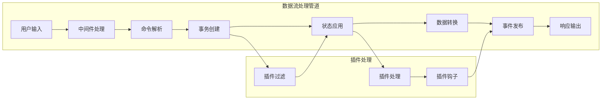
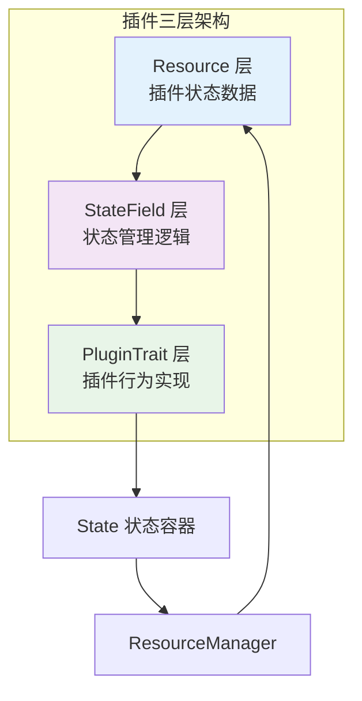
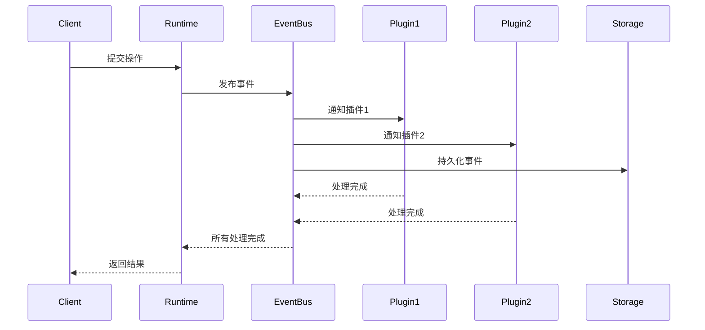

# ModuForge-RS 架构设计文档

## 概述

ModuForge-RS 是一个基于 Rust 的现代化状态管理和数据转换框架，采用不可变数据结构和事件驱动架构。该框架提供了完整的插件系统、中间件支持、规则引擎集成和协作功能。

## 核心设计原则

- **不可变性**: 基于 `im-rs` 的持久化数据结构
- **事件驱动**: 所有状态变更通过事件系统通知
- **模块化**: 8个独立的crate，各司其职
- **异步优先**: 基于 Tokio 的高性能异步处理
- **插件化**: 三层插件架构支持灵活扩展
- **类型安全**: 利用 Rust 类型系统保证安全性

## 分层架构图

### 官方架构图


上图展示了 ModuForge-RS 的完整分层架构，从应用层到基础设施层的8个层次，清晰展示了各组件之间的依赖关系。

### 详细架构层次

#### 🎯 应用层（顶层）
应用层包含基于 ModuForge-RS 构建的具体业务应用：

- **计价系统**: 基于规则引擎的动态计价应用
- **协作文档平台**: 支持实时协作的文档编辑平台
- **业务规则系统**: 企业级业务规则管理和执行系统
- **状态管理应用**: 复杂状态管理的企业应用
- **实时协作工具**: 基于 CRDT 的实时协作工具

#### 💼 服务层
服务层封装了各种业务服务，为上层应用提供统一的业务接口：

- **文档服务**: 文档创建、编辑、存储和检索服务
- **协作服务**: 实时协作、冲突解决和同步服务
- **规则服务**: 业务规则定义、验证和执行服务
- **模板服务**: 模板管理和渲染服务
- **用户服务**: 用户认证、授权和管理服务

#### 🌐 接口层
接口层提供多种 API 接口，支持不同的客户端接入方式：

- **REST API**: 标准的 HTTP RESTful 接口
- **WebSocket API**: 实时双向通信接口，支持协作功能
- **GraphQL API**: 灵活的查询接口，支持客户端按需获取数据
- **gRPC API**: 高性能的 RPC 接口，适用于微服务架构

#### ⚡ 运行时层
运行时层是框架的核心执行环境，管理整个系统的运行时状态：

- **异步运行时 (AsyncRuntime)**: 基于 Tokio 的高性能异步执行器
- **事件总线 (EventBus)**: 解耦的事件分发和处理系统
- **中间件栈 (MiddlewareStack)**: 可配置的请求/响应处理管道
- **流程引擎 (FlowEngine)**: 复杂业务流程的编排和执行
- **扩展管理 (ExtensionManager)**: 插件和扩展的动态加载和管理

#### 🧠 业务引擎层
业务引擎层包含各种专业的业务处理引擎：

- **规则引擎 (Rules Engine)**: 基于 GoRules JDM 标准的业务规则处理
- **表达式引擎 (Expression Engine)**: 高性能的表达式求值系统
- **决策引擎 (Decision Engine)**: 复杂决策逻辑的执行和管理
- **模板引擎 (Template Engine)**: 动态模板渲染和内容生成
- **协作引擎 (Collaboration Engine)**: 基于 CRDT 的实时协作处理

#### 🏗️ 核心处理层
核心处理层实现了框架的核心数据处理逻辑：

- **状态管理 (State Manager)**: 不可变状态的管理和版本控制
- **事务系统 (Transaction System)**: ACID 兼容的事务处理
- **转换引擎 (Transform Engine)**: 高效的数据转换和操作
- **插件系统 (Plugin System)**: 三层插件架构的实现
- **资源管理 (Resource Manager)**: 全局资源的生命周期管理

#### 📋 数据模型层
数据模型层定义了框架中使用的核心数据结构：

- **节点系统 (Node System)**: 层次化的文档节点结构
- **文档树 (Document Tree)**: 树形文档结构的表示和操作
- **属性系统 (Attributes)**: 类型安全的属性管理
- **标记系统 (Marks)**: 文档格式化和样式标记
- **模式定义 (Schema)**: 文档结构的验证和约束

#### 🔧 基础设施层
基础设施层提供了框架运行所需的基础技术设施：

- **异步通道 (Async Channels)**: 高性能的异步消息传递
- **WebSocket 服务**: 实时 WebSocket 连接管理
- **HTTP 服务**: HTTP 服务器和客户端实现
- **JSON 处理**: 高效的 JSON 序列化和反序列化
- **日志系统**: 结构化日志记录和监控

## 技术架构深度分析

### 数据流处理架构

以下图表展示了 ModuForge-RS 的数据流处理过程：



### 插件系统架构

ModuForge-RS 采用三层插件架构设计，实现了高度的模块化和可扩展性：



### 事件驱动架构

事件系统是 ModuForge-RS 的核心特性之一，提供了解耦的通信机制：



## 核心组件详解

### 1. 异步运行时 (AsyncRuntime)

异步运行时是整个框架的执行核心，提供：

- **高性能异步处理**: 基于 Tokio 的异步任务调度
- **中间件管道**: 可配置的请求/响应处理链
- **超时机制**: 完善的超时保护和错误处理
- **性能监控**: 内置的性能指标收集和分析

```rust
// 创建异步运行时
let mut runtime = ForgeAsyncRuntime::create(options).await?;

// 配置性能监控
runtime.set_performance_config(PerformanceConfig {
    enable_monitoring: true,
    middleware_timeout_ms: 1000,
    task_receive_timeout_ms: 5000,
    ..Default::default()
});

// 执行命令
runtime.command(Arc::new(MyCommand)).await?;
```

### 2. 状态管理系统 (State)

状态管理系统负责维护应用的整体状态：

- **不可变状态**: 基于 `im-rs` 的持久化数据结构
- **版本控制**: 自动版本追踪和状态快照
- **插件状态**: 隔离的插件状态管理
- **事务支持**: ACID 兼容的状态变更

```rust
// 创建状态
let state = State::create(StateConfig {
    schema: Some(schema),
    plugins: Some(plugins),
    ..Default::default()
}).await?;

// 应用事务
let mut transaction = Transaction::new();
transaction.add_step(AddNodeStep::new(node, parent_id));
let result = state.apply(transaction).await?;
```

### 3. 规则引擎系统

规则引擎提供强大的业务规则处理能力：

- **GoRules JDM 兼容**: 基于标准的决策模型
- **高性能表达式**: 编译型表达式求值
- **决策图执行**: 复杂决策流程的执行
- **自定义函数**: 支持用户定义的扩展函数

```rust
// 创建决策引擎
let engine = DecisionEngine::new(FilesystemLoader::new(options));

// 执行决策
let context = json!({ "age": 25, "income": 50000 });
let result = engine.evaluate("loan_approval.json", &context).await?;
```

### 4. 协作系统

协作系统支持实时多人协作：

- **CRDT 同步**: 基于 Yrs 的冲突无关复制数据类型
- **WebSocket 通信**: 实时双向通信
- **房间管理**: 多房间隔离的协作环境
- **冲突解决**: 自动冲突检测和解决

```rust
// 启动协作服务
let server = CollaborationServer::new(config);
server.start().await?;

// 创建协作房间
let room = sync_service.create_room("room_id").await?;
```

## 性能特性

### 内存管理优化

- **结构共享**: 不可变数据结构的内存共享
- **增量更新**: 只更新变更的部分
- **对象池**: 节点对象的复用机制
- **智能缓存**: LRU 缓存策略

### 并发处理优化

- **无锁设计**: 避免锁竞争的架构设计
- **异步优先**: 全面的异步处理支持
- **并行中间件**: 中间件的并行执行
- **事件并发**: 事件处理器的并发执行

### 网络通信优化

- **连接复用**: HTTP/WebSocket 连接池
- **压缩传输**: 数据压缩和优化传输
- **批量操作**: 减少网络往返次数
- **增量同步**: 只同步变更的数据

## 安全性设计

### 类型安全

- **编译时检查**: Rust 类型系统的编译时保证
- **生命周期管理**: 自动内存安全管理
- **错误处理**: 强制的错误处理机制

### 数据安全

- **输入验证**: 模式验证和数据完整性检查
- **权限控制**: 基于角色的访问控制
- **审计日志**: 完整的操作审计追踪

### 并发安全

- **线程安全**: Send/Sync trait 的安全保证
- **原子操作**: 无数据竞争的并发访问
- **事务隔离**: 事务级别的数据隔离

## 扩展性设计

### 水平扩展

- **无状态设计**: 支持多实例部署
- **分布式协作**: 跨节点的协作支持
- **负载均衡**: 请求分发和负载均衡

### 垂直扩展

- **模块化架构**: 按需加载的模块设计
- **插件热加载**: 运行时的插件动态加载
- **资源调优**: 可配置的资源使用策略

## 使用场景

### 1. 企业文档管理系统

- **富文本编辑**: 支持复杂格式的文档编辑
- **实时协作**: 多人同时编辑和评论
- **版本控制**: 完整的版本历史和回滚
- **权限管理**: 细粒度的权限控制

### 2. 业务规则引擎平台

- **规则建模**: 可视化的规则设计界面
- **决策执行**: 高性能的规则执行引擎
- **A/B 测试**: 规则版本的对比测试
- **监控分析**: 规则执行的性能监控

### 3. 实时协作平台

- **多媒体协作**: 支持文本、图片、视频的协作
- **冲突解决**: 智能的冲突检测和解决
- **离线支持**: 离线编辑和同步支持
- **跨平台**: 支持 Web、桌面和移动端

### 4. 状态管理中台

- **微服务状态**: 微服务间的状态同步
- **事件溯源**: 完整的事件历史追踪
- **CQRS 支持**: 命令查询责任分离
- **分布式事务**: 跨服务的分布式事务

## 部署和运维

### 容器化部署

```dockerfile
FROM rust:1.70 as builder
WORKDIR /app
COPY . .
RUN cargo build --release

FROM debian:bullseye-slim
RUN apt-get update && apt-get install -y ca-certificates
COPY --from=builder /app/target/release/moduforge-app /usr/local/bin/
CMD ["moduforge-app"]
```

### 监控和观测

- **指标收集**: Prometheus 兼容的指标输出
- **链路追踪**: 分布式链路追踪支持
- **日志聚合**: 结构化日志和日志聚合
- **健康检查**: 应用健康状态检查

### 配置管理

```rust
// 环境配置
let config = Config {
    server: ServerConfig {
        host: "0.0.0.0".to_string(),
        port: 8080,
    },
    database: DatabaseConfig {
        url: env::var("DATABASE_URL")?,
    },
    collaboration: CollaborationConfig {
        room_timeout: Duration::from_secs(3600),
    },
};
```

## 最佳实践

### 1. 插件开发最佳实践

```rust
// 推荐的插件架构
#[derive(Debug)]
struct MyPluginResource {
    data: HashMap<String, Value>,
}

impl Resource for MyPluginResource {
    fn as_any(&self) -> &dyn Any { self }
    fn as_any_mut(&mut self) -> &mut dyn Any { self }
}

#[derive(Debug)]
struct MyStateField;

#[async_trait]
impl StateField for MyStateField {
    async fn init(&self, _: &StateConfig, _: Option<&State>) -> Arc<dyn Resource> {
        Arc::new(MyPluginResource {
            data: HashMap::new(),
        })
    }
    
    async fn apply(&self, tr: &Transaction, value: Arc<dyn Resource>, 
                   _: &State, _: &State) -> Arc<dyn Resource> {
        // 状态更新逻辑
        value
    }
}

#[derive(Debug)]
struct MyPluginTrait;

#[async_trait]
impl PluginTrait for MyPluginTrait {
    async fn append_transaction(&self, _: &[Transaction], _: &State, 
                               _: &State) -> StateResult<Option<Transaction>> {
        // 插件业务逻辑
        Ok(None)
    }
}
```

### 2. 性能优化建议

- **批量操作**: 使用批量事务减少状态更新次数
- **缓存策略**: 合理使用缓存提高查询性能
- **异步处理**: 充分利用异步能力提高并发性能
- **内存优化**: 及时释放不需要的资源

### 3. 错误处理模式

```rust
// 使用 Result 类型进行错误处理
pub type ForgeResult<T> = Result<T, ForgeError>;

// 自定义错误类型
#[derive(thiserror::Error, Debug)]
pub enum ForgeError {
    #[error("状态错误: {0}")]
    StateError(String),
    
    #[error("事务错误: {0}")]
    TransactionError(String),
    
    #[error("插件错误: {0}")]
    PluginError(String),
}
```

## 总结

ModuForge-RS 是一个设计精良、功能完备的现代化框架，具有以下核心优势：

- **🚀 高性能**: 异步架构和不可变数据结构带来的高性能
- **🔧 高扩展性**: 插件系统和中间件支持的高度可扩展性
- **🛡️ 高安全性**: Rust 类型系统和内存安全保证
- **⚡ 高并发**: 无锁设计和异步处理的高并发能力
- **📊 高可靠性**: 完善的事务系统和错误处理机制

该框架适用于需要复杂状态管理、实时协作、业务规则处理的现代化应用场景，为开发者提供了强大而灵活的技术基础。 