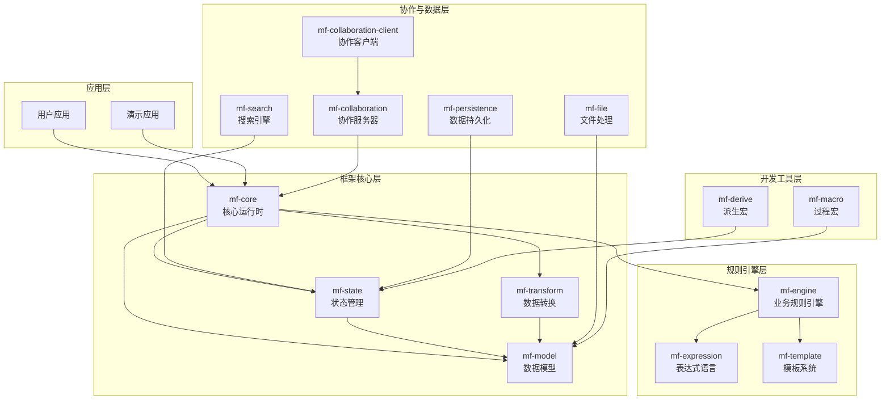
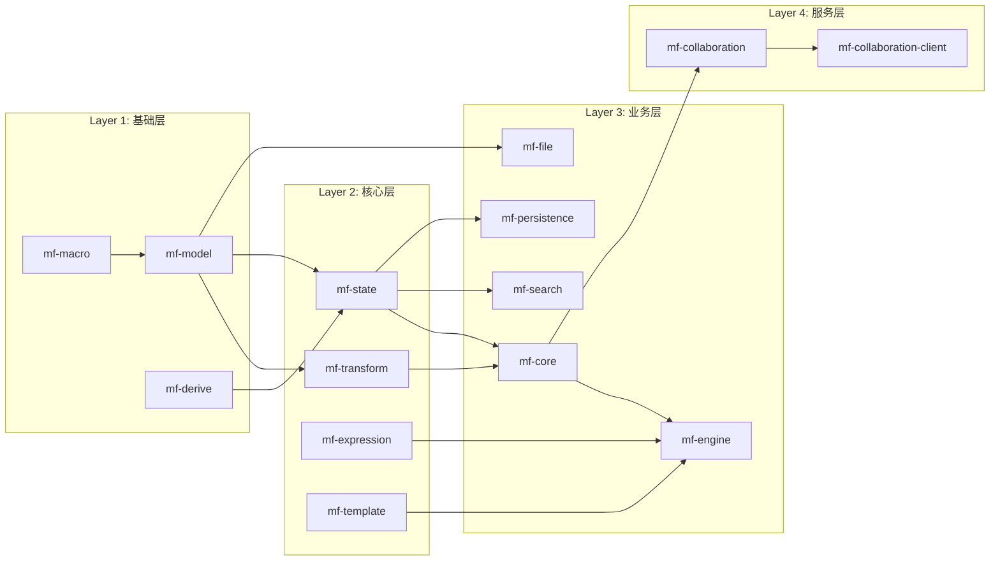
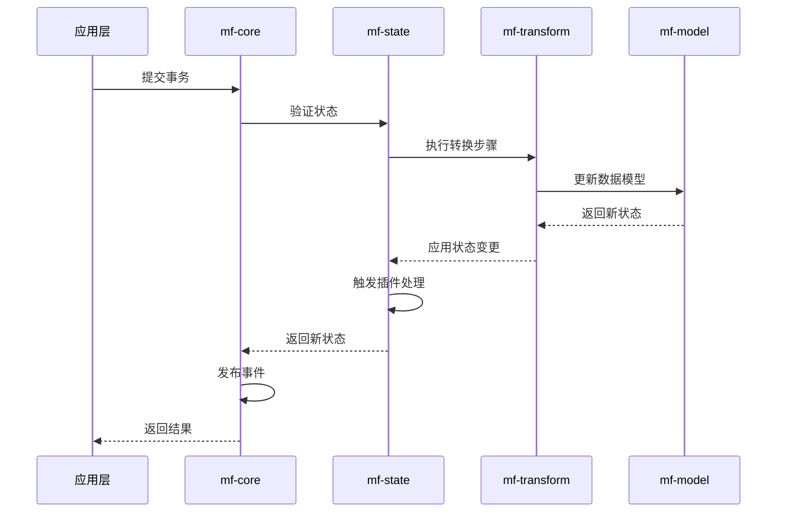
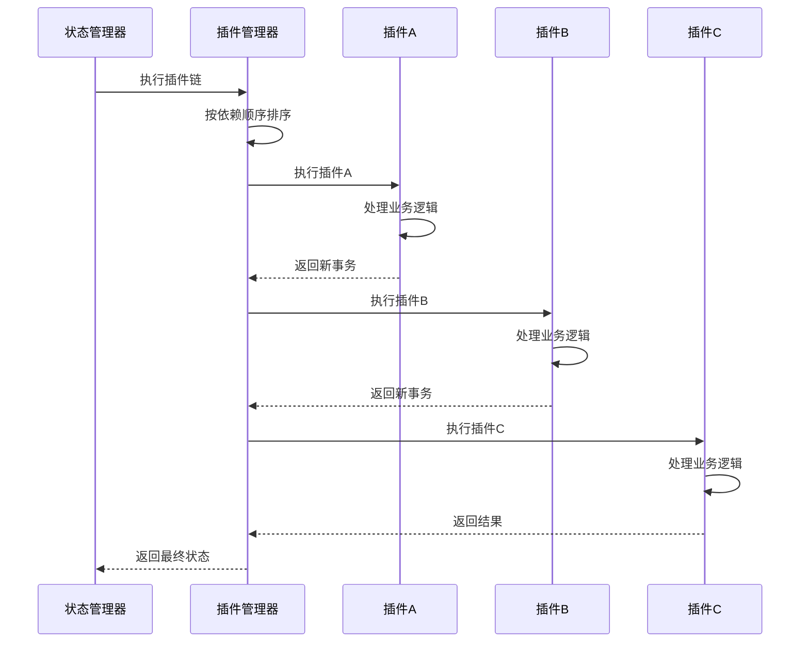

# ModuForge-RS 架构概览

## 🏗️ 总体架构

ModuForge-RS 是一个模块化的 Rust 框架，由 14 个核心 crates 组成，每个 crate 都有明确的职责和边界。

## 📦 Crates 详细说明

### 核心架构层

#### 🎯 mf-core - 核心运行时
**职责**: 框架的核心运行时环境，提供异步处理、事件系统、扩展管理等基础功能。

**关键组件**:
- `ForgeAsyncRuntime`: 异步运行时管理器
- `Extension`: 扩展系统
- `Middleware`: 中间件支持
- `EventSystem`: 事件驱动架构
- `HistoryManager`: 历史记录管理

**主要特性**:
- 异步任务调度和管理
- 插件和扩展的生命周期管理
- 事件发布订阅机制
- 中间件处理链
- 历史记录和撤销重做

#### 🏪 mf-state - 状态管理
**职责**: 应用状态的集中管理，包括插件状态、资源管理、事务处理。

**关键组件**:
- `State`: 全局状态容器
- `PluginManager`: 插件管理器
- `ResourceManager`: 资源管理器
- `Transaction`: 事务处理
- `DependencyManager`: 依赖管理

**主要特性**:
- 不可变状态管理
- 插件状态隔离
- 智能依赖管理（循环依赖检测、缺失依赖验证）
- 插件冲突检测
- 线程安全的资源共享

#### 🔄 mf-transform - 数据转换
**职责**: 定义和执行数据转换操作，提供事务性的数据变更能力。

**关键组件**:
- `Step`: 原子操作步骤
- `AddNodeStep`: 节点添加操作
- `AttrStep`: 属性修改操作
- `MarkStep`: 标记操作
- `BatchStep`: 批量操作

**主要特性**:
- ACID 事务保证
- 原子操作定义
- 操作的撤销和重做
- 批量操作优化
- 操作历史追踪

#### 🧬 mf-model - 数据模型
**职责**: 定义框架的核心数据结构，包括节点、标记、属性等。

**关键组件**:
- `Node`: 树形节点结构
- `Mark`: 节点标记系统
- `Attrs`: 属性系统
- `Schema`: 模式定义
- `Tree`: 树形结构操作

**主要特性**:
- 不可变数据结构（基于 im-rs）
- 高效的结构共享
- 类型安全的属性系统
- 灵活的标记系统
- 树形结构的高效操作

### 规则引擎层

#### ⚙️ mf-engine - 业务规则引擎
**职责**: 提供强大的业务规则执行引擎，支持决策表、决策图等多种规则形式。

**关键组件**:
- `Engine`: 规则引擎核心
- `Decision`: 决策处理器
- `GraphHandler`: 决策图处理
- `TableHandler`: 决策表处理
- `Loader`: 规则加载器

**主要特性**:
- 支持 GoRules JDM 标准
- 多种规则格式支持
- 规则缓存和优化
- 自定义函数扩展
- 规则验证和调试

#### 📝 mf-expression - 表达式语言
**职责**: 高性能的表达式解析和执行引擎，支持 WASM 编译。

**关键组件**:
- `Expression`: 表达式编译器
- `Lexer`: 词法分析器
- `Parser`: 语法分析器
- `VM`: 虚拟机执行器
- `Variable`: 变量系统

**主要特性**:
- 高性能表达式执行
- WASM 编译支持
- 丰富的内置函数
- 类型推导和检查
- 自定义函数注册

#### 🎨 mf-template - 模板系统
**职责**: 模板解析和渲染引擎，支持动态内容生成。

**关键组件**:
- `Interpreter`: 模板解释器
- `Lexer`: 模板词法分析
- `Parser`: 模板语法解析

**主要特性**:
- 模板语法解析
- 动态内容渲染
- 变量和表达式支持
- 控制流语句支持

### 协作与数据层

#### 🤝 mf-collaboration - 协作服务器
**职责**: 实时协作功能的服务器端实现，基于 CRDT 技术。

**关键组件**:
- `SyncService`: 同步服务
- `YrsManager`: Yrs CRDT 管理器
- `WebSocketServer`: WebSocket 服务器

**主要特性**:
- 基于 Yrs CRDT 的冲突解决
- WebSocket 实时通信
- 多用户会话管理
- 状态同步机制

#### 👥 mf-collaboration-client - 协作客户端
**职责**: 协作功能的客户端实现，提供状态映射和同步能力。

**关键组件**:
- `CollaborationClient`: 协作客户端
- `Mapping`: 状态映射器
- `TypedConverter`: 类型转换器

**主要特性**:
- 文档状态到协作状态的映射
- 实时状态同步
- 类型安全的状态转换
- 连接管理和重连机制

#### 📁 mf-file - 文件处理
**职责**: 文档的序列化、反序列化和文件格式支持。

**关键组件**:
- `Document`: 文档抽象
- `ZipDocWriter/Reader`: ZIP 文档处理
- `FormatStrategy`: 格式策略（JSON、CBOR、MessagePack）

**主要特性**:
- 多种序列化格式支持
- ZIP 压缩文档格式
- 增量导入导出
- 格式转换和兼容性

#### 🔍 mf-search - 搜索引擎
**职责**: 全文搜索和索引功能，支持复杂查询。

**关键组件**:
- `SearchService`: 搜索服务
- `Indexer`: 索引构建器
- `QueryParser`: 查询解析器

**主要特性**:
- 全文索引构建
- 复杂查询语法支持
- 结果排序和过滤
- 实时索引更新

#### 💾 mf-persistence - 数据持久化
**职责**: 数据持久化和恢复机制，支持多种存储后端。

**关键组件**:
- `SqlitePersistence`: SQLite 持久化
- `RecoveryManager`: 数据恢复管理器
- `EventSubscriber`: 事件订阅器

**主要特性**:
- 多存储后端支持
- 自动快照和恢复
- 增量持久化
- 事务日志记录

### 开发工具层

#### 🔧 mf-macro - 过程宏
**职责**: 提供过程宏定义，简化节点、插件、扩展的定义。

**主要宏**:
- `#[node]`: 节点定义宏
- `#[mark]`: 标记定义宏
- `#[plugin]`: 插件定义宏
- `#[extension]`: 扩展定义宏

#### 📋 mf-derive - 派生宏
**职责**: 提供派生宏，自动生成常用的 trait 实现。

**主要派生**:
- 依赖注入相关派生
- 序列化相关派生
- 状态管理相关派生

## 🔗 依赖关系图

## 🚀 数据流架构

### 1. 事务处理流程

### 2. 插件执行流程

## 💡 核心设计原则

### 1. 不可变性 (Immutability)
- 所有数据结构基于 `im-rs` 实现
- 使用 `Arc` 进行引用计数和共享
- 写时复制（Copy-on-Write）优化

### 2. 事件驱动 (Event-Driven)
- 所有状态变更都通过事件传播
- 异步事件处理和订阅机制
- 事件溯源和重放支持

### 3. 插件化 (Plugin Architecture)
- 高度模块化的插件系统
- 智能依赖管理和冲突检测
- 插件间的解耦和通信

### 4. 类型安全 (Type Safety)
- 利用 Rust 的类型系统保证安全性
- 编译时检查和错误预防
- 泛型和 trait 的广泛使用

### 5. 异步优先 (Async First)
- 基于 Tokio 的异步运行时
- 非阻塞 I/O 和并发处理
- 背压控制和资源管理

## 🎯 适用场景

### ✅ 非常适合的场景
1. **复杂文档编辑器**
   - 富文本编辑器
   - 代码编辑器
   - 协同文档编辑

2. **业务规则引擎**
   - 计费系统
   - 风控系统
   - 决策支持系统

3. **数据处理管道**
   - ETL 系统
   - 实时数据流处理
   - 大数据分析

4. **内容管理系统**
   - CMS 系统
   - 知识库管理
   - 版本控制系统

### ⚠️ 需要谨慎考虑的场景
1. **简单 CRUD 应用** - 可能过度设计
2. **实时游戏系统** - 延迟要求极高的场景
3. **资源受限环境** - 内存和 CPU 限制严格的场景

## 📈 性能特性

### 内存使用
- **结构共享**: 不可变数据结构的高效共享
- **引用计数**: Arc/Rc 的智能内存管理
- **惰性计算**: 按需加载和计算

### 并发性能
- **无锁数据结构**: 基于不可变性的并发安全
- **异步处理**: 高并发异步任务处理
- **工作窃取**: Tokio 运行时的高效调度

### 扩展性能
- **插件隔离**: 插件间的性能隔离
- **增量更新**: 最小化状态变更的影响
- **缓存优化**: 智能缓存和失效策略

---

这个架构概览为开发者提供了 ModuForge-RS 框架的全景视图，帮助理解各个组件的职责和相互关系，以及如何根据具体需求选择合适的组件组合。