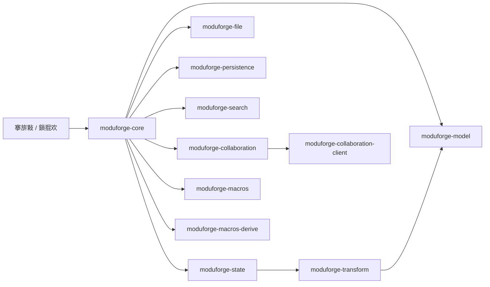

# ModuForge-RS 鏋舵瀯姒傝

ModuForge-RS 鏄洿缁曚笉鍙彉鏍戝舰鏁版嵁鏋勫缓鐨?Rust 宸ヤ綔鍖恒€傚畠灏嗚繍琛屾椂銆佸崗浣溿€佹寔涔呭寲鍜屽伐鍏烽摼鎵撳寘鍦ㄤ竴璧凤紝鍙互鍦ㄤ笉鑰﹀悎涓氬姟鐨勫墠鎻愪笅蹇€熸惌寤虹紪杈戝櫒鍐呮牳鎴栭鍩熻繍琛屾椂銆?
## 妯″潡鍒嗗眰

- **杩愯鏃跺眰**锛歚moduforge-core` 姹囪仛杩愯鏃躲€佷簨浠躲€佷腑闂翠欢銆佸巻鍙蹭笌绯荤粺璧勬簮鎺㈡祴銆?- **鐘舵€佷笌浜嬪姟灞?*锛歚moduforge-state`銆乣moduforge-transform` 绠＄悊涓嶅彲鍙樼姸鎬併€佹彃浠剁敓鍛藉懆鏈熶笌 Step/Transaction 娴佹按绾裤€?- **鏁版嵁妯″瀷灞?*锛歚moduforge-model` 瀹氫箟鑺傜偣銆佹爣璁般€佸睘鎬с€丼chema 涓庤妭鐐规睜銆?- **鍗忎綔涓庡瓨鍌ㄥ眰**锛歚moduforge-collaboration`銆乣moduforge-collaboration-client`銆乣moduforge-file`銆乣moduforge-persistence`銆乣moduforge-search` 鎻愪緵鍗忎綔銆佹枃浠舵牸寮忋€佷簨浠跺瓨鍌ㄥ拰鍏ㄦ枃妫€绱€?- **寮€鍙戣緟鍔╁眰**锛歚moduforge-macros`銆乣moduforge-macros-derive`銆乣tools/benchmark-coordinator`銆乣packages/docs` 绛夊伐鍏风敤浜庤嚜鍔ㄥ寲涓庣煡璇嗘矇娣€銆?

## 鍏抽敭 crate

### moduforge-core 鈥?杩愯鏃朵笌鎵╁睍
- **鑱岃矗**锛氱粺涓€杩愯鏃躲€佷簨浠剁郴缁熴€佹墿灞?涓棿浠躲€佸巻鍙茶褰曘€佺郴缁熻祫婧愭帰娴嬨€?- **甯哥敤 API**锛歚ForgeAsyncRuntime::create_with_config`銆乣ForgeRuntime::dispatch`銆乣ForgeRuntime::command`銆乣HistoryManager::undo`銆乣RuntimeOptions::set_content`銆?- **浜偣**锛氬悓姝?寮傛/Actor 涓夌鎵ц妯″紡銆佷簨浠舵€荤嚎銆佸彲缁勫悎鐨勪腑闂翠欢銆佸巻鍙插揩鐓с€佺郴缁熻祫婧愯嚜閫傚簲銆?
### moduforge-state 鈥?鐘舵€佷笌鎻掍欢
- **鑱岃矗**锛氱淮鎶や笉鍙彉鐘舵€併€佹彃浠剁敓鍛藉懆鏈熴€佽祫婧愯〃涓庢棩蹇楃郴缁熴€?- **甯哥敤 API**锛歚State::create`銆乣State::tr`銆乣Transaction::add_step`銆乣init_logging`銆?- **浜偣**锛氭彃浠堕殧绂讳笌渚濊禆妫€娴嬨€佺嚎绋嬪畨鍏ㄧ殑璧勬簮鍏变韩銆佷簨鍔″墠鍚庨挬瀛愩€?
### moduforge-transform 鈥?Step/Transaction 绠＄嚎
- **鑱岃矗**锛氬畾涔?Step 骞朵互浜嬪姟褰㈠紡鎵ц锛屼繚璇佸彲鍥炴斁涓庢挙閿€銆?- **甯哥敤 API**锛歚Transaction::add_step`銆乣AddNodeStep::new_single`銆乣AttrStep::new`銆乣BatchStep::new`銆?- **浜偣**锛氬師瀛愭搷浣溿€佹壒閲忎紭鍖栥€佽ˉ涓佸悎鎴愶紝涓庣储寮?鎸佷箙鍖栧崗浣滅揣瀵嗐€?
### moduforge-model 鈥?鏁版嵁妯″瀷
- **鑱岃矗**锛氭彁渚涜妭鐐广€佹爣璁般€佸睘鎬с€丼chema銆佽妭鐐规睜涓庢爲鎿嶄綔銆?- **甯哥敤 API**锛歚Node::new`銆乣Mark::new`銆乣Attrs::set`銆乣Schema::new`銆乣NodePool::default`銆?- **浜偣**锛氬熀浜?`imbl` 鐨勭粨鏋勫叡浜€佸唴瀹圭害鏉熸牎楠屻€佺伒娲荤殑鏍囪涓庡睘鎬х郴缁熴€?
## 鍗忎綔涓庣敓鎬?
### moduforge-collaboration / moduforge-collaboration-client
- Warp + Yrs WebSocket 鏈嶅姟涓庡鎴风宸ュ叿锛屾彁渚涙埧闂寸鐞嗐€佸仴搴锋鏌ャ€丄wareness 鍚屾銆?
### moduforge-file
- Append-only 鏂囦欢鏍煎紡銆乑ip 瀵煎叆瀵煎嚭銆佸巻鍙插抚缂栬В鐮併€丅lake3 鏍￠獙銆?
### moduforge-persistence
- 浜嬩欢瀛樺偍涓庡揩鐓ф帴鍙ｏ紝榛樿瀹炵幇涓?SQLite + WAL锛沗CommitMode` 鍙皟涓€鑷存€с€?
### moduforge-search
- 鍩轰簬 Tantivy 鐨勫閲忕储寮曪紝閫氳繃 `IndexEvent` 灏?Step/Transaction 鎶曞皠鍒版悳绱㈠簱銆?
## 寮€鍙戣緟鍔?- **moduforge-macros**锛歚mf_extension!`銆乣mf_plugin!`銆乣#[impl_command]`銆乣mf_ops!` 绛夊０鏄庡紡瀹忋€?- **moduforge-macros-derive**锛歚#[derive(Node)]`銆乣#[derive(Mark)]`銆乣#[derive(PState)]` 鍦ㄧ紪璇戞湡鐢熸垚绫诲瀷杞崲銆?- **宸ュ叿涓庣ず渚?*锛歚examples/`銆乣schema/`銆乣tools/benchmark-coordinator/`銆乣packages/docs` 瑕嗙洊钀藉湴銆佸熀鍑嗕笌鏂囨。闇€姹傘€?
## 鍏稿瀷鍦烘櫙
- 鏋勫缓澶у瀷鏍戝舰/鍥惧舰鏁版嵁缂栬緫鍣ㄣ€?- 闇€瑕佷簨鍔°€佹挙閿€/閲嶅仛銆佸巻鍙插洖鏀剧殑涓氬姟杩愯鏃躲€?- 绂荤嚎浼樺厛鎴栧急缃戝悓姝ュ満鏅紝閫氳繃浜嬩欢鍥炴斁鎴?CRDT 鍚堝苟鐘舵€併€?- 闇€瑕佸崗浣溿€佸叏鏂囨绱€佹彃浠跺寲鎵╁睍鐨勪紒涓氱郴缁熴€?
鍑€熷垎灞傛灦鏋勪笌澹版槑寮忔墿灞曪紝ModuForge-RS 鑳藉鍦ㄥ悓涓€濂楀唴鏍镐笂鏀拺妗岄潰銆乄eb銆佹湇鍔＄绛夊绉嶈繍琛屾ā寮忥紝骞朵繚鎸侀珮鍙淮鎶ゆ€т笌楂樿凯浠ｆ晥鐜囥€?
