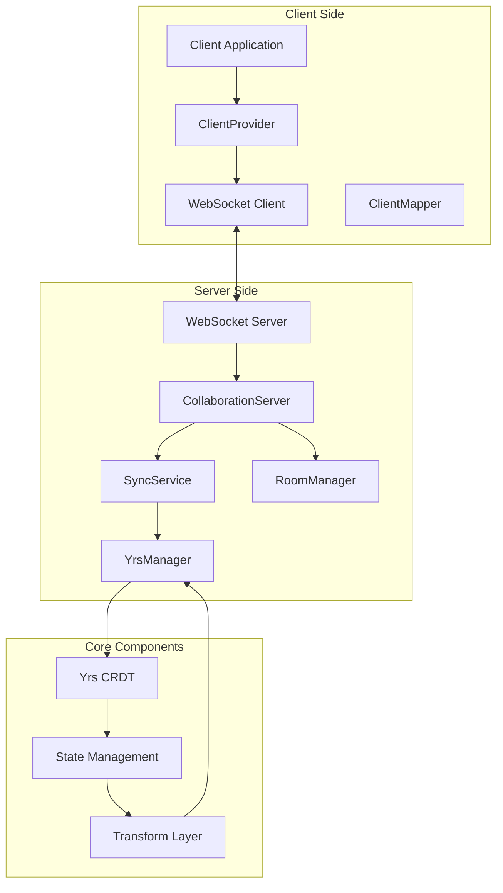
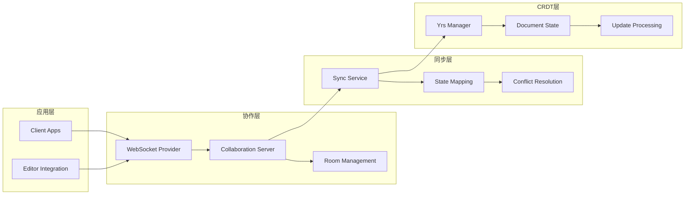

# ModuForge-RS 协作系统

## 概述

ModuForge-RS 协作系统是一个基于 WebSocket 和 Yrs CRDT 的实时协作文档编辑解决方案。该系统支持多用户同时编辑文档，提供冲突解决、实时同步和状态管理功能。

## 系统架构

### 架构图



### 组件层次



## 核心组件

### 1. 服务端组件 (moduforge-collaboration)

#### CollaborationServer
协作服务器的主要入口点，负责管理 WebSocket 连接和房间。

```rust
use moduforge_collaboration::{CollaborationServer, ServerConfig};

// 创建协作服务器
let config = ServerConfig {
    host: "0.0.0.0".to_string(),
    port: 8080,
    max_connections: 1000,
    heartbeat_interval: Duration::from_secs(30),
};

let server = CollaborationServer::new(config).await?;
server.start().await?;
```

#### SyncService
处理文档同步逻辑，包括状态映射和冲突解决。

```rust
use moduforge_collaboration::SyncService;
use moduforge_state::State;

let sync_service = SyncService::new();

// 处理状态更新
let updated_state = sync_service.apply_update(
    room_id,
    client_id,
    update_data,
    current_state
).await?;
```

#### YrsManager
管理 Yrs CRDT 文档实例和更新处理。

```rust
use moduforge_collaboration::YrsManager;

let yrs_manager = YrsManager::new();

// 创建新文档
let doc_id = yrs_manager.create_document("room_1").await?;

// 应用更新
yrs_manager.apply_update(doc_id, update_vector).await?;

// 获取文档状态
let doc_state = yrs_manager.get_document_state(doc_id).await?;
```

#### WebSocket 服务器
处理 WebSocket 连接和消息路由。

```rust
use moduforge_collaboration::WebSocketServer;

let ws_server = WebSocketServer::new()
    .with_handler(collaboration_handler)
    .with_middleware(auth_middleware);

ws_server.listen("0.0.0.0:8080").await?;
```

### 2. 客户端组件 (moduforge-collaboration-client)

#### WebsocketProvider
客户端 WebSocket 连接提供者。

```rust
use moduforge_collaboration_client::{WebsocketProvider, ProviderConfig};

let config = ProviderConfig {
    url: "ws://localhost:8080".to_string(),
    room_id: "room_1".to_string(),
    user_id: "user_123".to_string(),
    reconnect_attempts: 5,
};

let provider = WebsocketProvider::new(config).await?;
provider.connect().await?;
```

#### ClientConn
管理客户端连接状态和消息处理。

```rust
use moduforge_collaboration_client::ClientConn;

let conn = ClientConn::new(websocket_stream);

// 发送更新
conn.send_update(update_data).await?;

// 接收更新
let update = conn.receive_update().await?;
```

#### 状态映射
在 ModuForge 状态和 Yrs 文档之间进行映射。

```rust
use moduforge_collaboration_client::mapping::StateMapper;

let mapper = StateMapper::new();

// 将 ModuForge 状态转换为 Yrs 更新
let yrs_update = mapper.state_to_yrs(&moduforge_state)?;

// 将 Yrs 更新转换为 ModuForge 状态
let moduforge_state = mapper.yrs_to_state(&yrs_update)?;
```

## API 接口

### WebSocket 消息协议

#### 连接建立
```json
{
  "type": "connect",
  "room_id": "room_1",
  "user_id": "user_123",
  "client_id": "client_abc"
}
```

#### 文档更新
```json
{
  "type": "update",
  "room_id": "room_1",
  "client_id": "client_abc",
  "update": "<binary_yrs_update>",
  "timestamp": 1640995200000
}
```

#### 状态同步
```json
{
  "type": "sync",
  "room_id": "room_1",
  "state_vector": "<binary_state_vector>",
  "document_state": "<binary_document_state>"
}
```

#### 用户加入/离开
```json
{
  "type": "user_joined",
  "room_id": "room_1",
  "user_id": "user_456",
  "timestamp": 1640995200000
}
```

### REST API 端点

#### 房间管理
- `POST /api/rooms` - 创建房间
- `GET /api/rooms/{room_id}` - 获取房间信息
- `DELETE /api/rooms/{room_id}` - 删除房间
- `GET /api/rooms/{room_id}/users` - 获取房间用户列表

#### 文档管理
- `GET /api/rooms/{room_id}/document` - 获取文档状态
- `POST /api/rooms/{room_id}/document/snapshot` - 创建文档快照
- `GET /api/rooms/{room_id}/document/history` - 获取文档历史

## 使用示例

### 基本协作设置

#### 服务端设置
```rust
use moduforge_collaboration::{CollaborationServer, ServerConfig};
use tokio;

#[tokio::main]
async fn main() -> Result<(), Box<dyn std::error::Error>> {
    // 初始化服务器配置
    let config = ServerConfig {
        host: "0.0.0.0".to_string(),
        port: 8080,
        max_connections: 1000,
        heartbeat_interval: Duration::from_secs(30),
        document_timeout: Duration::from_secs(3600),
    };

    // 创建协作服务器
    let server = CollaborationServer::new(config).await?;
    
    // 启动服务器
    println!("协作服务器启动在 {}:{}", config.host, config.port);
    server.start().await?;
    
    Ok(())
}
```

#### 客户端集成
```rust
use moduforge_collaboration_client::{WebsocketProvider, ProviderConfig};
use moduforge_state::{Editor, State};

async fn setup_collaborative_editor() -> Result<Editor, Box<dyn std::error::Error>> {
    // 创建编辑器
    let editor = Editor::new().await?;
    
    // 配置协作提供者
    let provider_config = ProviderConfig {
        url: "ws://localhost:8080".to_string(),
        room_id: "document_1".to_string(),
        user_id: "user_123".to_string(),
        reconnect_attempts: 5,
    };
    
    // 创建协作提供者
    let provider = WebsocketProvider::new(provider_config).await?;
    
    // 连接到协作服务器
    provider.connect().await?;
    
    // 设置更新处理
    provider.on_update(|update| {
        // 应用远程更新到编辑器
        editor.apply_remote_update(update);
    });
    
    // 监听编辑器变更
    editor.on_transaction(|transaction| {
        // 发送本地变更到协作服务器
        provider.send_update(transaction.to_update());
    });
    
    Ok(editor)
}
```

### 高级功能示例

#### 自定义冲突解决
```rust
use moduforge_collaboration::conflict::{ConflictResolver, ResolutionStrategy};

let resolver = ConflictResolver::new()
    .with_strategy(ResolutionStrategy::LastWriterWins)
    .with_custom_resolver(|conflict| {
        // 自定义冲突解决逻辑
        match conflict.conflict_type {
            ConflictType::TextEdit => resolve_text_conflict(conflict),
            ConflictType::NodeStructure => resolve_structure_conflict(conflict),
            _ => ConflictResolution::UseRemote,
        }
    });
```

#### 实时光标和选择
```rust
use moduforge_collaboration_client::awareness::{Awareness, CursorInfo};

let awareness = Awareness::new();

// 设置本地光标位置
awareness.set_local_cursor(CursorInfo {
    user_id: "user_123".to_string(),
    position: 42,
    selection_start: 40,
    selection_end: 45,
    color: "#ff0000".to_string(),
});

// 监听远程光标变更
awareness.on_cursor_change(|user_id, cursor| {
    println!("用户 {} 的光标位置: {}", user_id, cursor.position);
});
```

#### 房间权限管理
```rust
use moduforge_collaboration::auth::{Permission, RoomPermissions};

let permissions = RoomPermissions::new()
    .grant_user("user_123", Permission::Read | Permission::Write)
    .grant_user("user_456", Permission::Read)
    .deny_user("user_789", Permission::Write);

server.set_room_permissions("room_1", permissions);
```

## 技术栈

### 核心技术
- **Yrs**: Rust 实现的 Y.js CRDT 库
- **Tokio**: 异步运行时
- **WebSocket**: 实时通信协议
- **Serde**: 序列化和反序列化

### 依赖项
```toml
[dependencies]
# 协作核心
yrs = "0.18"
tokio = { version = "1.0", features = ["full"] }
tokio-tungstenite = "0.20"

# ModuForge 核心
moduforge-core = "0.4.8"
moduforge-state = "0.4.8"
moduforge-model = "0.4.8"

# 实用工具
serde = { version = "1.0", features = ["derive"] }
serde_json = "1.0"
uuid = { version = "1.0", features = ["v4"] }
chrono = "0.4"
dashmap = "6.1"
```

## 性能特性

### 内存使用
- **增量更新**: 仅传输和存储文档变更
- **状态压缩**: 自动压缩历史状态
- **内存池**: 复用缓冲区减少分配

### 网络优化
- **二进制协议**: 使用 Yrs 的二进制更新格式
- **批量处理**: 合并多个小更新
- **压缩传输**: WebSocket 压缩支持

### 并发处理
- **异步处理**: 全异步架构
- **房间隔离**: 每个房间独立处理
- **连接池**: 高效的连接管理

## 安全考虑

### 身份验证
- JWT 令牌验证
- 会话管理
- 用户权限检查

### 数据验证
- 输入验证和清理
- 恶意更新检测
- 速率限制

### 网络安全
- WSS 加密传输
- CORS 配置
- DDoS 防护

## 故障排除

### 常见问题

#### 连接问题
```rust
// 检查连接状态
if !provider.is_connected() {
    println!("连接断开，尝试重连...");
    provider.reconnect().await?;
}
```

#### 同步问题
```rust
// 强制同步
provider.force_sync().await?;

// 检查同步状态
let sync_status = provider.get_sync_status();
println!("同步状态: {:?}", sync_status);
```

#### 内存泄漏
```rust
// 定期清理
server.cleanup_expired_rooms().await;
server.cleanup_disconnected_clients().await;
```

### 日志配置
```rust
use tracing_subscriber;

tracing_subscriber::fmt()
    .with_env_filter("moduforge_collaboration=debug")
    .init();
```

## 部署指南

### Docker 部署
```dockerfile
FROM rust:1.75 as builder
WORKDIR /app
COPY . .
RUN cargo build --release --bin collaboration-server

FROM debian:bookworm-slim
RUN apt-get update && apt-get install -y ca-certificates
COPY --from=builder /app/target/release/collaboration-server /usr/local/bin/
EXPOSE 8080
CMD ["collaboration-server"]
```

### Kubernetes 部署
```yaml
apiVersion: apps/v1
kind: Deployment
metadata:
  name: collaboration-server
spec:
  replicas: 3
  selector:
    matchLabels:
      app: collaboration-server
  template:
    metadata:
      labels:
        app: collaboration-server
    spec:
      containers:
      - name: collaboration-server
        image: moduforge/collaboration-server:latest
        ports:
        - containerPort: 8080
        env:
        - name: HOST
          value: "0.0.0.0"
        - name: PORT
          value: "8080"
        resources:
          limits:
            memory: "512Mi"
            cpu: "500m"
```

### 负载均衡配置
```nginx
upstream collaboration_servers {
    server collaboration-server-1:8080;
    server collaboration-server-2:8080;
    server collaboration-server-3:8080;
}

server {
    listen 80;
    
    location /ws {
        proxy_pass http://collaboration_servers;
        proxy_http_version 1.1;
        proxy_set_header Upgrade $http_upgrade;
        proxy_set_header Connection "upgrade";
        proxy_set_header Host $host;
        proxy_set_header X-Real-IP $remote_addr;
    }
}
```

## 监控和指标

### 内置指标
- 活跃连接数
- 房间数量
- 消息处理速率
- 内存使用情况
- 错误率

### Prometheus 集成
```rust
use prometheus::{Counter, Histogram, register_counter, register_histogram};

let message_counter = register_counter!(
    "collaboration_messages_total",
    "Total number of collaboration messages"
)?;

let latency_histogram = register_histogram!(
    "collaboration_message_duration_seconds",
    "Message processing duration"
)?;
```

## 扩展开发

### 自定义提供者
```rust
use moduforge_collaboration_client::{Provider, ProviderTrait};

#[derive(Debug)]
struct CustomProvider {
    // 自定义提供者实现
}

#[async_trait::async_trait]
impl ProviderTrait for CustomProvider {
    async fn connect(&self) -> Result<(), ProviderError> {
        // 自定义连接逻辑
    }
    
    async fn send_update(&self, update: Vec<u8>) -> Result<(), ProviderError> {
        // 自定义更新发送逻辑
    }
}
```

### 中间件开发
```rust
use moduforge_collaboration::middleware::{Middleware, MiddlewareContext};

#[derive(Debug)]
struct LoggingMiddleware;

#[async_trait::async_trait]
impl Middleware for LoggingMiddleware {
    async fn before_message(
        &self,
        ctx: &MiddlewareContext,
        message: &mut Message
    ) -> Result<(), MiddlewareError> {
        println!("处理消息: {:?}", message);
        Ok(())
    }
}
```

## 总结

ModuForge-RS 协作系统提供了完整的实时协作编辑解决方案，具有以下优势：

- **高性能**: 基于 Rust 和异步架构
- **类型安全**: 完整的类型检查和验证
- **可扩展**: 灵活的插件和中间件系统
- **实时性**: 低延迟的实时同步
- **一致性**: 基于 CRDT 的强一致性保证
- **可部署**: 支持多种部署方式和扩展策略

该系统适用于文档编辑器、代码编辑器、设计工具等需要实时协作功能的应用场景。 