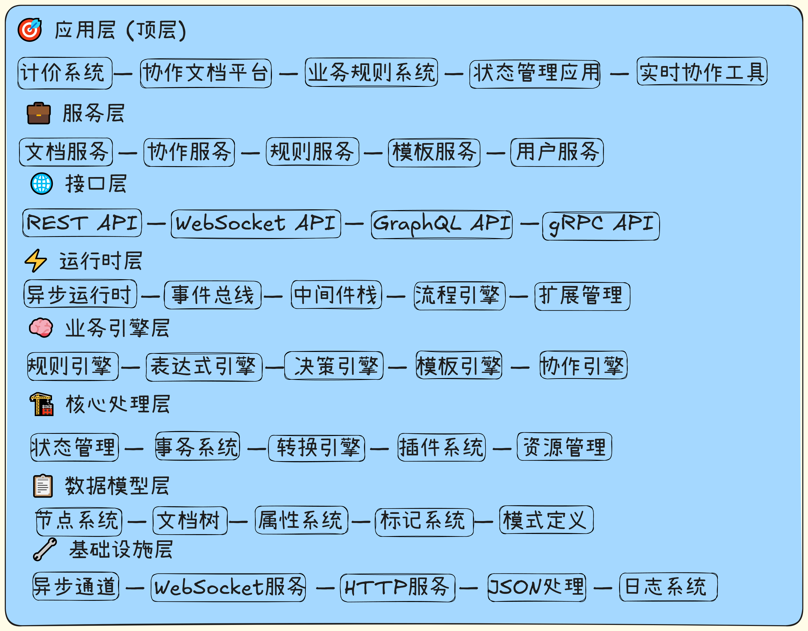
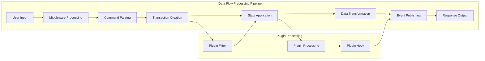
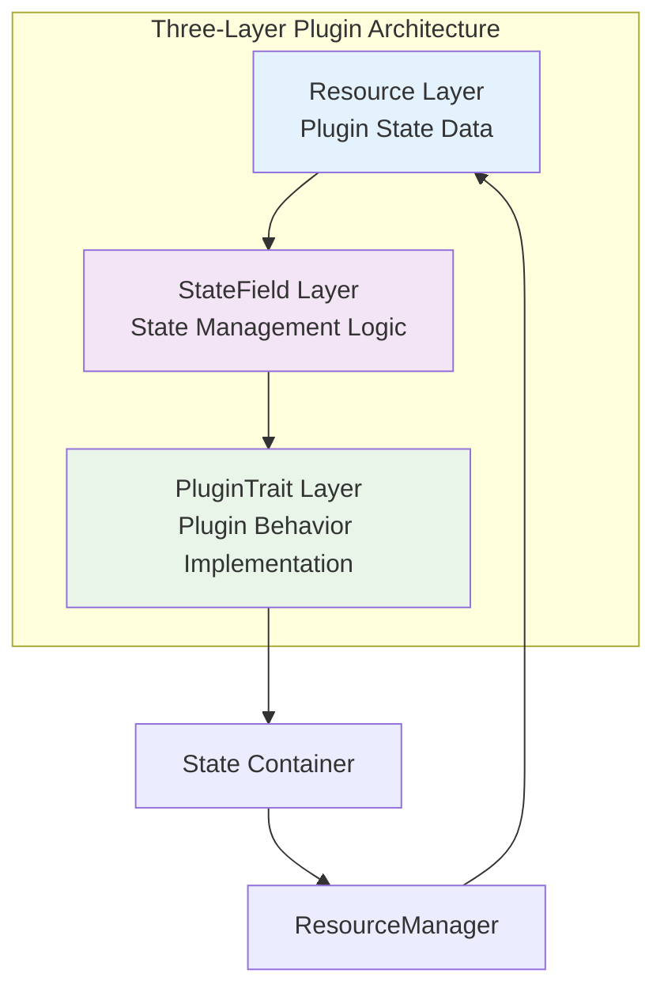
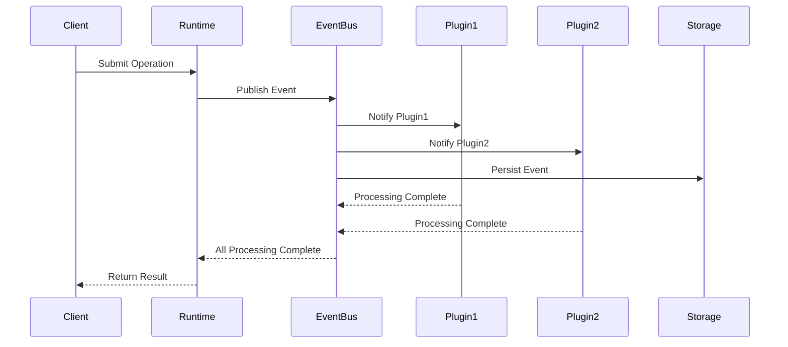

# ModuForge-RS Architecture Design Documentation

## Overview

ModuForge-RS is a modern state management and data transformation framework based on Rust, featuring immutable data structures and event-driven architecture. The framework provides complete plugin system, middleware support, rules engine integration, and collaboration capabilities.

## Core Design Principles

- **Immutability**: Persistent data structures based on `im-rs`
- **Event-Driven**: All state changes are notified through event system
- **Modularity**: 8 independent crates, each with specific responsibilities
- **Async-First**: High-performance async processing based on Tokio
- **Plugin-Based**: Three-layer plugin architecture for flexible extension
- **Type Safety**: Leveraging Rust type system for safety guarantees

## Layered Architecture Diagram

### Official Architecture Diagram


The diagram above shows the complete layered architecture of ModuForge-RS, with 8 distinct layers from application layer to infrastructure layer, clearly demonstrating the dependencies between components.

### Detailed Architecture Layers

#### 🎯 Application Layer (Top Layer)
The application layer contains specific business applications built on ModuForge-RS:

- **Pricing System**: Dynamic pricing application based on rules engine
- **Collaborative Document Platform**: Real-time collaborative document editing platform
- **Business Rules System**: Enterprise-level business rule management and execution system
- **State Management Application**: Enterprise applications with complex state management
- **Real-time Collaboration Tools**: Real-time collaboration tools based on CRDT

#### 💼 Service Layer
The service layer encapsulates various business services, providing unified business interfaces for upper layers:

- **Document Service**: Document creation, editing, storage, and retrieval services
- **Collaboration Service**: Real-time collaboration, conflict resolution, and sync services
- **Rules Service**: Business rule definition, validation, and execution services
- **Template Service**: Template management and rendering services
- **User Service**: User authentication, authorization, and management services

#### 🌐 Interface Layer
The interface layer provides multiple API interfaces supporting different client access methods:

- **REST API**: Standard HTTP RESTful interface
- **WebSocket API**: Real-time bidirectional communication interface for collaboration features
- **GraphQL API**: Flexible query interface for client-side data fetching on demand
- **gRPC API**: High-performance RPC interface suitable for microservice architecture

#### ⚡ Runtime Layer
The runtime layer is the core execution environment of the framework, managing the entire system's runtime state:

- **Async Runtime (AsyncRuntime)**: High-performance async executor based on Tokio
- **Event Bus (EventBus)**: Decoupled event distribution and processing system
- **Middleware Stack (MiddlewareStack)**: Configurable request/response processing pipeline
- **Flow Engine (FlowEngine)**: Orchestration and execution of complex business processes
- **Extension Manager (ExtensionManager)**: Dynamic loading and management of plugins and extensions

#### 🧠 Business Engine Layer
The business engine layer contains various specialized business processing engines:

- **Rules Engine**: Business rule processing based on GoRules JDM standard
- **Expression Engine**: High-performance expression evaluation system
- **Decision Engine**: Execution and management of complex decision logic
- **Template Engine**: Dynamic template rendering and content generation
- **Collaboration Engine**: Real-time collaboration processing based on CRDT

#### 🏗️ Core Processing Layer
The core processing layer implements the framework's core data processing logic:

- **State Manager**: Management and version control of immutable state
- **Transaction System**: ACID-compatible transaction processing
- **Transform Engine**: Efficient data transformation and operations
- **Plugin System**: Implementation of three-layer plugin architecture
- **Resource Manager**: Lifecycle management of global resources

#### 📋 Data Model Layer
The data model layer defines the core data structures used in the framework:

- **Node System**: Hierarchical document node structure
- **Document Tree**: Representation and manipulation of tree-structured documents
- **Attributes System**: Type-safe attribute management
- **Marks System**: Document formatting and style marks
- **Schema Definition**: Document structure validation and constraints

#### 🔧 Infrastructure Layer
The infrastructure layer provides the basic technical infrastructure required for framework operation:

- **Async Channels**: High-performance asynchronous message passing
- **WebSocket Service**: Real-time WebSocket connection management
- **HTTP Service**: HTTP server and client implementation
- **JSON Processing**: Efficient JSON serialization and deserialization
- **Logging System**: Structured logging and monitoring

## In-depth Technical Architecture Analysis

### Data Flow Processing Architecture

The following diagram shows the data flow processing in ModuForge-RS:



### Plugin System Architecture

ModuForge-RS adopts a three-layer plugin architecture design, achieving high modularity and extensibility:



### Event-Driven Architecture

The event system is one of the core features of ModuForge-RS, providing decoupled communication mechanisms:



## Core Components Detailed

### 1. Async Runtime (AsyncRuntime)

The async runtime is the execution core of the entire framework, providing:

- **High-performance async processing**: Async task scheduling based on Tokio
- **Middleware pipeline**: Configurable request/response processing chain
- **Timeout mechanisms**: Comprehensive timeout protection and error handling
- **Performance monitoring**: Built-in performance metrics collection and analysis

```rust
// Create async runtime
let mut runtime = ForgeAsyncRuntime::create(options).await?;

// Configure performance monitoring
runtime.set_performance_config(PerformanceConfig {
    enable_monitoring: true,
    middleware_timeout_ms: 1000,
    task_receive_timeout_ms: 5000,
    ..Default::default()
});

// Execute command
runtime.command(Arc::new(MyCommand)).await?;
```

### 2. State Management System (State)

The state management system is responsible for maintaining the overall application state:

- **Immutable state**: Persistent data structures based on `im-rs`
- **Version control**: Automatic version tracking and state snapshots
- **Plugin state**: Isolated plugin state management
- **Transaction support**: ACID-compatible state changes

```rust
// Create state
let state = State::create(StateConfig {
    schema: Some(schema),
    plugins: Some(plugins),
    ..Default::default()
}).await?;

// Apply transaction
let mut transaction = Transaction::new();
transaction.add_step(AddNodeStep::new(node, parent_id));
let result = state.apply(transaction).await?;
```

### 3. Rules Engine System

The rules engine provides powerful business rule processing capabilities:

- **GoRules JDM compatibility**: Based on standard decision models
- **High-performance expressions**: Compiled expression evaluation
- **Decision graph execution**: Execution of complex decision flows
- **Custom functions**: Support for user-defined extension functions

```rust
// Create decision engine
let engine = DecisionEngine::new(FilesystemLoader::new(options));

// Execute decision
let context = json!({ "age": 25, "income": 50000 });
let result = engine.evaluate("loan_approval.json", &context).await?;
```

### 4. Collaboration System

The collaboration system supports real-time multi-user collaboration:

- **CRDT synchronization**: Conflict-free replicated data types based on Yrs
- **WebSocket communication**: Real-time bidirectional communication
- **Room management**: Multi-room isolated collaboration environment
- **Conflict resolution**: Automatic conflict detection and resolution

```rust
// Start collaboration service
let server = CollaborationServer::new(config);
server.start().await?;

// Create collaboration room
let room = sync_service.create_room("room_id").await?;
```

## Performance Characteristics

### Memory Management Optimization

- **Structural sharing**: Memory sharing in immutable data structures
- **Incremental updates**: Only update changed parts
- **Object pooling**: Reuse mechanism for node objects
- **Smart caching**: LRU cache strategy

### Concurrency Processing Optimization

- **Lock-free design**: Architecture design avoiding lock contention
- **Async-first**: Comprehensive async processing support
- **Parallel middleware**: Parallel execution of middleware
- **Event concurrency**: Concurrent execution of event handlers

### Network Communication Optimization

- **Connection reuse**: HTTP/WebSocket connection pooling
- **Compressed transmission**: Data compression and optimized transmission
- **Batch operations**: Reduce network round trips
- **Incremental sync**: Only sync changed data

## Security Design

### Type Safety

- **Compile-time checks**: Compile-time guarantees from Rust type system
- **Lifecycle management**: Automatic memory safety management
- **Error handling**: Enforced error handling mechanisms

### Data Security

- **Input validation**: Schema validation and data integrity checks
- **Access control**: Role-based access control
- **Audit logging**: Complete operation audit trails

### Concurrency Safety

- **Thread safety**: Send/Sync trait safety guarantees
- **Atomic operations**: Data race-free concurrent access
- **Transaction isolation**: Transaction-level data isolation

## Extensibility Design

### Horizontal Scaling

- **Stateless design**: Support for multi-instance deployment
- **Distributed collaboration**: Cross-node collaboration support
- **Load balancing**: Request distribution and load balancing

### Vertical Scaling

- **Modular architecture**: On-demand loading module design
- **Plugin hot-loading**: Runtime dynamic plugin loading
- **Resource tuning**: Configurable resource usage strategies

## Use Cases

### 1. Enterprise Document Management System

- **Rich text editing**: Support for complex format document editing
- **Real-time collaboration**: Multi-user simultaneous editing and commenting
- **Version control**: Complete version history and rollback
- **Permission management**: Fine-grained permission control

### 2. Business Rules Engine Platform

- **Rule modeling**: Visual rule design interface
- **Decision execution**: High-performance rule execution engine
- **A/B testing**: Rule version comparison testing
- **Monitoring and analytics**: Performance monitoring of rule execution

### 3. Real-time Collaboration Platform

- **Multimedia collaboration**: Support for text, image, video collaboration
- **Conflict resolution**: Intelligent conflict detection and resolution
- **Offline support**: Offline editing and sync support
- **Cross-platform**: Support for Web, desktop, and mobile

### 4. State Management Middleware

- **Microservice state**: State synchronization between microservices
- **Event sourcing**: Complete event history tracking
- **CQRS support**: Command Query Responsibility Segregation
- **Distributed transactions**: Cross-service distributed transactions

## Deployment and Operations

### Containerized Deployment

```dockerfile
FROM rust:1.70 as builder
WORKDIR /app
COPY . .
RUN cargo build --release

FROM debian:bullseye-slim
RUN apt-get update && apt-get install -y ca-certificates
COPY --from=builder /app/target/release/moduforge-app /usr/local/bin/
CMD ["moduforge-app"]
```

### Monitoring and Observability

- **Metrics collection**: Prometheus-compatible metrics output
- **Distributed tracing**: Distributed tracing support
- **Log aggregation**: Structured logging and log aggregation
- **Health checks**: Application health status checks

### Configuration Management

```rust
// Environment configuration
let config = Config {
    server: ServerConfig {
        host: "0.0.0.0".to_string(),
        port: 8080,
    },
    database: DatabaseConfig {
        url: env::var("DATABASE_URL")?,
    },
    collaboration: CollaborationConfig {
        room_timeout: Duration::from_secs(3600),
    },
};
```

## Best Practices

### 1. Plugin Development Best Practices

```rust
// Recommended plugin architecture
#[derive(Debug)]
struct MyPluginResource {
    data: HashMap<String, Value>,
}

impl Resource for MyPluginResource {
    fn as_any(&self) -> &dyn Any { self }
    fn as_any_mut(&mut self) -> &mut dyn Any { self }
}

#[derive(Debug)]
struct MyStateField;

#[async_trait]
impl StateField for MyStateField {
    async fn init(&self, _: &StateConfig, _: Option<&State>) -> Arc<dyn Resource> {
        Arc::new(MyPluginResource {
            data: HashMap::new(),
        })
    }
    
    async fn apply(&self, tr: &Transaction, value: Arc<dyn Resource>, 
                   _: &State, _: &State) -> Arc<dyn Resource> {
        // State update logic
        value
    }
}

#[derive(Debug)]
struct MyPluginTrait;

#[async_trait]
impl PluginTrait for MyPluginTrait {
    async fn append_transaction(&self, _: &[Transaction], _: &State, 
                               _: &State) -> StateResult<Option<Transaction>> {
        // Plugin business logic
        Ok(None)
    }
}
```

### 2. Performance Optimization Recommendations

- **Batch operations**: Use batch transactions to reduce state update frequency
- **Caching strategies**: Use caching appropriately to improve query performance
- **Async processing**: Make full use of async capabilities for improved concurrency
- **Memory optimization**: Release unnecessary resources promptly

### 3. Error Handling Patterns

```rust
// Use Result type for error handling
pub type ForgeResult<T> = Result<T, ForgeError>;

// Custom error types
#[derive(thiserror::Error, Debug)]
pub enum ForgeError {
    #[error("State error: {0}")]
    StateError(String),
    
    #[error("Transaction error: {0}")]
    TransactionError(String),
    
    #[error("Plugin error: {0}")]
    PluginError(String),
}
```

## Summary

ModuForge-RS is a well-designed, feature-complete modern framework with the following core advantages:

- **🚀 High Performance**: High performance from async architecture and immutable data structures
- **🔧 High Extensibility**: High extensibility through plugin system and middleware support
- **🛡️ High Security**: Rust type system and memory safety guarantees
- **⚡ High Concurrency**: High concurrency through lock-free design and async processing
- **📊 High Reliability**: Comprehensive transaction system and error handling mechanisms

This framework is suitable for modern application scenarios requiring complex state management, real-time collaboration, and business rule processing, providing developers with a powerful and flexible technical foundation. 