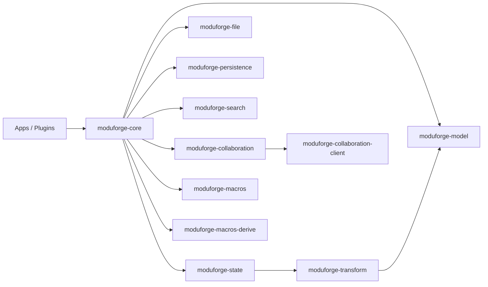

# ModuForge-RS Architecture Overview

ModuForge-RS is a Rust workspace built around immutable tree-shaped data. It bundles runtimes, collaboration tooling, persistence, and developer utilities so that editor cores or domain runtimes can be assembled without coupling business code.

## Layered modules

- **Runtime layer**: `moduforge-core` unifies runtimes, events, middleware, history, and system resource probes.
- **State & transaction layer**: `moduforge-state` and `moduforge-transform` manage the immutable state container, plugin lifecycle, and the Step/Transaction pipeline.
- **Data model layer**: `moduforge-model` defines nodes, marks, attributes, schema, and node pools.
- **Collaboration & storage layer**: `moduforge-collaboration`, `moduforge-collaboration-client`, `moduforge-file`, `moduforge-persistence`, and `moduforge-search` deliver collaboration, file formats, event storage, and full-text indexing.
- **Developer tooling**: `moduforge-macros`, `moduforge-macros-derive`, `tools/benchmark-coordinator`, and `packages/docs` provide automation, benchmarks, and documentation.

## Core crates

### moduforge-core — Runtime & extensions
- **Role**: unified entry point for runtimes, event system, extensions/middleware, history, and resource detection.
- **Key APIs**: `ForgeAsyncRuntime::create_with_config`, `ForgeRuntime::dispatch`, `ForgeRuntime::command`, `HistoryManager::undo`, `RuntimeOptions::set_content`.
- **Highlights**: sync/async/actor runtimes, event bus, composable middleware, history snapshots, adaptive resource tuning.

### moduforge-state — State & plugins
- **Role**: maintain immutable state, plugin lifecycle, resource tables, and logging.
- **Key APIs**: `State::create`, `State::tr`, `Transaction::add_step`, `init_logging`.
- **Highlights**: plugin isolation and dependency checks, thread-safe resource sharing, pre/post transaction hooks.

### moduforge-transform — Step/Transaction pipeline
- **Role**: define steps and execute them transactionally with replay guarantees.
- **Key APIs**: `Transaction::add_step`, `AddNodeStep::new_single`, `AttrStep::new`, `BatchStep::new`.
- **Highlights**: atomic operations, batch optimisation, patch synthesis, tight integration with indexing/persistence.

### moduforge-model — Data model
- **Role**: provide nodes, marks, attributes, schema, node pools, and tree helpers.
- **Key APIs**: `Node::new`, `Mark::new`, `Attrs::set`, `Schema::new`, `NodePool::default`.
- **Highlights**: `imbl`-based structural sharing, content constraint checks, flexible mark/attribute systems.

## Collaboration & ecosystem

### moduforge-collaboration / moduforge-collaboration-client
Warp + Yrs WebSocket service and client toolkit with room lifecycle management, health checks, and awareness sync.

### moduforge-file
Append-only file format, zip import/export, history frame codecs, Blake3 validation.

### moduforge-persistence
Event store and snapshot interface with the default SQLite + WAL implementation; `CommitMode` lets you tune durability.

### moduforge-search
Tantivy-based incremental indexing that consumes `IndexEvent` updates from Steps or Transactions.

## Developer tooling
- **moduforge-macros**: declarative helpers such as `mf_extension!`, `mf_plugin!`, `impl_command!`, `mf_ops!`.
- **moduforge-macros-derive**: `#[derive(Node)]`, `#[derive(Mark)]`, `#[derive(PState)]` to generate conversions at compile time.
- **Tools & examples**: `examples/`, `schema/`, `tools/benchmark-coordinator/`, and `packages/docs` cover integration, benchmarking, and documentation needs.

## Typical scenarios

- Building large tree/graph editors.
- Domain runtimes that require transactions, undo/redo, and replayable history.
- Offline-first workflows that rely on event replay or CRDT-based merges.
- Enterprise systems that need collaboration, full-text search, and plugin-driven extensions.

Thanks to the layered architecture and declarative extensions, ModuForge-RS supports desktop, web, and server deployments on the same runtime foundation while staying maintainable and fast to iterate.
