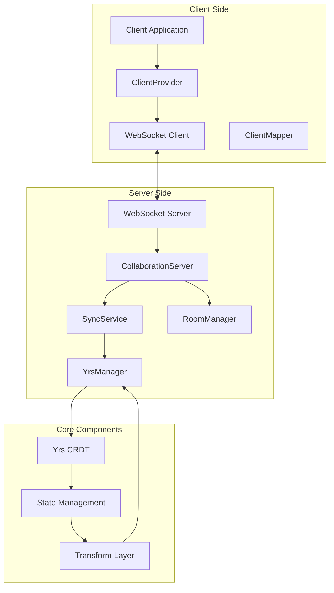
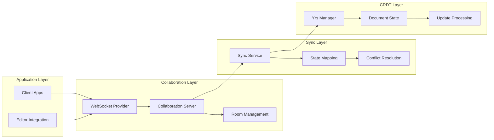

# ModuForge-RS Collaboration System

## Overview

The ModuForge-RS Collaboration System is a real-time collaborative document editing solution based on WebSocket and Yrs CRDT. This system supports multi-user simultaneous document editing, providing conflict resolution, real-time synchronization, and state management capabilities.

## System Architecture

### Architecture Diagram



### Component Hierarchy



## Core Components

### 1. Server Components (moduforge-collaboration)

#### CollaborationServer
Main entry point for the collaboration server, responsible for managing WebSocket connections and rooms.

```rust
use moduforge_collaboration::{CollaborationServer, ServerConfig};

// Create collaboration server
let config = ServerConfig {
    host: "0.0.0.0".to_string(),
    port: 8080,
    max_connections: 1000,
    heartbeat_interval: Duration::from_secs(30),
};

let server = CollaborationServer::new(config).await?;
server.start().await?;
```

#### SyncService
Handles document synchronization logic, including state mapping and conflict resolution.

```rust
use moduforge_collaboration::SyncService;
use moduforge_state::State;

let sync_service = SyncService::new();

// Process state update
let updated_state = sync_service.apply_update(
    room_id,
    client_id,
    update_data,
    current_state
).await?;
```

#### YrsManager
Manages Yrs CRDT document instances and update processing.

```rust
use moduforge_collaboration::YrsManager;

let yrs_manager = YrsManager::new();

// Create new document
let doc_id = yrs_manager.create_document("room_1").await?;

// Apply update
yrs_manager.apply_update(doc_id, update_vector).await?;

// Get document state
let doc_state = yrs_manager.get_document_state(doc_id).await?;
```

#### WebSocket Server
Handles WebSocket connections and message routing.

```rust
use moduforge_collaboration::WebSocketServer;

let ws_server = WebSocketServer::new()
    .with_handler(collaboration_handler)
    .with_middleware(auth_middleware);

ws_server.listen("0.0.0.0:8080").await?;
```

### 2. Client Components (moduforge-collaboration-client)

#### WebsocketProvider
Client-side WebSocket connection provider.

```rust
use moduforge_collaboration_client::{WebsocketProvider, ProviderConfig};

let config = ProviderConfig {
    url: "ws://localhost:8080".to_string(),
    room_id: "room_1".to_string(),
    user_id: "user_123".to_string(),
    reconnect_attempts: 5,
};

let provider = WebsocketProvider::new(config).await?;
provider.connect().await?;
```

#### ClientConn
Manages client connection state and message handling.

```rust
use moduforge_collaboration_client::ClientConn;

let conn = ClientConn::new(websocket_stream);

// Send update
conn.send_update(update_data).await?;

// Receive update
let update = conn.receive_update().await?;
```

#### State Mapping
Maps between ModuForge state and Yrs documents.

```rust
use moduforge_collaboration_client::mapping::StateMapper;

let mapper = StateMapper::new();

// Convert ModuForge state to Yrs update
let yrs_update = mapper.state_to_yrs(&moduforge_state)?;

// Convert Yrs update to ModuForge state
let moduforge_state = mapper.yrs_to_state(&yrs_update)?;
```

## API Interface

### WebSocket Message Protocol

#### Connection Establishment
```json
{
  "type": "connect",
  "room_id": "room_1",
  "user_id": "user_123",
  "client_id": "client_abc"
}
```

#### Document Update
```json
{
  "type": "update",
  "room_id": "room_1",
  "client_id": "client_abc",
  "update": "<binary_yrs_update>",
  "timestamp": 1640995200000
}
```

#### State Sync
```json
{
  "type": "sync",
  "room_id": "room_1",
  "state_vector": "<binary_state_vector>",
  "document_state": "<binary_document_state>"
}
```

#### User Join/Leave
```json
{
  "type": "user_joined",
  "room_id": "room_1",
  "user_id": "user_456",
  "timestamp": 1640995200000
}
```

### REST API Endpoints

#### Room Management
- `POST /api/rooms` - Create room
- `GET /api/rooms/{room_id}` - Get room information
- `DELETE /api/rooms/{room_id}` - Delete room
- `GET /api/rooms/{room_id}/users` - Get room user list

#### Document Management
- `GET /api/rooms/{room_id}/document` - Get document state
- `POST /api/rooms/{room_id}/document/snapshot` - Create document snapshot
- `GET /api/rooms/{room_id}/document/history` - Get document history

## Usage Examples

### Basic Collaboration Setup

#### Server Setup
```rust
use moduforge_collaboration::{CollaborationServer, ServerConfig};
use tokio;

#[tokio::main]
async fn main() -> Result<(), Box<dyn std::error::Error>> {
    // Initialize server configuration
    let config = ServerConfig {
        host: "0.0.0.0".to_string(),
        port: 8080,
        max_connections: 1000,
        heartbeat_interval: Duration::from_secs(30),
        document_timeout: Duration::from_secs(3600),
    };

    // Create collaboration server
    let server = CollaborationServer::new(config).await?;
    
    // Start server
    println!("Collaboration server started on {}:{}", config.host, config.port);
    server.start().await?;
    
    Ok(())
}
```

#### Client Integration
```rust
use moduforge_collaboration_client::{WebsocketProvider, ProviderConfig};
use moduforge_state::{Editor, State};

async fn setup_collaborative_editor() -> Result<Editor, Box<dyn std::error::Error>> {
    // Create editor
    let editor = Editor::new().await?;
    
    // Configure collaboration provider
    let provider_config = ProviderConfig {
        url: "ws://localhost:8080".to_string(),
        room_id: "document_1".to_string(),
        user_id: "user_123".to_string(),
        reconnect_attempts: 5,
    };
    
    // Create collaboration provider
    let provider = WebsocketProvider::new(provider_config).await?;
    
    // Connect to collaboration server
    provider.connect().await?;
    
    // Setup update handling
    provider.on_update(|update| {
        // Apply remote update to editor
        editor.apply_remote_update(update);
    });
    
    // Listen to editor changes
    editor.on_transaction(|transaction| {
        // Send local changes to collaboration server
        provider.send_update(transaction.to_update());
    });
    
    Ok(editor)
}
```

### Advanced Feature Examples

#### Custom Conflict Resolution
```rust
use moduforge_collaboration::conflict::{ConflictResolver, ResolutionStrategy};

let resolver = ConflictResolver::new()
    .with_strategy(ResolutionStrategy::LastWriterWins)
    .with_custom_resolver(|conflict| {
        // Custom conflict resolution logic
        match conflict.conflict_type {
            ConflictType::TextEdit => resolve_text_conflict(conflict),
            ConflictType::NodeStructure => resolve_structure_conflict(conflict),
            _ => ConflictResolution::UseRemote,
        }
    });
```

#### Real-time Cursor and Selection
```rust
use moduforge_collaboration_client::awareness::{Awareness, CursorInfo};

let awareness = Awareness::new();

// Set local cursor position
awareness.set_local_cursor(CursorInfo {
    user_id: "user_123".to_string(),
    position: 42,
    selection_start: 40,
    selection_end: 45,
    color: "#ff0000".to_string(),
});

// Listen to remote cursor changes
awareness.on_cursor_change(|user_id, cursor| {
    println!("User {} cursor position: {}", user_id, cursor.position);
});
```

#### Room Permission Management
```rust
use moduforge_collaboration::auth::{Permission, RoomPermissions};

let permissions = RoomPermissions::new()
    .grant_user("user_123", Permission::Read | Permission::Write)
    .grant_user("user_456", Permission::Read)
    .deny_user("user_789", Permission::Write);

server.set_room_permissions("room_1", permissions);
```

## Technology Stack

### Core Technologies
- **Yrs**: Rust implementation of Y.js CRDT library
- **Tokio**: Async runtime
- **WebSocket**: Real-time communication protocol
- **Serde**: Serialization and deserialization

### Dependencies
```toml
[dependencies]
# Collaboration core
yrs = "0.18"
tokio = { version = "1.0", features = ["full"] }
tokio-tungstenite = "0.20"

# ModuForge core
moduforge-core = "0.4.6"
moduforge-state = "0.4.6"
moduforge-model = "0.4.6"

# Utilities
serde = { version = "1.0", features = ["derive"] }
serde_json = "1.0"
uuid = { version = "1.0", features = ["v4"] }
chrono = "0.4"
dashmap = "6.1"
```

## Performance Characteristics

### Memory Usage
- **Incremental Updates**: Only transmit and store document changes
- **State Compression**: Automatic compression of historical states
- **Memory Pooling**: Reuse buffers to reduce allocation

### Network Optimization
- **Binary Protocol**: Use Yrs binary update format
- **Batch Processing**: Merge multiple small updates
- **Compression**: WebSocket compression support

### Concurrent Processing
- **Async Processing**: Full async architecture
- **Room Isolation**: Each room processes independently
- **Connection Pooling**: Efficient connection management

## Security Considerations

### Authentication
- JWT token validation
- Session management
- User permission checking

### Data Validation
- Input validation and sanitization
- Malicious update detection
- Rate limiting

### Network Security
- WSS encrypted transmission
- CORS configuration
- DDoS protection

## Troubleshooting

### Common Issues

#### Connection Problems
```rust
// Check connection status
if !provider.is_connected() {
    println!("Connection lost, attempting reconnect...");
    provider.reconnect().await?;
}
```

#### Sync Issues
```rust
// Force sync
provider.force_sync().await?;

// Check sync status
let sync_status = provider.get_sync_status();
println!("Sync status: {:?}", sync_status);
```

#### Memory Leaks
```rust
// Regular cleanup
server.cleanup_expired_rooms().await;
server.cleanup_disconnected_clients().await;
```

### Logging Configuration
```rust
use tracing_subscriber;

tracing_subscriber::fmt()
    .with_env_filter("moduforge_collaboration=debug")
    .init();
```

## Deployment Guide

### Docker Deployment
```dockerfile
FROM rust:1.75 as builder
WORKDIR /app
COPY . .
RUN cargo build --release --bin collaboration-server

FROM debian:bookworm-slim
RUN apt-get update && apt-get install -y ca-certificates
COPY --from=builder /app/target/release/collaboration-server /usr/local/bin/
EXPOSE 8080
CMD ["collaboration-server"]
```

### Kubernetes Deployment
```yaml
apiVersion: apps/v1
kind: Deployment
metadata:
  name: collaboration-server
spec:
  replicas: 3
  selector:
    matchLabels:
      app: collaboration-server
  template:
    metadata:
      labels:
        app: collaboration-server
    spec:
      containers:
      - name: collaboration-server
        image: moduforge/collaboration-server:latest
        ports:
        - containerPort: 8080
        env:
        - name: HOST
          value: "0.0.0.0"
        - name: PORT
          value: "8080"
        resources:
          limits:
            memory: "512Mi"
            cpu: "500m"
```

### Load Balancer Configuration
```nginx
upstream collaboration_servers {
    server collaboration-server-1:8080;
    server collaboration-server-2:8080;
    server collaboration-server-3:8080;
}

server {
    listen 80;
    
    location /ws {
        proxy_pass http://collaboration_servers;
        proxy_http_version 1.1;
        proxy_set_header Upgrade $http_upgrade;
        proxy_set_header Connection "upgrade";
        proxy_set_header Host $host;
        proxy_set_header X-Real-IP $remote_addr;
    }
}
```

## Monitoring and Metrics

### Built-in Metrics
- Active connection count
- Room count
- Message processing rate
- Memory usage
- Error rate

### Prometheus Integration
```rust
use prometheus::{Counter, Histogram, register_counter, register_histogram};

let message_counter = register_counter!(
    "collaboration_messages_total",
    "Total number of collaboration messages"
)?;

let latency_histogram = register_histogram!(
    "collaboration_message_duration_seconds",
    "Message processing duration"
)?;
```

## Extension Development

### Custom Providers
```rust
use moduforge_collaboration_client::{Provider, ProviderTrait};

#[derive(Debug)]
struct CustomProvider {
    // Custom provider implementation
}

#[async_trait::async_trait]
impl ProviderTrait for CustomProvider {
    async fn connect(&self) -> Result<(), ProviderError> {
        // Custom connection logic
    }
    
    async fn send_update(&self, update: Vec<u8>) -> Result<(), ProviderError> {
        // Custom update sending logic
    }
}
```

### Middleware Development
```rust
use moduforge_collaboration::middleware::{Middleware, MiddlewareContext};

#[derive(Debug)]
struct LoggingMiddleware;

#[async_trait::async_trait]
impl Middleware for LoggingMiddleware {
    async fn before_message(
        &self,
        ctx: &MiddlewareContext,
        message: &mut Message
    ) -> Result<(), MiddlewareError> {
        println!("Processing message: {:?}", message);
        Ok(())
    }
}
```

## Summary

The ModuForge-RS Collaboration System provides a complete real-time collaborative editing solution with the following advantages:

- **High Performance**: Built on Rust and async architecture
- **Type Safety**: Complete type checking and validation
- **Extensible**: Flexible plugin and middleware system
- **Real-time**: Low-latency real-time synchronization
- **Consistency**: Strong consistency guarantees based on CRDT
- **Deployable**: Support for various deployment methods and scaling strategies

This system is suitable for document editors, code editors, design tools, and other applications requiring real-time collaboration features. 