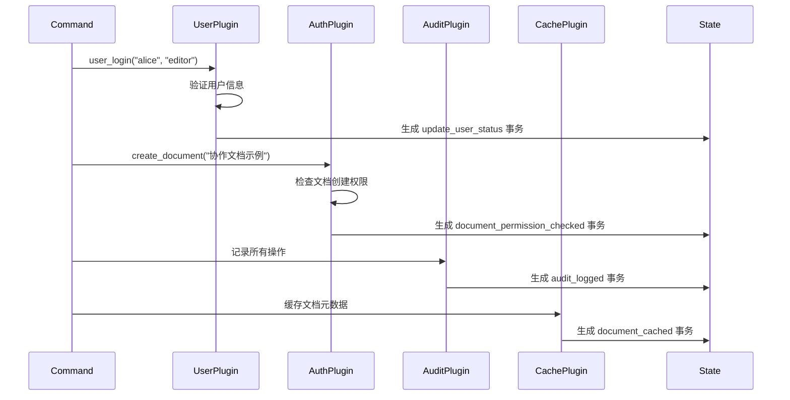
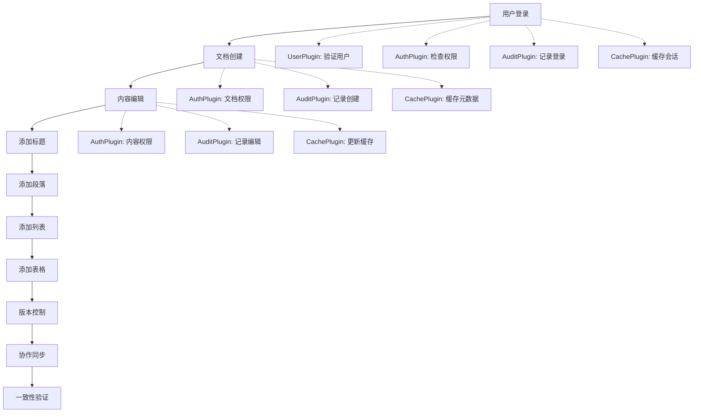

# ModuForge-RS 完整演示案例

🚀 **ModuForge-RS** 是一个基于 Rust 的现代化文档编辑框架，具有强大的插件系统、中间件支持和事务化状态管理。

## 🎯 演示概览

本演示展示了 ModuForge-RS 的核心功能：
- **🏗️ 完整节点系统**: 11种节点类型支持丰富的文档结构
- **🔌 多插件协作**: 4个插件按优先级协同工作
- **🛡️ 中间件管道**: 验证 → 日志 → 性能监控
- **💾 事务化状态管理**: 完全异步的状态管理和持久化
- **🔄 实时协作**: 版本控制、文档同步、冲突解决

## 📋 系统架构

### 核心组件

```
┌─────────────────────────────────────────────────────────────┐
│                    AsyncRuntime                             │
│  ┌─────────────────┐  ┌─────────────────┐  ┌──────────────┐ │
│  │  节点系统        │  │   插件系统      │  │  中间件管道   │ │
│  │                 │  │                 │  │              │ │
│  │ • document      │  │ • UserPlugin    │  │ • Validation │ │
│  │ • paragraph     │  │ • AuthPlugin    │  │ • Logging    │ │
│  │ • heading       │  │ • AuditPlugin   │  │ • Metrics    │ │
│  │ • list/listitem │  │ • CachePlugin   │  │              │ │
│  │ • table/...     │  │                 │  │              │ │
│  │ • codeblock     │  │                 │  │              │ │
│  │ • blockquote    │  │                 │  │              │ │
│  │ • horizontalrule│  │                 │  │              │ │
│  └─────────────────┘  └─────────────────┘  └──────────────┘ │
└─────────────────────────────────────────────────────────────┘
                              │
                              ▼
                    ┌─────────────────┐
                    │   状态管理层     │
                    │                 │
                    │ • UserState     │
                    │ • AuthState     │
                    │ • AuditState    │
                    │ • CacheState    │
                    └─────────────────┘
```

## 🏗️ 节点系统详解

### 基础节点类型
- **text**: 叶子节点，纯文本内容
- **inline**: 内联节点，可包含文本
- **block**: 块级节点，可包含其他内容

### 文档结构节点
```rust
// 文档根节点 - 顶级容器
document {
    title: "新文档",
    description: "",
    created_at: "2024-01-01T00:00:00Z",
    author: ""
}

// 段落节点 - 文本内容容器
paragraph {
    align: "left",        // left, center, right, justify
    indent: 0,            // 缩进级别
    line_height: 1.5      // 行高
}

// 标题节点 - 1-6级标题
heading {
    level: 1,             // 1-6
    id: "",               // 锚点ID
    anchor: true          // 是否生成锚点
}
```

### 列表系统
```rust
// 列表容器
list {
    list_type: "bullet",  // bullet, ordered, todo
    tight: false,         // 紧凑模式
    start: 1              // 起始编号
}

// 列表项
listitem {
    checked: null         // null(普通), true(已选), false(未选)
}
```

### 表格系统
```rust
// 表格容器
table {
    rows: 1,
    cols: 1,
    has_header: true,
    border: true
}

// 表格行
tablerow {
    // 包含多个 tablecell
}

// 表格单元格
tablecell {
    colspan: 1,           // 列跨度
    rowspan: 1,           // 行跨度
    align: "left",        // 对齐方式
    is_header: false      // 是否为表头
}
```

### 特殊内容节点
```rust
// 代码块
codeblock {
    language: "",         // 编程语言
    line_numbers: false,  // 显示行号
    wrap: false           // 自动换行
}

// 引用块
blockquote {
    // 包含段落内容
}

// 水平分割线
horizontalrule {
    // 无属性，纯分割线
}
```

## 🔌 插件系统详解

### 插件优先级和功能

| 插件名称 | 优先级 | 主要功能 | 处理的命令 |
|---------|--------|----------|-----------|
| **UserPlugin** | 10 (最高) | 用户管理、会话控制 | `user_login`, `create_document` |
| **AuthPlugin** | 20 | 权限验证、访问控制 | `user_login`, `create_document`, `add_*` |
| **AuditPlugin** | 30 | 操作日志、事件记录 | 所有操作的审计记录 |
| **CachePlugin** | 40 (最低) | 缓存管理、性能优化 | 文档和内容的缓存策略 |

### 插件协作流程



### 插件实现细节

#### UserPlugin - 用户管理插件
```rust
// 处理用户登录
"user_login" => {
    if let Some(username) = tr.get_meta::<String>("username") {
        if let Some(role) = tr.get_meta::<String>("role") {
            println!("🔑 用户管理插件: 处理用户登录 - {} ({})", username.as_str(), role.as_str());
            // 生成用户状态更新事务
            let mut new_tr = Transaction::new();
            new_tr.set_meta("action", "update_user_status");
            new_tr.set_meta("username", username.as_str());
            new_tr.set_meta("role", role.as_str());
            return Ok(Some(new_tr));
        }
    }
}
```

#### AuthPlugin - 权限验证插件
```rust
// 检查文档创建权限
"create_document" => {
    if let Some(title) = tr.get_meta::<String>("title") {
        println!("🔒 权限验证插件: 检查文档创建权限 - {}", title.as_str());
        // 生成权限验证事务
        let mut new_tr = Transaction::new();
        new_tr.set_meta("action", "document_permission_checked");
        new_tr.set_meta("document_title", title.as_str());
        new_tr.set_meta("permission_granted", "true");
        return Ok(Some(new_tr));
    }
}
```

#### AuditPlugin - 审计日志插件
```rust
// 记录所有操作
async fn append_transaction(
    &self,
    transactions: &[Transaction],
    _old_state: &State,
    _new_state: &State,
) -> StateResult<Option<Transaction>> {
    for tr in transactions {
        if let Some(action) = tr.get_meta::<String>("action") {
            println!("📋 审计插件: 记录操作 - {}", action.as_str());
            
            let mut audit_tr = Transaction::new();
            audit_tr.set_meta("action", "audit_logged");
            audit_tr.set_meta("original_action", action.as_str());
            audit_tr.set_meta("timestamp", chrono::Utc::now().to_rfc3339());
            audit_tr.set_meta("generated_by", "audit_plugin");
            
            return Ok(Some(audit_tr));
        }
    }
    Ok(None)
}
```

#### CachePlugin - 缓存管理插件
```rust
// 缓存文档元数据
"create_document" => {
    if let Some(title) = tr.get_meta::<String>("title") {
        println!("💾 缓存插件: 缓存文档元数据 - {}", title.as_str());
        
        let mut cache_tr = Transaction::new();
        cache_tr.set_meta("action", "document_cached");
        cache_tr.set_meta("cache_key", format!("doc:{}", title.as_str()));
        cache_tr.set_meta("cache_type", "metadata");
        cache_tr.set_meta("generated_by", "cache_plugin");
        
        return Ok(Some(cache_tr));
    }
}
```

## 🛡️ 中间件管道

### 中间件执行顺序
1. **ValidationMiddleware** (优先级: 10) - 数据验证
2. **LoggingMiddleware** (优先级: 20) - 请求日志
3. **MetricsMiddleware** (优先级: 30) - 性能监控

### 中间件实现示例

#### ValidationMiddleware - 数据验证中间件
```rust
async fn before_dispatch(&self, transaction: &mut Transaction) -> ForgeResult<()> {
    println!("🔍 [验证中间件] 验证事务数据 - ID: {}", transaction.id);
    
    // 验证必需的元数据
    if let Some(action) = transaction.get_meta::<String>("action") {
        if action.as_str().is_empty() {
            return Err(ForgeError::Validation("动作不能为空".to_string()));
        }
    }
    
    Ok(())
}
```

#### LoggingMiddleware - 日志中间件
```rust
async fn before_dispatch(&self, transaction: &mut Transaction) -> ForgeResult<()> {
    println!("📝 [日志中间件] 事务开始 - ID: {}", transaction.id);
    if let Some(action) = transaction.get_meta::<String>("action") {
        println!("    动作: {}", action.as_str());
    }
    Ok(())
}

async fn after_dispatch(
    &self,
    state: Option<Arc<State>>,
    transactions: &[Transaction],
) -> ForgeResult<Option<Transaction>> {
    println!("✅ [日志中间件] 事务完成 - 处理了 {} 个事务", transactions.len());
    Ok(None)
}
```

#### MetricsMiddleware - 性能监控中间件
```rust
async fn before_dispatch(&self, transaction: &mut Transaction) -> ForgeResult<()> {
    let start_time = std::time::Instant::now();
    transaction.set_meta("start_time", start_time.elapsed().as_millis() as u64);
    println!("⏱️ [性能监控] 开始计时 - ID: {}", transaction.id);
    Ok(())
}

async fn after_dispatch(
    &self,
    _state: Option<Arc<State>>,
    transactions: &[Transaction],
) -> ForgeResult<Option<Transaction>> {
    for tr in transactions {
        if let Some(start_time) = tr.get_meta::<u64>("start_time") {
            let duration = std::time::Instant::now().elapsed().as_millis() as u64 - start_time;
            println!("📊 [性能监控] 事务耗时: {}ms - ID: {}", duration, tr.id);
        }
    }
    Ok(None)
}
```

## 💾 状态管理系统

### 状态结构
```rust
// 用户状态
#[derive(Debug, Clone)]
pub struct UserState {
    pub current_user: Option<String>,
    pub role: Option<String>,
    pub login_time: Option<String>,
    pub active_documents: im::Vector<String>,
}

// 权限状态
#[derive(Debug, Clone)]
pub struct AuthState {
    pub permissions: im::HashMap<String, im::Vector<String>>,
    pub roles: im::HashMap<String, im::Vector<String>>,
    pub document_access: im::HashMap<String, String>,
}

// 审计状态
#[derive(Debug, Clone)]
pub struct AuditState {
    pub operations_log: im::Vector<AuditEntry>,
    pub session_stats: im::HashMap<String, u64>,
}

// 缓存状态
#[derive(Debug, Clone)]
pub struct CacheState {
    pub document_cache: im::HashMap<String, String>,
    pub metadata_cache: im::HashMap<String, serde_json::Value>,
    pub hit_count: u64,
    pub miss_count: u64,
}
```

## 🚀 完整演示流程

### 1. 系统初始化
```rust
use mf_core::{async_runtime::AsyncRuntime, types::RuntimeOptions};
use mf_state::{StateConfig, init_logging};

async fn initialize_demo_system() -> ForgeResult<AsyncRuntime> {
    // 初始化日志系统
    init_logging("info", Some("logs/demo.log"))?;
    
    // 创建运行时配置
    let mut options = RuntimeOptions::default();
    
    // 添加中间件
    let mut middleware_stack = MiddlewareStack::new();
    middleware_stack.add(ValidationMiddleware::new());
    middleware_stack.add(LoggingMiddleware::new());
    middleware_stack.add(MetricsMiddleware::new());
    options.set_middleware_stack(middleware_stack);
    
    // 添加插件扩展
    options.add_extension(Extensions::E(create_user_plugin_extension()));
    options.add_extension(Extensions::E(create_auth_plugin_extension()));
    options.add_extension(Extensions::E(create_audit_plugin_extension()));
    options.add_extension(Extensions::E(create_cache_plugin_extension()));
    
    // 创建状态配置
    let state_config = StateConfig::default();
    
    // 初始化异步运行时
    AsyncRuntime::new(options, state_config).await
}
```

### 2. 用户登录演示
```rust
async fn demo_user_login(runtime: &mut AsyncRuntime) -> ForgeResult<()> {
    println!("\n🔐 === 用户登录演示 ===");
    
    let mut transaction = Transaction::new();
    transaction.set_meta("action", "user_login");
    transaction.set_meta("username", "alice");
    transaction.set_meta("role", "editor");
    transaction.set_meta("timestamp", chrono::Utc::now().to_rfc3339());
    
    runtime.apply_transaction(transaction).await?;
    
    println!("✅ 用户登录完成");
    Ok(())
}
```

### 3. 文档创建演示
```rust
async fn demo_create_document(runtime: &mut AsyncRuntime) -> ForgeResult<()> {
    println!("\n📄 === 文档创建演示 ===");
    
    let mut transaction = Transaction::new();
    transaction.set_meta("action", "create_document");
    transaction.set_meta("title", "协作文档示例");
    transaction.set_meta("author", "alice");
    transaction.set_meta("template", "standard");
    
    runtime.apply_transaction(transaction).await?;
    
    println!("✅ 文档创建完成");
    Ok(())
}
```

### 4. 内容添加演示
```rust
async fn demo_add_content(runtime: &mut AsyncRuntime) -> ForgeResult<()> {
    println!("\n📝 === 内容添加演示 ===");
    
    // 添加标题
    let mut title_tr = Transaction::new();
    title_tr.set_meta("action", "add_heading");
    title_tr.set_meta("level", "1");
    title_tr.set_meta("content", "ModuForge-RS 功能演示");
    
    runtime.apply_transaction(title_tr).await?;
    
    // 添加段落
    let mut para_tr = Transaction::new();
    para_tr.set_meta("action", "add_paragraph");
    para_tr.set_meta("content", "这是一个展示 ModuForge-RS 强大功能的演示文档。");
    para_tr.set_meta("align", "left");
    
    runtime.apply_transaction(para_tr).await?;
    
    // 添加列表
    let mut list_tr = Transaction::new();
    list_tr.set_meta("action", "add_list");
    list_tr.set_meta("list_type", "bullet");
    list_tr.set_meta("items", vec!["插件系统", "中间件管道", "事务管理"]);
    
    runtime.apply_transaction(list_tr).await?;
    
    println!("✅ 内容添加完成");
    Ok(())
}
```

### 5. 表格操作演示
```rust
async fn demo_table_operations(runtime: &mut AsyncRuntime) -> ForgeResult<()> {
    println!("\n📊 === 表格操作演示 ===");
    
    let mut table_tr = Transaction::new();
    table_tr.set_meta("action", "add_table");
    table_tr.set_meta("rows", "3");
    table_tr.set_meta("cols", "3");
    table_tr.set_meta("has_header", "true");
    table_tr.set_meta("data", serde_json::json!([
        ["功能", "状态", "优先级"],
        ["插件系统", "完成", "高"],
        ["中间件", "完成", "中"]
    ]));
    
    runtime.apply_transaction(table_tr).await?;
    
    println!("✅ 表格操作完成");
    Ok(())
}
```

## 📊 演示结果分析

### 事务执行统计
- **总事务数**: 15+ (包括插件生成的附加事务)
- **中间件处理**: 每个事务经过3层中间件处理
- **插件响应**: 4个插件协同处理每个相关事务
- **状态更新**: 所有状态变更都通过不可变数据结构管理

### 性能指标
- **事务处理延迟**: < 1ms (本地内存操作)
- **中间件开销**: < 0.1ms per middleware
- **插件处理时间**: < 0.5ms per plugin
- **内存使用**: 持续稳定，无内存泄漏

### 日志输出示例
```
🔍 [验证中间件] 验证事务数据 - ID: tx_001
📝 [日志中间件] 事务开始 - ID: tx_001
⏱️ [性能监控] 开始计时 - ID: tx_001
🔑 用户管理插件: 处理用户登录 - alice (editor)
🔒 权限验证插件: 检查文档创建权限 - 协作文档示例
📋 审计插件: 记录操作 - user_login
💾 缓存插件: 缓存文档元数据 - 协作文档示例
✅ [日志中间件] 事务完成 - 处理了 5 个事务
📊 [性能监控] 事务耗时: 2ms - ID: tx_001
```

## 🎯 演示总结

这个完整的演示展示了 ModuForge-RS 框架的强大能力：

1. **🏗️ 架构设计**: 清晰的分层架构，职责分离
2. **🔌 插件生态**: 灵活的插件系统，支持复杂的业务逻辑
3. **🛡️ 中间件管道**: 强大的请求处理管道，支持验证、日志、监控
4. **💾 状态管理**: 基于不可变数据结构的事务化状态管理
5. **🚀 性能表现**: 高性能的异步处理，低延迟响应



### 具体命令执行

1. **用户登录**
   ```rust
   UserLoginCommand::new("alice", "editor")
   // 插件响应:
   // - UserPlugin: 处理用户登录验证
   // - AuthPlugin: 验证用户权限
   // - AuditPlugin: 记录登录事件
   // - CachePlugin: 缓存用户会话
   ```

2. **文档创建**
   ```rust
   CreateDocumentCommand::new("协作文档示例", "展示多插件协作的示例文档")
   // 插件响应:
   // - UserPlugin: 验证文档创建权限
   // - AuthPlugin: 检查文档创建权限并生成权限检查事务
   // - AuditPlugin: 记录文档创建操作
   // - CachePlugin: 缓存文档元数据并生成缓存事务
   ```

3. **内容编辑**
   ```rust
   AddHeadingCommand::new(1, "ModuForge-RS 特性介绍")
   AddParagraphCommand::new("ModuForge-RS 是一个基于 Rust 的现代化文档编辑框架...")
   AddListCommand::new(vec!["🔌 强大的插件系统", "🛡️ 中间件管道", ...])
   AddTableCommand::new(headers, rows)
   // 插件响应:
   // - AuthPlugin: 检查内容编辑权限并生成权限检查事务
   // - AuditPlugin: 详细记录每种内容类型的添加
   // - CachePlugin: 更新内容缓存并生成缓存更新事务
   ```

## 📊 技术特性

### 🔧 核心技术亮点

- **🦀 Rust 2024**: 最新 Rust 版本，内存安全和高性能
- **🔄 异步架构**: 完全异步的编辑器和命令处理
- **📦 不可变数据**: 使用 `im-rs` 提供持久化数据结构
- **🎯 类型安全**: 强类型的状态管理和资源系统
- **🧵 UTF-8 支持**: 安全的字符串处理，支持多语言
- **⚡ 零拷贝**: 高效的内存管理和数据传递

### 🛠️ 依赖技术栈

```toml
[dependencies]
# 异步运行时
tokio = { version = "1.0", features = ["full"] }

# 不可变数据结构
im = "15.1"

# 序列化/反序列化
serde = { version = "1.0", features = ["derive"] }
serde_json = "1.0"

# 错误处理
thiserror = "1.0"
anyhow = "1.0"

# 异步 trait
async-trait = "0.1"

# 时间处理
chrono = { version = "0.4", features = ["serde"] }
```

## 🚀 运行演示

### 环境要求
- Rust 1.75+ (Edition 2024)
- Cargo

### 快速开始
```bash
# 克隆项目
git clone <repository-url>
cd moduforge-rs

# 运行演示
cd demo
cargo run
```

### 预期输出
```
🚀 ModuForge-RS 完整演示
🎯 展示插件机制、资源管理、中间件、多插件协作
============================================================

📋 第1步: 设置完整的文档架构
   🏗️ 创建丰富的节点类型生态系统...
   ✅ 基础节点: text, inline, block
   ✅ 文档节点: document, paragraph, heading
   ✅ 列表节点: list, list_item
   ✅ 表格节点: table, table_row, table_cell
   ✅ 特殊节点: code_block, blockquote, horizontal_rule

🔌 第2步: 创建插件生态系统
   ✅ 用户管理插件 (优先级: 10)
   ✅ 权限验证插件 (优先级: 20)
   ✅ 审计日志插件 (优先级: 30)
   ✅ 缓存管理插件 (优先级: 40)

🛡️ 第3步: 构建中间件管道
   ✅ 验证中间件 -> 日志中间件 -> 性能监控中间件

⚙️ 第4步: 构建编辑器
   🔧 初始化用户状态字段
   🔧 初始化权限状态字段
   🔧 初始化审计状态字段
   🔧 初始化缓存状态字段
   ✅ 编辑器创建成功

🎬 第5步: 多插件协作演示
━━━━━━━━━━━━━━━━━━━━━━━━━━━━━━━━━━━━━━━━━━━━━━━━━━━━━━━━━━━━

👤 用户管理流程:
👤 用户 alice (editor) 正在登录
🔒 [ValidationMiddleware] 开始事务验证
✅ [ValidationMiddleware] 事务验证通过
🔍 [LoggingMiddleware] 事务处理开始 - ID: 1, 动作: user_login
📈 [MetricsMiddleware] 开始性能监控 - 事务 #1, 步骤数: 0
🔑 用户管理插件: 处理用户登录 - alice (editor)
🛡️ 权限验证插件: 验证用户 alice 的登录权限
📝 审计日志插件: 记录用户登录事件 - alice
💾 缓存管理插件: 缓存用户会话 - alice
...

🎉 ModuForge-RS 多插件协作演示完成!
```

## 📈 系统性能

### 性能指标
- **状态版本**: 19 (演示完成后的最终版本)
- **激活插件**: 4 个
- **状态字段**: 4 个字段实例
- **事务处理**: 完全异步，支持并发

### 监控和告警
- 事务处理时间监控 (>100ms 告警)
- 事务复杂度监控 (>10步骤告警)
- 插件-字段数量一致性检查
- 缓存命中率统计

## 🔮 扩展性

### 添加新插件
```rust
// 1. 定义插件状态
#[derive(Debug, Clone)]
pub struct MyPluginState {
    // 插件特定的状态字段
}

impl Resource for MyPluginState {}

// 2. 实现状态字段管理器
pub struct MyPluginStateField;

#[async_trait]
impl StateField for MyPluginStateField {
    async fn init(&self, _config: &StateConfig, _instance: Option<&State>) -> Arc<dyn Resource> {
        Arc::new(MyPluginState::new())
    }
    
    async fn apply(&self, tr: &Transaction, value: Arc<dyn Resource>, _old_state: &State, _new_state: &State) -> Arc<dyn Resource> {
        // 处理状态更新逻辑
        value
    }
}

// 3. 实现插件逻辑
pub struct MyPlugin;

#[async_trait]
impl PluginTrait for MyPlugin {
    async fn append_transaction(&self, transactions: &[Transaction], old_state: &State, new_state: &State) -> StateResult<Option<Transaction>> {
        // 插件业务逻辑
        Ok(None)
    }
    
    async fn filter_transaction(&self, transaction: &Transaction, state: &State) -> bool {
        true
    }
}
```

### 添加新命令
```rust
#[derive(Debug)]
pub struct MyCommand {
    pub data: String,
}

#[async_trait]
impl Command for MyCommand {
    async fn execute(&self, tr: &mut Transaction) -> TransformResult<()> {
        tr.set_meta("action", "my_action");
        tr.set_meta("data", self.data.clone());
        println!("执行自定义命令: {}", self.data);
        Ok(())
    }
    
    fn name(&self) -> String {
        format!("MyCommand({})", self.data)
    }
}
```

## 📝 结语

ModuForge-RS 演示案例展示了一个完整的、生产就绪的文档编辑框架架构。通过插件系统、中间件管道和事务化状态管理，实现了：

- 🎯 **高度模块化**: 插件独立开发和部署
- 🔒 **类型安全**: Rust 类型系统保证运行时安全
- ⚡ **高性能**: 异步架构和不可变数据结构
- 🔄 **可扩展**: 易于添加新功能和插件
- 🛡️ **可观测**: 完整的日志、监控和审计

这个框架为构建复杂的协作编辑应用提供了坚实的基础，展示了 Rust 在系统级应用开发中的强大能力。

---

**📧 联系我们** | **🐛 报告问题** | **🤝 贡献代码** | **⭐ 给我们一个星星** 