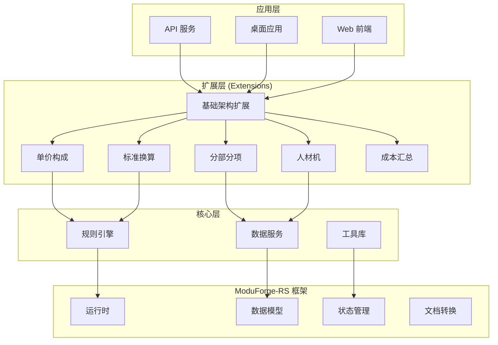

# Price-RS: 完整的工程计价系统案例

Price-RS 是一个基于 ModuForge-RS 框架构建的大型工程计价软件系统，展示了如何使用 ModuForge-RS 构建复杂的企业级应用。本案例将深入分析其架构设计、扩展系统、节点定义和业务实现。

## 项目概述

### 系统定位

Price-RS 是一个专业的工程造价计算系统，用于：
- 工程项目成本核算
- 单价构成分析
- 人材机（人工、材料、机械）管理
- 费率计算和标准换算
- 分部分项工程管理

### 技术架构



## 项目结构

```
price-rs/
├── applications/          # 应用层
│   ├── api/              # REST API 服务
│   ├── desktop/          # 桌面应用
│   └── web/              # Web 应用
│
├── exts/                 # 扩展模块（核心业务逻辑）
│   ├── base-schema/      # 基础节点定义
│   ├── djgc/             # 单价构成扩展
│   ├── bzhs/             # 标准换算扩展
│   ├── fbfx/             # 分部分项扩展
│   ├── rcj/              # 人材机扩展
│   ├── rcj-collect/      # 人材机汇总
│   ├── collect/          # 成本汇总扩展
│   └── config/           # 配置扩展
│
├── crates/               # 核心库
│   ├── budget/           # 预算管理
│   ├── common/           # 公共类型
│   ├── utils/            # 工具函数
│   ├── web/              # Web 基础设施
│   └── infrastructure/  # 基础设施
│       ├── rules/        # 规则引擎
│       ├── database/     # 数据服务
│       └── shared/       # 共享组件
│
└── tools/                # 开发工具
```

## 核心扩展实现

### 1. 基础架构扩展 (base-schema)

基础架构定义了工程项目的层次结构：

```rust
use mf_derive::Node;
use serde::{Deserialize, Serialize};

/// 工程项目节点 - 顶层结构
#[derive(Node, Debug, Clone, Serialize, Deserialize)]
#[node_type = "GCXM"]
#[desc = "工程项目"]
#[content = "(DXGC|DWGC)+"]  // 可包含单项工程或单位工程
pub struct ProjectNode {
    // 基础信息
    #[attr]
    pub construct_name: Option<String>,      // 建设名称
    #[attr]
    pub construct_code: Option<String>,      // 建设代码
    #[attr]
    pub path: Option<String>,               // 项目路径

    // 招标信息
    #[attr]
    pub bidding_type: i32,                  // 招标类型

    // 地理位置
    #[attr]
    pub ss_province: Option<String>,        // 所在省份代码
    #[attr]
    pub ss_province_name: Option<String>,   // 省份名称
    #[attr]
    pub ss_city: Option<String>,            // 所在城市代码
    #[attr]
    pub ss_city_name: Option<String>,       // 城市名称

    // 费率配置
    #[attr]
    pub gf_id: Option<String>,              // 规费ID
    #[attr]
    pub awf_id: Option<String>,             // 安文费ID
    #[attr]
    pub rgf_id: Option<String>,             // 人工费ID

    // 定额标准
    #[attr]
    pub qd_standard_id: Option<String>,     // 清单标准ID
    #[attr]
    pub de_standard_id: Option<String>,     // 定额标准ID
    #[attr]
    pub de_standard_release_year: Option<String>, // 定额发布年份

    // 项目信息
    #[attr]
    pub project_overview: Option<String>,    // 项目概况
    #[attr]
    pub construction_unit: Option<String>,   // 建设单位
    #[attr]
    pub version: Option<String>,            // 版本

    // 显示控制
    #[attr]
    pub main_rcj_show_flag: Option<bool>,   // 主材显示标志
    #[attr]
    pub standard_conversion_show_flag: Option<bool>, // 标准换算显示
}

/// 单项工程节点 - 中间层
#[derive(Node, Debug, Clone, Serialize, Deserialize)]
#[node_type = "DXGC"]
#[desc = "单项工程"]
#[content = "(DWGC|DXGC)+"]  // 可包含单位工程或其他单项工程
pub struct SingleProjectNode {
    #[attr]
    pub project_code: Option<String>,       // 工程代码
    #[attr]
    pub project_name: Option<String>,       // 工程名称

    // 工程量和造价
    #[attr]
    pub jzmj: Option<f64>,                  // 建筑面积
    #[attr]
    pub total: Option<f64>,                 // 总造价
    #[attr]
    pub average: Option<f64>,               // 平均造价
    #[attr]
    pub unitcost: Option<f64>,              // 单位造价

    // 费用明细
    #[attr]
    pub gfee: Option<f64>,                  // 规费
    #[attr]
    pub safe_fee: Option<f64>,              // 安全文明施工费
    #[attr]
    pub sbf: Option<f64>,                   // 设备费
    #[attr]
    pub zbkzj: Option<f64>,                 // 招标控制价
    #[attr]
    pub zbj: Option<f64>,                   // 招标价

    // 税费
    #[attr]
    pub sbf_tax: Option<f64>,               // 设备费税额
    #[attr]
    pub sbf_cost: Option<f64>,              // 设备费成本

    // 其他
    #[attr]
    pub bz_date: Option<String>,            // 编制日期
    #[attr]
    pub clde_year: Option<String>,          // 材料定额年份
    #[attr]
    pub sort_no: Option<i32>,               // 排序号
}

/// 单位工程节点 - 具体工程单元
#[derive(Node, Debug, Clone, Serialize, Deserialize)]
#[node_type = "DWGC"]
#[desc = "单位工程"]
pub struct UnitProjectNode {
    #[attr]
    pub up_code: Option<String>,            // 单位工程代码
    #[attr]
    pub up_name: Option<String>,            // 单位工程名称

    // 费用汇总
    #[attr]
    pub uptotal: Option<f64>,               // 合计
    #[attr]
    pub average: Option<f64>,               // 平均价

    // 分部分项费用
    #[attr]
    pub fbfxhj: Option<f64>,                // 分部分项合计
    #[attr]
    pub fbfxrgf: Option<f64>,               // 分部分项人工费
    #[attr]
    pub fbfxclf: Option<f64>,               // 分部分项材料费
    #[attr]
    pub fbfxjxf: Option<f64>,               // 分部分项机械费
    #[attr]
    pub fbfxlr: Option<f64>,                // 分部分项利润
    #[attr]
    pub fbfxglf: Option<f64>,               // 分部分项管理费

    // 措施项目费用
    #[attr]
    pub csxhj: Option<f64>,                 // 措施项合计
    #[attr]
    pub csxrgf: Option<f64>,                // 措施项人工费
    #[attr]
    pub csxclf: Option<f64>,                // 措施项材料费
    #[attr]
    pub csxjxf: Option<f64>,                // 措施项机械费
    #[attr]
    pub csxglf: Option<f64>,                // 措施项管理费

    // ... 更多属性（实际有170+个字段）
}
```

### 2. 单价构成扩展 (djgc)

单价构成扩展处理工程项目的价格计算：

```rust
// exts/djgc/extension-djgc/src/lib.rs
use mf_macro::{mf_extension, mf_op};
use crate::plugins::plugin_djgc;

// 定义扩展操作
mf_op!(setup, |manager| {
    // 初始化单价构成计算引擎
    Ok(())
});

// 节点转换函数
fn transform_nodes(node: &mut Node) -> ForgeResult<()> {
    // 处理节点转换逻辑
    Ok(())
}

// 注册扩展
mf_extension!(
    djgc,
    ops = [setup],
    plugins = [plugin_djgc::new()],
    node_transform = transform_nodes,
    nodes = [
        DjgcContainerNode::node_definition(),
        DjgcRowNode::node_definition()
    ],
    docs = "单价构成扩展"
);

// 单价构成节点定义
#[derive(Node, Debug, Clone, Serialize, Deserialize)]
#[node_type = "djgc"]
#[desc = "单价构成"]
#[content = "djgcRowNode+"]
pub struct DjgcContainerNode {
    #[attr]
    pub value: String,
}

#[derive(Node, Debug, Clone, Serialize, Deserialize)]
#[node_type = "djgcRowNode"]
#[desc = "单价构成行节点"]
pub struct DjgcRowNode {
    #[attr]
    pub qf_code: String,         // 取费编码
    #[attr]
    pub standard: String,        // 标准
    #[attr]
    pub type_name: String,       // 单价构成类型
    #[attr]
    pub code: String,            // 费用代号
    #[attr]
    pub caculate_base: String,   // 计算基数
    #[attr]
    pub desc: String,            // 描述
    #[attr]
    pub rate: String,            // 费率
    #[attr(default = 0.0)]
    pub price: f64,              // 单价
}
```

### 3. 单价构成插件实现

```rust
// exts/djgc/extension-djgc/src/plugins/plugin_djgc.rs
use mf_state::{Plugin, Transaction, State};
use async_trait::async_trait;

pub struct DjgcPlugin {
    // 插件配置
    config: DjgcConfig,
}

impl DjgcPlugin {
    pub fn new() -> Self {
        Self {
            config: DjgcConfig::default(),
        }
    }

    /// 计算单价构成
    fn calculate_price(&self, node: &DjgcRowNode) -> f64 {
        let base = self.parse_calculate_base(&node.caculate_base);
        let rate = self.parse_rate(&node.rate);

        // 根据费用类型计算
        match node.type_name.as_str() {
            "人工费" => base * rate * self.config.labor_coefficient,
            "材料费" => base * rate * self.config.material_coefficient,
            "机械费" => base * rate * self.config.machine_coefficient,
            "管理费" => base * rate * self.config.management_rate,
            "利润" => base * rate * self.config.profit_rate,
            "规费" => base * rate * self.config.regulatory_rate,
            "税金" => base * rate * self.config.tax_rate,
            _ => base * rate,
        }
    }
}

#[async_trait]
impl Plugin for DjgcPlugin {
    fn name(&self) -> &str {
        "djgc_plugin"
    }

    async fn append_transaction(
        &mut self,
        tr: &Transaction,
        _old_state: &State,
        new_state: &State,
    ) -> Option<Transaction> {
        // 查找所有单价构成节点
        let djgc_nodes = new_state.doc.find_nodes_by_type("djgcRowNode");

        // 创建新事务更新计算结果
        let mut update_tr = new_state.tr();

        for node_id in djgc_nodes {
            if let Some(node) = new_state.doc.get_node(&node_id) {
                if let Ok(djgc_row) = node.deserialize::<DjgcRowNode>() {
                    // 计算单价
                    let calculated_price = self.calculate_price(&djgc_row);

                    // 更新节点属性
                    update_tr.set_node_attribute(
                        &node_id,
                        "price",
                        calculated_price.into()
                    );
                }
            }
        }

        Some(update_tr)
    }
}
```

### 4. 人材机扩展 (rcj)

人材机（人工、材料、机械）管理是工程造价的核心：

```rust
// exts/rcj/extension-rcj/src/nodes.rs
#[derive(Node, Debug, Clone, Serialize, Deserialize)]
#[node_type = "RCJ"]
#[desc = "人材机节点"]
pub struct RcJNode {
    // 基础信息
    #[attr]
    pub code: String,                // 编码
    #[attr]
    pub name: String,                // 名称
    #[attr]
    pub rcj_type: RcjType,           // 类型：人工/材料/机械
    #[attr]
    pub unit: String,                // 单位

    // 价格信息
    #[attr]
    pub market_price: f64,           // 市场价
    #[attr]
    pub budget_price: f64,           // 预算价
    #[attr]
    pub info_price: Option<f64>,    // 信息价

    // 用量和费用
    #[attr]
    pub quantity: f64,               // 数量
    #[attr]
    pub total_amount: f64,           // 合价

    // 调整系数
    #[attr]
    pub adjustment_factor: Option<f64>, // 调整系数
    #[attr]
    pub loss_rate: Option<f64>,        // 损耗率

    // 来源信息
    #[attr]
    pub source: Option<String>,        // 来源
    #[attr]
    pub supplier: Option<String>,      // 供应商
    #[attr]
    pub brand: Option<String>,         // 品牌规格
}

#[derive(Debug, Clone, Serialize, Deserialize)]
pub enum RcjType {
    Labor,      // 人工
    Material,   // 材料
    Machine,    // 机械
}

// 人材机汇总节点
#[derive(Node, Debug, Clone, Serialize, Deserialize)]
#[node_type = "RCJ_COLLECT"]
#[desc = "人材机汇总"]
#[content = "RCJ+"]
pub struct RcjCollectNode {
    #[attr]
    pub project_id: String,          // 项目ID
    #[attr]
    pub total_labor_cost: f64,       // 人工费合计
    #[attr]
    pub total_material_cost: f64,    // 材料费合计
    #[attr]
    pub total_machine_cost: f64,     // 机械费合计
    #[attr]
    pub total_cost: f64,             // 总费用
}
```

### 5. 规则引擎集成

Price-RS 集成了 Zen 规则引擎用于复杂的业务规则计算：

```rust
// crates/infrastructure/rules/src/lib.rs
use zen_engine::{DecisionEngine, Rule};
use price_common::CalculationContext;

pub struct PriceRuleEngine {
    engine: DecisionEngine,
}

impl PriceRuleEngine {
    pub fn new() -> Self {
        let mut engine = DecisionEngine::new();

        // 加载费率计算规则
        engine.load_rule(Rule::new(
            "management_fee_rule",
            r#"
            when {
                project.type == "房建" && project.area > 10000
            } then {
                management_rate = 8.5
            }
            "#
        ));

        // 加载税率规则
        engine.load_rule(Rule::new(
            "tax_rule",
            r#"
            when {
                project.is_general_taxpayer == true
            } then {
                tax_rate = 9
            } else {
                tax_rate = 3
            }
            "#
        ));

        Self { engine }
    }

    pub async fn calculate(&self, context: CalculationContext) -> RuleResult {
        self.engine.evaluate(context).await
    }
}
```

## 命令系统

Price-RS 实现了丰富的命令系统用于处理业务操作：

```rust
// exts/djgc/extension-djgc/src/command/mod.rs
use mf_state::Command;
use async_trait::async_trait;

/// 更新单价命令
pub struct UpdatePriceCommand {
    pub node_id: String,
    pub new_price: f64,
    pub reason: String,
}

#[async_trait]
impl Command for UpdatePriceCommand {
    fn name(&self) -> &str {
        "update_price"
    }

    async fn execute(&self, tr: &mut Transaction) -> ForgeResult<()> {
        // 更新节点价格
        tr.set_node_attribute(&self.node_id, "price", self.new_price.into())?;

        // 记录变更历史
        tr.add_metadata("price_change", json!({
            "node_id": self.node_id,
            "old_price": tr.get_node(&self.node_id)?.get_attr("price"),
            "new_price": self.new_price,
            "reason": self.reason,
            "timestamp": chrono::Utc::now(),
        }));

        Ok(())
    }

    async fn validate(&self, state: &State) -> ForgeResult<()> {
        // 验证节点存在
        if !state.doc.has_node(&self.node_id) {
            return Err(ForgeError::NodeNotFound(self.node_id.clone()));
        }

        // 验证价格合理性
        if self.new_price < 0.0 {
            return Err(ForgeError::InvalidValue("价格不能为负数".into()));
        }

        Ok(())
    }
}

/// 批量导入人材机命令
pub struct ImportRcjCommand {
    pub items: Vec<RcJNode>,
    pub replace_existing: bool,
}

#[async_trait]
impl Command for ImportRcjCommand {
    fn name(&self) -> &str {
        "import_rcj"
    }

    async fn execute(&self, tr: &mut Transaction) -> ForgeResult<()> {
        for item in &self.items {
            let node_id = format!("rcj_{}", item.code);

            if self.replace_existing || !tr.has_node(&node_id) {
                // 创建或更新节点
                tr.upsert_node(node_id, item.clone().into())?;
            }
        }

        // 触发汇总计算
        tr.dispatch_event("rcj_imported", self.items.len());

        Ok(())
    }
}
```

## API 服务实现

```rust
// applications/api/src/main.rs
use axum::{Router, Extension};
use price_web::AppState;
use moduforge_core::ForgeRuntime;

#[tokio::main]
async fn main() {
    // 初始化 ModuForge 运行时
    let runtime = ForgeRuntime::builder()
        .add_extension(extension_base_schema::extension())
        .add_extension(extension_djgc::extension())
        .add_extension(extension_bzhs::extension())
        .add_extension(extension_fbfx_csxm::extension())
        .add_extension(extension_rcj::extension())
        .add_extension(extension_rcj_collect::extension())
        .build()
        .await
        .expect("Failed to build runtime");

    // 创建应用状态
    let state = AppState::new(runtime);

    // 构建路由
    let app = Router::new()
        .nest("/api/v1", api_routes())
        .layer(Extension(state));

    // 启动服务器
    let listener = tokio::net::TcpListener::bind("0.0.0.0:3000")
        .await
        .unwrap();

    axum::serve(listener, app)
        .await
        .unwrap();
}

fn api_routes() -> Router {
    Router::new()
        .nest("/projects", project_routes())
        .nest("/djgc", djgc_routes())
        .nest("/rcj", rcj_routes())
        .nest("/calculate", calculation_routes())
}

// 项目管理路由
fn project_routes() -> Router {
    Router::new()
        .route("/", get(list_projects).post(create_project))
        .route("/:id", get(get_project).put(update_project).delete(delete_project))
        .route("/:id/calculate", post(calculate_project))
}

// 单价构成路由
fn djgc_routes() -> Router {
    Router::new()
        .route("/:project_id", get(get_djgc).post(update_djgc))
        .route("/:project_id/batch", post(batch_update_djgc))
}
```

## 数据持久化

Price-RS 使用多种持久化策略：

```rust
// crates/infrastructure/database/src/lib.rs
use moduforge_persistence::{PersistenceProvider, StorageBackend};
use rbatis::RBatis;

pub struct PriceDatabase {
    rbatis: RBatis,
    cache: DashMap<String, CachedProject>,
}

impl PriceDatabase {
    pub async fn new(db_url: &str) -> Result<Self> {
        let rb = RBatis::new();
        rb.init(rbdc_sqlite::driver::SqliteDriver {}, db_url).await?;

        Ok(Self {
            rbatis: rb,
            cache: DashMap::new(),
        })
    }

    /// 保存项目
    pub async fn save_project(&self, project: &ProjectNode) -> Result<()> {
        // 序列化为 JSON
        let json = serde_json::to_value(project)?;

        // 保存到数据库
        self.rbatis
            .exec("INSERT OR REPLACE INTO projects (id, data) VALUES (?, ?)",
                  vec![project.construct_code.clone(), json])
            .await?;

        // 更新缓存
        self.cache.insert(
            project.construct_code.clone(),
            CachedProject::new(project.clone())
        );

        Ok(())
    }

    /// 加载项目
    pub async fn load_project(&self, project_id: &str) -> Result<ProjectNode> {
        // 检查缓存
        if let Some(cached) = self.cache.get(project_id) {
            if !cached.is_expired() {
                return Ok(cached.project.clone());
            }
        }

        // 从数据库加载
        let result: Option<serde_json::Value> = self.rbatis
            .fetch_one("SELECT data FROM projects WHERE id = ?", vec![project_id])
            .await?;

        match result {
            Some(json) => {
                let project = serde_json::from_value(json)?;

                // 更新缓存
                self.cache.insert(
                    project_id.to_string(),
                    CachedProject::new(project.clone())
                );

                Ok(project)
            }
            None => Err(anyhow!("Project not found: {}", project_id))
        }
    }
}
```

## 性能优化

### 1. 并行计算

```rust
use rayon::prelude::*;

impl PriceCalculator {
    /// 并行计算多个单位工程
    pub fn parallel_calculate(&self, units: Vec<UnitProjectNode>) -> Vec<CalculationResult> {
        units.par_iter()
            .map(|unit| self.calculate_unit(unit))
            .collect()
    }

    /// 并行处理人材机汇总
    pub fn parallel_aggregate_rcj(&self, projects: Vec<ProjectNode>) -> RcjSummary {
        let results: Vec<_> = projects.par_iter()
            .map(|project| {
                let labor = self.sum_labor(project);
                let material = self.sum_material(project);
                let machine = self.sum_machine(project);
                (labor, material, machine)
            })
            .collect();

        // 汇总结果
        RcjSummary {
            total_labor: results.iter().map(|r| r.0).sum(),
            total_material: results.iter().map(|r| r.1).sum(),
            total_machine: results.iter().map(|r| r.2).sum(),
        }
    }
}
```

### 2. 缓存策略

```rust
use lru::LruCache;

pub struct CalculationCache {
    // 计算结果缓存
    results: Arc<RwLock<LruCache<String, CalculationResult>>>,
    // 规则缓存
    rules: Arc<RwLock<HashMap<String, CompiledRule>>>,
}

impl CalculationCache {
    pub async fn get_or_calculate<F>(
        &self,
        key: &str,
        calculate: F
    ) -> Result<CalculationResult>
    where
        F: FnOnce() -> Future<Output = Result<CalculationResult>>,
    {
        // 检查缓存
        if let Some(result) = self.results.write().await.get(key) {
            return Ok(result.clone());
        }

        // 执行计算
        let result = calculate().await?;

        // 存入缓存
        self.results.write().await.put(key.to_string(), result.clone());

        Ok(result)
    }
}
```

## 测试策略

```rust
#[cfg(test)]
mod tests {
    use super::*;

    #[tokio::test]
    async fn test_project_calculation() {
        // 创建测试项目
        let project = create_test_project();

        // 初始化运行时
        let runtime = create_test_runtime().await;

        // 执行计算
        let result = runtime.calculate_project(&project).await.unwrap();

        // 验证结果
        assert_eq!(result.total_cost, 1000000.0);
        assert_eq!(result.labor_cost, 300000.0);
        assert_eq!(result.material_cost, 500000.0);
        assert_eq!(result.machine_cost, 200000.0);
    }

    #[tokio::test]
    async fn test_djgc_plugin() {
        let plugin = DjgcPlugin::new();
        let state = create_test_state();

        // 创建包含单价构成节点的事务
        let mut tr = state.tr();
        tr.insert_node(create_djgc_node());

        // 应用插件
        let result = plugin.append_transaction(&tr, &state, &state).await;

        // 验证计算结果
        assert!(result.is_some());
        let updated_tr = result.unwrap();
        let node = updated_tr.get_node("djgc_001").unwrap();
        assert_eq!(node.get_attr("price"), 150.0);
    }
}
```

## 部署配置

```toml
# deployment/config.toml
[server]
host = "0.0.0.0"
port = 3000
workers = 4

[database]
url = "sqlite://./data/price.db"
max_connections = 10
min_connections = 2

[cache]
max_memory = "2GB"
ttl = 3600

[rules]
engine = "zen"
rule_path = "./rules"

[extensions]
enabled = [
    "base-schema",
    "djgc",
    "bzhs",
    "fbfx",
    "rcj",
    "rcj-collect"
]
```

## 项目特点总结

### 1. 模块化架构
- 使用 ModuForge-RS 的扩展系统实现业务模块化
- 每个扩展独立维护，易于开发和测试
- 通过接口分离实现松耦合

### 2. 丰富的节点系统
- 定义了完整的工程项目层次结构
- 支持复杂的业务数据模型（170+ 字段）
- 使用宏简化节点定义

### 3. 插件驱动的业务逻辑
- 通过插件实现自动计算
- 支持事务级的数据一致性
- 插件可以相互协作

### 4. 规则引擎集成
- 使用 Zen 规则引擎处理复杂业务规则
- 规则外部化，易于维护
- 支持动态规则更新

### 5. 高性能设计
- 并行计算支持
- 多级缓存策略
- 异步 I/O 处理

### 6. 企业级特性
- 完整的 API 服务
- 数据持久化支持
- 全面的测试覆盖
- 生产级部署配置

## 最佳实践

1. **扩展设计原则**
   - 单一职责：每个扩展负责一个业务领域
   - 接口分离：通过 interface crate 定义公共接口
   - 依赖倒置：核心不依赖具体扩展

2. **节点设计模式**
   - 使用 Option 处理可选字段
   - 提供合理的默认值
   - 保持节点的不可变性

3. **插件开发指南**
   - 插件应该是无状态的或管理好自己的状态
   - 使用事务保证数据一致性
   - 提供清晰的错误信息

4. **性能优化技巧**
   - 使用并行计算处理批量操作
   - 实现智能缓存策略
   - 避免不必要的序列化/反序列化

## 总结

Price-RS 项目完美展示了如何使用 ModuForge-RS 框架构建大型企业级应用。通过模块化的扩展系统、丰富的节点定义、插件驱动的业务逻辑和高性能的架构设计，实现了一个功能完整、性能优异、易于维护的工程计价系统。

这个案例为使用 ModuForge-RS 开发类似系统提供了宝贵的参考和最佳实践。