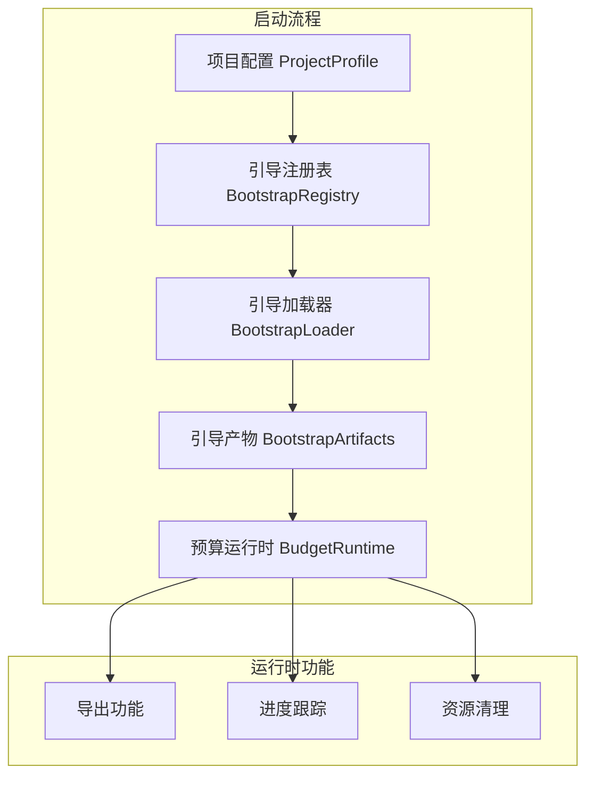

# Price-RS 运行时启动与引导系统

本文档详细分析 Price-RS 项目中的运行时启动机制，展示了如何通过引导系统（Bootstrap）构建和管理复杂的业务运行时。

## 运行时架构概述

Price-RS 使用分层的启动架构，将系统初始化分为多个阶段：



## 核心组件详解

### 1. 项目配置 (ProjectProfile)

项目配置定义了系统的基本信息和运行阶段：

```rust
// price_common/src/bootstrap/profile.rs
use serde::{Deserialize, Serialize};
use std::collections::HashMap;

/// 项目阶段枚举
#[derive(Debug, Clone, Serialize, Deserialize)]
pub enum ProjectPhase {
    Budget,       // 预算阶段
    Bidding,      // 招标阶段
    Settlement,   // 结算阶段
    Audit,        // 审计阶段
}

/// 项目配置
#[derive(Debug, Clone)]
pub struct ProjectProfile {
    /// 项目唯一标识
    project_id: String,

    /// 当前阶段
    phase: ProjectPhase,

    /// 元数据配置
    metadata: HashMap<String, String>,

    /// 扩展配置
    extensions: Vec<String>,

    /// 性能配置
    performance: PerformanceConfig,
}

impl ProjectProfile {
    /// 构建器模式创建配置
    pub fn builder() -> ProjectProfileBuilder {
        ProjectProfileBuilder::default()
    }
}

pub struct ProjectProfileBuilder {
    project_id: Option<String>,
    phase: Option<ProjectPhase>,
    metadata: HashMap<String, String>,
    extensions: Vec<String>,
    performance: PerformanceConfig,
}

impl ProjectProfileBuilder {
    pub fn project_id(mut self, id: impl Into<String>) -> Self {
        self.project_id = Some(id.into());
        self
    }

    pub fn phase(mut self, phase: ProjectPhase) -> Self {
        self.phase = Some(phase);
        self
    }

    pub fn metadata(mut self, key: impl Into<String>, value: impl Into<String>) -> Self {
        self.metadata.insert(key.into(), value.into());
        self
    }

    pub fn extension(mut self, ext: impl Into<String>) -> Self {
        self.extensions.push(ext.into());
        self
    }

    pub fn build(self) -> Result<ProjectProfile> {
        let project_id = self.project_id.ok_or("project_id is required")?;
        let phase = self.phase.ok_or("phase is required")?;

        Ok(ProjectProfile {
            project_id,
            phase,
            metadata: self.metadata,
            extensions: self.extensions,
            performance: self.performance,
        })
    }
}

/// 性能配置
#[derive(Debug, Clone)]
pub struct PerformanceConfig {
    /// 最大并发任务数
    pub max_concurrent_tasks: usize,

    /// 缓存大小（MB）
    pub cache_size_mb: usize,

    /// 是否启用并行处理
    pub enable_parallel: bool,

    /// 批处理大小
    pub batch_size: usize,
}

impl Default for PerformanceConfig {
    fn default() -> Self {
        Self {
            max_concurrent_tasks: 4,
            cache_size_mb: 512,
            enable_parallel: true,
            batch_size: 100,
        }
    }
}
```

### 2. 引导注册表 (BootstrapRegistry)

引导注册表管理七种类型的提供器（Provider），用于系统的模块化配置：

```rust
// price_common/src/bootstrap/registry.rs
use std::sync::Arc;

/// 引导注册表
/// 负责管理七类提供器，并在构建 Loader 时按项目画像筛选出有效的阶段链
pub struct BootstrapRegistry {
    /// Schema/扩展提供器 - 节点和扩展定义
    schema: Vec<Entry<dyn ExtensionProvider>>,

    /// 规则提供器 - 业务规则加载器
    rules: Vec<Entry<dyn RuleProvider>>,

    /// 数据源提供器 - 数据库、HTTP等数据源配置
    data_sources: Vec<Entry<dyn DataSourceProvider>>,

    /// 元数据提供器 - 项目元数据
    metadata: Vec<Entry<dyn MetadataProvider>>,

    /// 事件处理器提供器 - 事件处理器（如持久化、搜索引擎）
    event_handlers: Vec<Entry<dyn EventHandlerProvider>>,

    /// 中间件提供器 - 请求拦截、日志等中间件
    middleware: Vec<Entry<dyn MiddlewareProvider>>,

    /// Forge配置提供器 - ModuForge运行时配置
    forge_configs: Vec<Entry<dyn ForgeConfigProvider>>,
}

/// 提供器选择器
/// 通过项目阶段/项目ID/租户/区域编码筛选匹配的提供器
#[derive(Debug, Clone, Default)]
pub struct ProviderSelector {
    pub phase: Option<ProjectPhase>,
    pub project_id: Option<String>,
    pub tenant_id: Option<String>,
    pub region_code: Option<String>,
}

/// 注册表内部条目包装
struct Entry<T: ?Sized> {
    selector: ProviderSelector,
    provider: Arc<T>,
}

impl BootstrapRegistry {
    /// 创建空注册表
    pub fn new() -> Self {
        Self {
            schema: Vec::new(),
            rules: Vec::new(),
            data_sources: Vec::new(),
            metadata: Vec::new(),
            event_handlers: Vec::new(),
            middleware: Vec::new(),
            forge_configs: Vec::new(),
        }
    /// 注册 schema 提供器
    pub fn register_schema<P>(
        &mut self,
        selector: ProviderSelector,
        provider: P,
    ) where
        P: ExtensionProvider + 'static,
    {
        self.schema.push(Entry::new(selector, Arc::new(provider)));
    }

    /// 注册规则提供器
    pub fn register_rule<P>(
        &mut self,
        selector: ProviderSelector,
        provider: P,
    ) where
        P: RuleProvider + 'static,
    {
        self.rules.push(Entry::new(selector, Arc::new(provider)));
    }

    /// 注册数据源提供器
    pub fn register_data_source<P>(
        &mut self,
        selector: ProviderSelector,
        provider: P,
    ) where
        P: DataSourceProvider + 'static,
    {
        self.data_sources.push(Entry::new(selector, Arc::new(provider)));
    }

    /// 注册元数据提供器
    pub fn register_metadata<P>(
        &mut self,
        selector: ProviderSelector,
        provider: P,
    ) where
        P: MetadataProvider + 'static,
    {
        self.metadata.push(Entry::new(selector, Arc::new(provider)));
    }

    /// 注册事件处理器提供器
    pub fn register_event_handler<P>(
        &mut self,
        selector: ProviderSelector,
        provider: P,
    ) where
        P: EventHandlerProvider + 'static,
    {
        self.event_handlers.push(Entry::new(selector, Arc::new(provider)));
    }

    /// 注册中间件提供器
    pub fn register_middleware<P>(
        &mut self,
        selector: ProviderSelector,
        provider: P,
    ) where
        P: MiddlewareProvider + 'static,
    {
        self.middleware.push(Entry::new(selector, Arc::new(provider)));
    }

    /// 注册 Forge 配置提供器
    pub fn register_forge_config<P>(
        &mut self,
        selector: ProviderSelector,
        provider: P,
    ) where
        P: ForgeConfigProvider + 'static,
    {
        self.forge_configs.push(Entry::new(selector, Arc::new(provider)));
    }

    /// 根据项目画像构建加载器及其阶段链
    /// 构建顺序：Schema → DataSource → Metadata → EventHandler → Middleware → ForgeConfig → Rule
    pub fn build_loader(
        &self,
        profile: &ProjectProfile,
    ) -> BootstrapLoader {
        let mut builder = BootstrapLoader::builder();

        // 1. Schema 阶段
        for entry in self.schema.iter().filter(|e| e.selector.matches(profile)) {
            builder.add_stage(schema_stage_from_arc(Arc::clone(&entry.provider)));
        }

        // 2. DataSource 阶段
        for entry in self.data_sources.iter().filter(|e| e.selector.matches(profile)) {
            builder.add_stage(data_source_stage_from_arc(Arc::clone(&entry.provider)));
        }

        // 3. Metadata 阶段
        for entry in self.metadata.iter().filter(|e| e.selector.matches(profile)) {
            builder.add_stage(metadata_stage_from_arc(Arc::clone(&entry.provider)));
        }

        // 4. EventHandler 阶段
        for entry in self.event_handlers.iter().filter(|e| e.selector.matches(profile)) {
            builder.add_stage(event_handler_stage_from_arc(Arc::clone(&entry.provider)));
        }

        // 5. Middleware 阶段
        for entry in self.middleware.iter().filter(|e| e.selector.matches(profile)) {
            builder.add_stage(middleware_stage_from_arc(Arc::clone(&entry.provider)));
        }

        // 6. ForgeConfig 阶段
        for entry in self.forge_configs.iter().filter(|e| e.selector.matches(profile)) {
            builder.add_stage(forge_config_stage_from_arc(Arc::clone(&entry.provider)));
        }

        // 7. Rule 阶段
        for entry in self.rules.iter().filter(|e| e.selector.matches(profile)) {
            builder.add_stage(rule_stage_from_arc(Arc::clone(&entry.provider)));
        }

        builder.build()
    }
}
```

### 2.1 引导注册表构建器 (BootstrapRegistryBuilder)

实际项目中提供了一个构建器来简化注册表的创建：

```rust
// price_budget/src/bootstrap.rs
pub struct BootstrapRegistryBuilder {
    registry: BootstrapRegistry,
    selector: ProviderSelector,
}

impl BootstrapRegistryBuilder {
    /// 创建新的构建器
    pub fn new() -> Self {
        Self {
            registry: BootstrapRegistry::new(),
            selector: ProviderSelector::default()
        }
    }

    /// 设置选择器（用于筛选 Provider）
    pub fn with_selector(mut self, selector: ProviderSelector) -> Self {
        self.selector = selector;
        self
    }

    /// 设置规则提供器
    pub fn with_rule_provider<R>(mut self, provider: R) -> Self
    where
        R: RuleProvider + 'static,
    {
        self.registry.register_rule(self.selector.clone(), provider);
        self
    }

    /// 设置 Schema 提供器
    pub fn with_schema_provider<P>(mut self, provider: P) -> Self
    where
        P: ExtensionProvider + 'static,
    {
        self.registry.register_schema(self.selector.clone(), provider);
        self
    }

    /// 构建注册表
    pub fn build(mut self) -> BootstrapRegistry {
        // 填充默认的 Provider
        self.fill_defaults();
        self.registry
    }

    /// 填充默认的 Provider（如果用户没有自定义）
    fn fill_defaults(&mut self) {
        let default_selector = ProviderSelector::default();

        // 注册默认扩展
        self.registry.register_schema(default_selector.clone(), DefaultSchemaProvider);
        // 注册默认数据源
        self.registry.register_data_source(default_selector.clone(), DefaultDataSourceProvider);
        // 注册默认元数据
        self.registry.register_metadata(default_selector.clone(), DefaultMetadataProvider);
        // 注册默认事件处理器
        self.registry.register_event_handler(default_selector.clone(), DefaultEventHandlerProvider);
        // 注册默认中间件
        self.registry.register_middleware(default_selector.clone(), DefaultMiddlewareProvider);
        // 注册默认运行时配置
        self.registry.register_forge_config(default_selector.clone(), DefaultForgeConfigProvider);
        // 注册默认规则引擎配置
        self.registry.register_rule(default_selector, DefaultRuleProvider);
    }
}
```

### 2.2 默认提供器实现

Price-RS 项目为每种提供器类型都实现了默认版本：

```rust
// price_budget/src/bootstrap.rs

/// 默认的 Schema 提供器 - 提供扩展定义
pub struct DefaultSchemaProvider;

#[async_trait]
impl ExtensionProvider for DefaultSchemaProvider {
    async fn provide(
        &self,
        profile: &ProjectProfile,
    ) -> BootstrapResult<Vec<Extensions>> {
        let mut extensions = Vec::new();
        match profile.phase {
            // 预算项目
            ProjectPhase::Budget => {
                // 1: 左侧工程项目树
                extensions.extend(base_sechma::init());
                // 2: 分部分项措施项目
                extensions.extend(fbfx_csxm::init());
                // 3: 单价构成
                extensions.extend(djgc::init());
                // 4：人材机
                extensions.extend(rcj::init());
                // 5: 预算项目自身定义
                extensions.extend(price_budget::init());
            },
            _ => {},
        }
        Ok(extensions)
    }

    fn name(&self) -> &'static str {
        "default_schema_provider"
    }
}

/// 默认的事件处理器提供器
pub struct DefaultEventHandlerProvider;

#[async_trait]
impl EventHandlerProvider for DefaultEventHandlerProvider {
    async fn provide(
        &self,
        profile: &ProjectProfile,
    ) -> BootstrapResult<Vec<Arc<dyn EventHandler<Event> + Send + Sync>>> {
        let mut handles: Vec<Arc<dyn EventHandler<Event> + Send + Sync>> = vec![];

        match profile.phase {
            ProjectPhase::Budget => {
                let path = Path::new(&profile.project_id);

                // 初始化快照处理器（持久化）
                let store = SqliteEventStore::open(path, CommitMode::AsyncDurable {
                    group_window_ms: 8
                }).await?;

                // 配置持久化选项
                let persist_opts = PersistOptions {
                    commit_mode: CommitMode::AsyncDurable { group_window_ms: 8 },
                    snapshot_every_n_events: 1000,
                    snapshot_every_bytes: 8 * 1024 * 1024,
                    snapshot_every_ms: 5 * 60 * 1000,
                    compression: true,
                };

                // 注入持久化订阅者
                let subscriber = Arc::new(SnapshotSubscriber::new(
                    store,
                    persist_opts,
                    "default_doc"
                ));
                handles.push(subscriber);

                // 初始化本地搜索引擎
                let search = create_search_index_handler(path).await?;
                handles.push(search);
            },
            _ => {},
        }
        Ok(handles)
    }

    fn name(&self) -> &'static str {
        "default_event_handler_provider"
    }
}

/// 默认的规则提供器
struct DefaultRuleProvider;

#[async_trait]
impl RuleProvider for DefaultRuleProvider {
    async fn provide(
        &self,
        profile: &ProjectProfile,
    ) -> BootstrapResult<Arc<dyn RulesLoaderExt>> {
        match profile.metadata.get("rules") {
            None => Err(BootstrapError::InvalidConfiguration(
                "profile.metadata 缺少规则引擎路径配置".to_string()
            )),
            Some(rules) => Ok(Arc::new(SystemLoader {
                root: rules.clone()
            })),
        }
    }

    fn name(&self) -> &'static str {
        "test-rule"
    }
}
```

### 3. 引导加载器 (BootstrapLoader)

引导加载器由注册表构建，负责按顺序执行各个提供器阶段：

```rust
// 通过注册表构建加载器的过程（在 BootstrapRegistry::build_loader 中）
pub fn build_loader(&self, profile: &ProjectProfile) -> BootstrapLoader {
    let mut builder = BootstrapLoader::builder();

    // 按顺序添加各个阶段
    // 1. Schema 阶段 - 加载扩展和节点定义
    for entry in self.schema.iter().filter(|e| e.selector.matches(profile)) {
        builder.add_stage(schema_stage_from_arc(Arc::clone(&entry.provider)));
    }

    // 2. DataSource 阶段 - 配置数据源
    for entry in self.data_sources.iter().filter(|e| e.selector.matches(profile)) {
        builder.add_stage(data_source_stage_from_arc(Arc::clone(&entry.provider)));
    }

    // 3. Metadata 阶段 - 加载元数据
    for entry in self.metadata.iter().filter(|e| e.selector.matches(profile)) {
        builder.add_stage(metadata_stage_from_arc(Arc::clone(&entry.provider)));
    }

    // 4. EventHandler 阶段 - 设置事件处理器（持久化、搜索等）
    for entry in self.event_handlers.iter().filter(|e| e.selector.matches(profile)) {
        builder.add_stage(event_handler_stage_from_arc(Arc::clone(&entry.provider)));
    }

    // 5. Middleware 阶段 - 配置中间件
    for entry in self.middleware.iter().filter(|e| e.selector.matches(profile)) {
        builder.add_stage(middleware_stage_from_arc(Arc::clone(&entry.provider)));
    }

    // 6. ForgeConfig 阶段 - 配置 ModuForge 运行时
    for entry in self.forge_configs.iter().filter(|e| e.selector.matches(profile)) {
        builder.add_stage(forge_config_stage_from_arc(Arc::clone(&entry.provider)));
    }

    // 7. Rule 阶段 - 加载业务规则
    for entry in self.rules.iter().filter(|e| e.selector.matches(profile)) {
        builder.add_stage(rule_stage_from_arc(Arc::clone(&entry.provider)));
    }

    builder.build()
```

### 4. 引导产物 (BootstrapArtifacts)

引导产物包含了系统运行所需的所有组件：

```rust
// price_common/src/bootstrap/artifacts.rs
use moduforge_core::ForgeRuntime;
use std::sync::Arc;

/// 引导产物
pub struct BootstrapArtifacts {
    /// ModuForge 运行时
    pub forge_runtime: Arc<ForgeRuntime>,

    /// 加载的扩展集合
    pub extensions: ExtensionSet,

    /// 初始化的服务容器
    pub services: ServiceContainer,

    /// 项目数据
    pub project_data: ProjectData,

    /// 插件集合
    pub plugins: PluginSet,

    /// 中间件链
    pub middleware: MiddlewareChain,

    /// 项目配置
    pub profile: ProjectProfile,
}

impl BootstrapArtifacts {
    /// 获取指定服务
    pub fn get_service<T: Service>(&self, name: &str) -> Option<Arc<T>> {
        self.services.get(name)
    }

    /// 获取指定扩展
    pub fn get_extension(&self, name: &str) -> Option<Arc<dyn Extension>> {
        self.extensions.get(name)
    }

    /// 获取运行时
    pub fn runtime(&self) -> Arc<ForgeRuntime> {
        self.forge_runtime.clone()
    }
}
```

### 5. 预算运行时 (BudgetRuntime)

预算运行时是业务层的核心运行时，基于引导产物构建：

```rust
// price_budget/src/runtime/mod.rs
use price_common::bootstrap::BootstrapArtifacts;
use tokio::sync::mpsc;
use std::path::PathBuf;

/// 预算运行时
pub struct BudgetRuntime {
    /// 引导产物
    artifacts: BootstrapArtifacts,

    /// 运行时状态
    state: RuntimeState,

    /// 后台任务管理器
    task_manager: TaskManager,

    /// 事件总线
    event_bus: EventBus,
}

impl BudgetRuntime {
    /// 从引导产物创建运行时
    pub async fn from_bootstrap(artifacts: BootstrapArtifacts) -> Result<Self> {
        // 初始化运行时状态
        let state = RuntimeState::new(&artifacts.project_data);

        // 创建任务管理器
        let task_manager = TaskManager::new(artifacts.profile.performance.max_concurrent_tasks);

        // 创建事件总线
        let event_bus = EventBus::new();

        // 启动后台服务
        Self::start_background_services(&artifacts, &task_manager).await?;

        Ok(Self {
            artifacts,
            state,
            task_manager,
            event_bus,
        })
    }

    async fn start_background_services(
        artifacts: &BootstrapArtifacts,
        task_manager: &TaskManager,
    ) -> Result<()> {
        // 启动自动保存服务
        if let Some(autosave) = artifacts.plugins.get("autosave") {
            task_manager.spawn_recurring(
                "autosave",
                Duration::from_secs(300),
                autosave.clone()
            );
        }

        // 启动监控服务
        if let Some(monitoring) = artifacts.services.get::<MonitoringService>("monitoring") {
            task_manager.spawn_background(
                "monitoring",
                monitoring.start()
            );
        }

        Ok(())
    }

    /// 导出项目（同步版本）
    pub async fn export(&mut self, path: PathBuf) -> Result<ExportStats> {
        let exporter = Exporter::new(self.artifacts.clone());
        exporter.export_to_file(path).await
    }

    /// 导出项目（带进度跟踪）
    pub async fn export_with_progress(
        &mut self,
        path: impl Into<PathBuf>,
        progress_tx: mpsc::Sender<ExportProgress>,
    ) -> tokio::task::JoinHandle<Result<ExportStats>> {
        let artifacts = self.artifacts.clone();
        let path = path.into();

        tokio::spawn(async move {
            let exporter = Exporter::new(artifacts);
            exporter.export_with_progress(path, progress_tx).await
        })
    }

    /// 销毁运行时
    pub async fn destroy(&mut self) -> Result<()> {
        // 1. 停止所有后台任务
        self.task_manager.shutdown_all().await?;

        // 2. 保存未保存的数据
        self.save_pending_changes().await?;

        // 3. 关闭所有服务
        for (name, service) in self.artifacts.services.iter() {
            service.shutdown().await?;
        }

        // 4. 清理资源
        self.cleanup_resources().await?;

        Ok(())
    }

    async fn save_pending_changes(&mut self) -> Result<()> {
        if self.state.has_pending_changes() {
            let db_service = self.artifacts.get_service::<DatabaseService>("database")
                .ok_or(Error::ServiceNotFound("database"))?;

            db_service.save_project(&self.artifacts.project_data).await?;
            self.state.clear_pending_changes();
        }

        Ok(())
    }

    async fn cleanup_resources(&mut self) -> Result<()> {
        // 清理临时文件
        if let Some(temp_dir) = self.state.temp_directory() {
            tokio::fs::remove_dir_all(temp_dir).await.ok();
        }

        // 清理缓存
        if let Some(cache) = self.artifacts.get_service::<CacheService>("cache") {
            cache.clear().await;
        }

        Ok(())
    }
}
```

## 完整启动示例

基于 export.rs 测试文件中的实际实现，这里是完整的启动流程：

```rust
use price_budget::bootstrap::BootstrapRegistryBuilder;
use price_budget::runtime::BudgetRuntime;
use price_common::bootstrap::{BootstrapArtifacts, ProjectPhase, ProjectProfile};
use tokio::sync::mpsc;

#[tokio::test(flavor = "multi_thread", worker_threads = 2)]
async fn export_with_progress() -> anyhow::Result<()> {
    // 使用新的 API：直接从 Bootstrap 产物创建运行时
    let artifacts = build_bootstrap_artifacts().await;
    let mut runtime = BudgetRuntime::from_bootstrap(artifacts).await?;
    let (progress_tx, mut progress_rx) = mpsc::channel(100);

    // 启动导出任务 - export_with_progress 返回 JoinHandle
    let export_handle = runtime.export_with_progress("./test_export.mff", progress_tx).await;

    // 使用单独的任务处理进度接收
    let progress_task = tokio::spawn(async move {
        while let Some(progress) = progress_rx.recv().await {
            println!("导出进度: {}% - {}", progress.percentage, progress.current_segment);
        }
        println!("进度通道已关闭");
    });

    // 等待导出任务完成
    match export_handle.await {
        Ok(Ok(stats)) => {
            println!("导出成功: {} 段, {} 字节", stats.total_segments(), stats.total_bytes);
        },
        Ok(Err(e)) => {
            eprintln!("导出失败: {:?}", e);
            return Err(anyhow::anyhow!("Export failed: {:?}", e));
        },
        Err(e) => {
            eprintln!("任务 JoinError: {:?}", e);
            return Err(anyhow::anyhow!("Task join error: {:?}", e));
        },
    }

    // 等待进度任务完成
    let _ = progress_task.await;

    // 导出完成后销毁运行时
    runtime.destroy().await?;
    println!("运行时销毁成功");

    // 清理测试文件
    if std::path::Path::new("./test_export.mff").exists() {
        std::fs::remove_file("./test_export.mff")?;
        println!("清理测试文件成功");
    }

    Ok(())
}

/// 通过引导加载器组装 BootstrapArtifacts
async fn build_bootstrap_artifacts() -> BootstrapArtifacts {
    let profile = ProjectProfile::builder()
        .project_id("123456789")
        .phase(ProjectPhase::Budget)
        .metadata("rules", "/rules")
        .build()
        .expect("invalid project profile");

    let registry = BootstrapRegistryBuilder::new().build();
    let loader = registry.build_loader(&profile);
    loader.bootstrap(profile).await.expect("bootstrap loader should succeed")

    // 6. 使用运行时功能

    // 6.1 带进度跟踪的导出
    let (progress_tx, mut progress_rx) = mpsc::channel(100);

    // 启动导出任务
    let export_handle = runtime.export_with_progress("./project_export.mff", progress_tx).await;

    // 处理进度更新
    let progress_task = tokio::spawn(async move {
        while let Some(progress) = progress_rx.recv().await {
            println!("导出进度: {}% - {}", progress.percentage, progress.current_segment);

            // 可以将进度发送给前端
            // websocket.send(progress).await;
        }
        println!("进度通道已关闭");
    });

    // 等待导出完成
    match export_handle.await {
        Ok(Ok(stats)) => {
            println!("导出成功:");
            println!("  总段数: {}", stats.total_segments());
            println!("  总字节: {}", stats.total_bytes);
            println!("  耗时: {:?}", stats.duration);
        }
        Ok(Err(e)) => {
            eprintln!("导出失败: {:?}", e);
            return Err(anyhow::anyhow!("Export failed: {:?}", e));
        }
        Err(e) => {
            eprintln!("任务 JoinError: {:?}", e);
            return Err(anyhow::anyhow!("Task join error: {:?}", e));
        }
    }

    // 等待进度任务完成
    let _ = progress_task.await;

    // 7. 执行其他业务操作
    // ... 其他业务逻辑 ...

    // 8. 销毁运行时
    runtime.destroy().await?;
    println!("运行时销毁成功");

    Ok(())
}
```

## 进度跟踪系统

### 进度数据结构

```rust
// price_budget/src/export/progress.rs
use serde::{Serialize, Deserialize};

#[derive(Debug, Clone, Serialize, Deserialize)]
pub struct ExportProgress {
    /// 当前进度百分比 (0-100)
    pub percentage: u8,

    /// 当前处理的段
    pub current_segment: String,

    /// 已处理的段数
    pub processed_segments: usize,

    /// 总段数
    pub total_segments: usize,

    /// 已处理的字节数
    pub processed_bytes: usize,

    /// 预估总字节数
    pub estimated_total_bytes: Option<usize>,

    /// 当前阶段
    pub stage: ExportStage,

    /// 错误信息（如果有）
    pub error: Option<String>,
}

#[derive(Debug, Clone, Serialize, Deserialize)]
pub enum ExportStage {
    Preparing,        // 准备阶段
    CollectingData,   // 收集数据
    Processing,       // 处理数据
    Writing,          // 写入文件
    Finalizing,       // 最后处理
    Complete,         // 完成
    Failed,           // 失败
}

/// 导出统计
#[derive(Debug, Clone)]
pub struct ExportStats {
    /// 导出的段
    pub segments: Vec<SegmentInfo>,

    /// 总字节数
    pub total_bytes: usize,

    /// 导出耗时
    pub duration: Duration,

    /// 错误信息
    pub errors: Vec<String>,
}

impl ExportStats {
    pub fn total_segments(&self) -> usize {
        self.segments.len()
    }
}
```

### 导出器实现

```rust
// price_budget/src/export/exporter.rs
use tokio::sync::mpsc;
use std::path::PathBuf;

pub struct Exporter {
    artifacts: BootstrapArtifacts,
}

impl Exporter {
    pub fn new(artifacts: BootstrapArtifacts) -> Self {
        Self { artifacts }
    }

    /// 带进度跟踪的导出
    pub async fn export_with_progress(
        &self,
        path: PathBuf,
        progress_tx: mpsc::Sender<ExportProgress>,
    ) -> Result<ExportStats> {
        let start_time = Instant::now();
        let mut stats = ExportStats::default();

        // 1. 准备阶段
        self.send_progress(&progress_tx, ExportProgress {
            percentage: 0,
            current_segment: "准备导出".to_string(),
            processed_segments: 0,
            total_segments: 0,
            processed_bytes: 0,
            estimated_total_bytes: None,
            stage: ExportStage::Preparing,
            error: None,
        }).await;

        // 2. 收集数据
        let segments = self.collect_segments().await?;
        let total_segments = segments.len();

        self.send_progress(&progress_tx, ExportProgress {
            percentage: 10,
            current_segment: "数据收集完成".to_string(),
            processed_segments: 0,
            total_segments,
            processed_bytes: 0,
            estimated_total_bytes: Some(self.estimate_size(&segments)),
            stage: ExportStage::CollectingData,
            error: None,
        }).await;

        // 3. 处理和写入数据
        let mut file = tokio::fs::File::create(&path).await?;
        let mut processed_segments = 0;
        let mut processed_bytes = 0;

        for segment in segments {
            // 处理段
            let processed_data = self.process_segment(&segment).await?;
            let data_bytes = processed_data.len();

            // 写入文件
            file.write_all(&processed_data).await?;

            processed_segments += 1;
            processed_bytes += data_bytes;

            // 计算进度
            let percentage = (10 + (processed_segments * 80 / total_segments)) as u8;

            // 发送进度
            self.send_progress(&progress_tx, ExportProgress {
                percentage,
                current_segment: segment.name.clone(),
                processed_segments,
                total_segments,
                processed_bytes,
                estimated_total_bytes: Some(processed_bytes * total_segments / processed_segments),
                stage: ExportStage::Processing,
                error: None,
            }).await;

            stats.segments.push(SegmentInfo {
                name: segment.name,
                size: data_bytes,
            });
        }

        // 4. 最终处理
        self.send_progress(&progress_tx, ExportProgress {
            percentage: 95,
            current_segment: "正在完成导出".to_string(),
            processed_segments: total_segments,
            total_segments,
            processed_bytes,
            estimated_total_bytes: Some(processed_bytes),
            stage: ExportStage::Finalizing,
            error: None,
        }).await;

        // 刷新并关闭文件
        file.flush().await?;
        drop(file);

        // 5. 完成
        stats.total_bytes = processed_bytes;
        stats.duration = start_time.elapsed();

        self.send_progress(&progress_tx, ExportProgress {
            percentage: 100,
            current_segment: "导出完成".to_string(),
            processed_segments: total_segments,
            total_segments,
            processed_bytes,
            estimated_total_bytes: Some(processed_bytes),
            stage: ExportStage::Complete,
            error: None,
        }).await;

        Ok(stats)
    }

    async fn send_progress(&self, tx: &mpsc::Sender<ExportProgress>, progress: ExportProgress) {
        // 忽略发送错误（接收方可能已关闭）
        let _ = tx.send(progress).await;
    }

    async fn collect_segments(&self) -> Result<Vec<Segment>> {
        // 根据项目阶段收集不同的数据段
        let mut segments = Vec::new();

        // 基础数据段
        segments.push(Segment::new("project_info", SegmentType::ProjectInfo));
        segments.push(Segment::new("metadata", SegmentType::Metadata));

        // 根据阶段添加特定段
        match self.artifacts.profile.phase {
            ProjectPhase::Budget => {
                segments.push(Segment::new("djgc_data", SegmentType::Djgc));
                segments.push(Segment::new("bzhs_data", SegmentType::Bzhs));
                segments.push(Segment::new("rcj_data", SegmentType::Rcj));
                segments.push(Segment::new("fbfx_data", SegmentType::Fbfx));
            }
            ProjectPhase::Bidding => {
                segments.push(Segment::new("tender_data", SegmentType::Tender));
                segments.push(Segment::new("bidding_docs", SegmentType::BiddingDocs));
            }
            _ => {}
        }

        Ok(segments)
    }

    async fn process_segment(&self, segment: &Segment) -> Result<Vec<u8>> {
        match segment.segment_type {
            SegmentType::ProjectInfo => {
                self.serialize_project_info().await
            }
            SegmentType::Djgc => {
                self.serialize_djgc_data().await
            }
            SegmentType::Rcj => {
                self.serialize_rcj_data().await
            }
            _ => {
                // 处理其他类型
                Ok(Vec::new())
            }
        }
    }
}
```

## 错误处理

```rust
// price_budget/src/error.rs
use thiserror::Error;

#[derive(Error, Debug)]
pub enum BudgetError {
    #[error("引导失败: {0}")]
    BootstrapFailed(String),

    #[error("扩展未找到: {0}")]
    ExtensionNotFound(String),

    #[error("服务未找到: {0}")]
    ServiceNotFound(String),

    #[error("导出失败: {0}")]
    ExportFailed(String),

    #[error("数据库错误: {0}")]
    DatabaseError(#[from] DatabaseError),

    #[error("IO 错误: {0}")]
    IoError(#[from] std::io::Error),

    #[error("序列化错误: {0}")]
    SerializationError(#[from] serde_json::Error),

    #[error("运行时错误: {0}")]
    RuntimeError(String),
}

type Result<T> = std::result::Result<T, BudgetError>;
```

## 关键设计特点

### 1. 分层启动架构
- **配置层**：ProjectProfile 定义系统配置
- **注册层**：BootstrapRegistry 管理可用组件
- **加载层**：BootstrapLoader 执行初始化
- **产物层**：BootstrapArtifacts 包含运行组件
- **运行层**：BudgetRuntime 提供业务功能

### 2. 灵活的扩展管理
- 根据项目阶段动态加载扩展
- 支持自定义扩展注册
- 扩展间松耦合设计

### 3. 完善的生命周期管理
- 明确的启动流程
- 优雅的关闭机制
- 资源自动清理

### 4. 进度跟踪机制
- 实时进度报告
- 多阶段状态跟踪
- 异步任务管理

### 5. 错误处理策略
- 分层错误处理
- 详细的错误信息
- 优雅的错误恢复

## 最佳实践

1. **使用构建器模式**：简化复杂对象的创建
2. **依赖注入**：通过注册表管理依赖
3. **异步优先**：充分利用异步特性
4. **资源管理**：确保资源正确释放
5. **进度反馈**：为长时间操作提供进度
6. **错误传播**：使用 Result 类型传播错误
7. **模块化设计**：保持组件独立性

## 总结

Price-RS 的运行时启动系统展示了一个企业级应用的完整启动流程。通过分层的架构设计、灵活的扩展机制和完善的生命周期管理，实现了一个健壮、可扩展的系统启动框架。这个设计为构建大型 Rust 应用提供了优秀的参考范例。