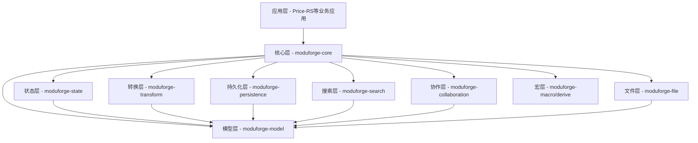

# 架构设计详解

本文档详细介绍 ModuForge-RS 的系统架构、设计模式和技术决策。

## 整体架构

### 分层架构

ModuForge-RS 采用分层架构设计，从下到上分为：



### 核心 Crates 职责

```
┌─────────────────────────────────────────────────────┐
│                    应用层                            │
│      (Price-RS、业务扩展、Tauri/Web应用)            │
└─────────────────────────────────────────────────────┘
                         ↓
┌─────────────────────────────────────────────────────┐
│              moduforge-core (mf_core)               │
│  - 运行时系统（同步/异步/Actor三种模式）            │
│  - 事件总线（高性能无锁设计）                       │
│  - 扩展管理器                                       │
│  - 中间件系统                                       │
│  - 历史管理器                                       │
│  - 配置管理                                         │
│  - Actor系统（基于ractor）                          │
│  - 泛型框架支持                                     │
└─────────────────────────────────────────────────────┘
         ↓              ↓              ↓
┌──────────────┐ ┌──────────────┐ ┌──────────────┐
│moduforge-    │ │moduforge-    │ │moduforge-    │
│model         │ │state         │ │transform     │
│(mf_model)    │ │(mf_state)    │ │(mf_transform)│
│              │ │              │ │              │
│- Node系统    │ │- State管理   │ │- 泛型Step    │
│- Mark系统    │ │- Transaction │ │- Transform   │
│- Schema定义  │ │- Plugin系统  │ │- 批量操作    │
│- NodePool    │ │- Resource    │ │- 命令系统    │
│- 泛型traits  │ │- Selection   │ │- 增量更新    │
└──────────────┘ └──────────────┘ └──────────────┘
         ↓              ↓              ↓
┌─────────────────────────────────────────────────────┐
│                    支撑层                            │
│  - moduforge-persistence: SQLite持久化、快照管理    │
│  - moduforge-search: 全文搜索、索引服务            │
│  - moduforge-collaboration: WebRTC协作、CRDT       │
│  - moduforge-file: 文件导入导出                     │
│  - moduforge-macro: 过程宏（mf_extension!等）      │
│  - moduforge-derive: 派生宏（#[derive(Node)]等）   │
└─────────────────────────────────────────────────────┘
```

## 核心模块详解

### 1. 模型层 (moduforge-model)

#### 设计目标

- 提供高性能的文档模型
- 支持泛型抽象（DataContainer trait）
- 线程安全的节点管理
- 持久化数据结构（rpds）

#### 核心组件

```rust
// 泛型数据容器trait
pub trait DataContainer: Clone + Send + Sync + Debug + 'static {
    type NodeType: Clone + Send + Sync + Debug;
    type IdType: Clone + Send + Sync + Debug + Hash + Eq;

    fn get_node(&self, id: &Self::IdType) -> Option<&Self::NodeType>;
    fn add_node(&mut self, node: Self::NodeType) -> Result<Self::IdType>;
    fn update_node(&mut self, id: &Self::IdType, node: Self::NodeType) -> Result<()>;
    fn remove_node(&mut self, id: &Self::IdType) -> Result<()>;
}

// 节点池 - 默认的DataContainer实现
pub struct NodePool {
    nodes: DashMap<Box<str>, Arc<Node>>,  // 并发安全的节点存储
    id_generator: Arc<AtomicU64>,         // 原子ID生成器
    root_id: Option<Box<str>>,            // 根节点ID
}

// 节点定义
pub struct Node {
    pub id: Box<str>,                     // 节点唯一标识
    pub r#type: Box<str>,                 // 节点类型
    pub attrs: HashMap<String, Value>,    // 节点属性
    pub text: Option<String>,              // 文本内容
    pub children: Vec<Box<str>>,          // 子节点ID列表
    pub marks: Vec<Mark>,                 // 标记列表
    pub parent: Option<Box<str>>,         // 父节点ID
}

// 标记定义
pub struct Mark {
    pub r#type: Box<str>,                 // 标记类型
    pub attrs: HashMap<String, Value>,    // 标记属性
}

// Schema定义trait
pub trait SchemaDefinition: Clone + Send + Sync + Debug + 'static {
    type Container: DataContainer;

    fn validate_node(&self, node: &Node) -> Result<()>;
    fn factory(&self) -> &NodeFactory;
}
```

### 2. 转换层 (moduforge-transform)

#### 泛型框架设计

```rust
// 泛型Step trait - 支持任意容器和Schema组合
pub trait StepGeneric<C, S>: Send + Sync
where
    C: DataContainer + 'static,
    S: SchemaDefinition<Container = C> + 'static,
{
    fn apply(&self, pool: &mut C) -> StepResult<()>;
    fn invert(&self, pool: &C) -> StepResult<Box<dyn StepGeneric<C, S>>>;
    fn map(&self, mapping: &Mapping) -> StepResult<Box<dyn StepGeneric<C, S>>>;
    fn to_json(&self) -> Value;
}

// 泛型Transform - 事务处理
pub struct TransformGeneric<C, S>
where
    C: DataContainer + 'static,
    S: SchemaDefinition<Container = C> + 'static,
{
    pub doc: C,
    pub schema: S,
    pub steps: Vec<Box<dyn StepGeneric<C, S>>>,
    pub docs: Vec<C>,
    pub mapping: Mapping,
}

// 具体实现 - NodePool的Step
pub struct AddNodeStep {
    pub parent_id: Box<str>,
    pub nodes: Vec<Node>,
    pub index: Option<usize>,
}

impl StepGeneric<NodePool, Schema> for AddNodeStep {
    fn apply(&self, pool: &mut NodePool) -> StepResult<()> {
        // 添加节点实现
    }
}
```

#### 命令系统（通过宏实现）

```rust
use moduforge_transform::impl_command;

#[impl_command(InsertCommand)]
pub async fn insert_command(
    tr: &mut Transaction,
    parent_id: &Box<str>,
    name: &Box<str>,
    r#type: &String,
    other: &HashMap<String, Value>,
) -> TransformResult<()> {
    // 命令实现
}
```

### 3. 状态层 (moduforge-state)

#### 核心结构

```rust
// 泛型状态
pub struct StateGeneric<C, S>
where
    C: DataContainer + 'static,
    S: SchemaDefinition<Container = C> + 'static,
{
    pub node_pool: Arc<C>,              // 节点池
    pub schema: Arc<S>,                  // Schema
    pub selection: Selection,            // 选区
    pub plugins: Vec<Arc<dyn Plugin>>,  // 插件列表
    pub resources: ResourceTable,        // 资源表
    pub version: u64,                    // 版本号
}

// 事务定义
pub struct TransactionGeneric<C, S> {
    pub id: Box<str>,
    pub steps: Vec<Arc<dyn StepGeneric<C, S>>>,
    pub invert_steps: Vec<Arc<dyn StepGeneric<C, S>>>,
    pub metadata: HashMap<String, Value>,
    pub timestamp: i64,
}

// 插件系统
pub trait Plugin: Send + Sync {
    fn key(&self) -> &str;
    fn apply(&mut self, tr: &Transaction, old_state: &State) -> Result<()>;
    fn destroy(&mut self) {}
}

// 资源管理
pub struct ResourceTable {
    resources: DashMap<TypeId, Box<dyn Any + Send + Sync>>,
}
```

### 4. 核心运行时 (moduforge-core)

#### 多种运行时模式

```rust
// 1. 异步运行时 - 基于Tokio
pub struct ForgeAsyncRuntime {
    state: Arc<RwLock<State>>,
    history: Arc<RwLock<HistoryManager>>,
    event_bus: Arc<EventBus<Event>>,
    extensions: Arc<ExtensionManager>,
    processor: Arc<AsyncProcessor>,
    middleware_stack: MiddlewareStack,
    config: Arc<ForgeConfig>,
}

// 2. 同步运行时 - 无异步依赖
pub struct ForgeSyncRuntime {
    state: Arc<Mutex<State>>,
    history: Arc<Mutex<HistoryManager>>,
    event_bus: Arc<EventBus<Event>>,
    extensions: Arc<ExtensionManager>,
    processor: Arc<SyncProcessor>,
    config: Arc<ForgeConfig>,
}

// 3. Actor运行时 - 基于ractor
pub struct ForgeActorRuntime {
    system: ForgeActorSystem,
    state_actor: ActorRef<StateMessage>,
    transaction_processor: ActorRef<TransactionMessage>,
    event_bus: ActorRef<EventBusMessage>,
    config: Arc<ForgeConfig>,
}

// 统一的运行时trait
#[async_trait]
pub trait RuntimeTrait: Send + Sync {
    async fn get_state(&self) -> ForgeResult<Arc<State>>;
    async fn get_tr(&self) -> ForgeResult<Transaction>;
    async fn dispatch(&mut self, tr: Transaction) -> ForgeResult<()>;
    async fn undo(&mut self) -> ForgeResult<()>;
    async fn redo(&mut self) -> ForgeResult<()>;
    async fn shutdown(&mut self) -> ForgeResult<()>;
}

// 自适应运行时选择器
pub struct AdaptiveRuntimeSelector;

impl AdaptiveRuntimeSelector {
    pub fn select_runtime(config: &ForgeConfig) -> RuntimeType {
        match config.runtime_config.runtime_type {
            RuntimeType::Auto => {
                let resources = SystemResources::detect();
                match resources.tier {
                    ResourceTier::High => RuntimeType::Async,
                    ResourceTier::Medium => RuntimeType::Actor,
                    ResourceTier::Low => RuntimeType::Sync,
                }
            }
            explicit => explicit,
        }
    }
}
```

#### 事件总线架构

```rust
pub struct EventBus<T: Send + Sync + Clone + 'static> {
    tx: Sender<T>,
    rt: Receiver<T>,
    // 使用 ArcSwap 实现无锁读取
    event_handlers: Arc<ArcSwap<Vec<Arc<dyn EventHandler<T>>>>>,
    // DashMap 提供O(1)查找
    handler_registry: Arc<DashMap<HandlerId, Arc<dyn EventHandler<T>>>>,
    next_handler_id: Arc<AtomicU64>,
    config: EventConfig,
    stats: EventBusStats,
}

// 事件类型
pub enum EventGeneric<C, S> {
    Create(Arc<StateGeneric<C, S>>),
    TrApply {
        old_state: Arc<StateGeneric<C, S>>,
        new_state: Arc<StateGeneric<C, S>>,
        transactions: Vec<Arc<TransactionGeneric<C, S>>>,
    },
    Undo { /* ... */ },
    Redo { /* ... */ },
    Jump { /* ... */ },
    TrFailed { /* ... */ },
    HistoryCleared,
    Destroy,
    Stop,
}
```

### 5. 持久化层 (moduforge-persistence)

#### 功能特性

- SQLite事件存储
- 快照管理
- 增量恢复
- 压缩支持

```rust
pub struct SqliteEventStore {
    conn: Arc<Mutex<Connection>>,
    commit_mode: CommitMode,
}

pub struct SnapshotSubscriber {
    store: Arc<SqliteEventStore>,
    options: PersistOptions,
    doc_id: String,
}

pub struct PersistOptions {
    pub commit_mode: CommitMode,
    pub snapshot_every_n_events: usize,
    pub snapshot_every_bytes: usize,
    pub snapshot_every_ms: u64,
    pub compression: bool,
}
```

### 6. 搜索层 (moduforge-search)

#### 功能特性

- 全文搜索
- 增量索引
- SQLite后端

```rust
pub struct IndexService {
    backend: Arc<dyn Backend>,
}

pub enum IndexEvent {
    Rebuild {
        pool: Arc<NodePool>,
        scope: RebuildScope,
    },
    TransactionCommitted {
        pool_before: Option<Arc<NodePool>>,
        pool_after: Arc<NodePool>,
        steps: Vec<Arc<dyn StepGeneric<NodePool, Schema>>>,
    },
}

pub struct SqliteBackend {
    conn: Arc<Mutex<Connection>>,
    indexers: Arc<StepIndexerRegistry>,
}
```

### 7. 协作层 (moduforge-collaboration)

#### 功能特性

- WebRTC实时协作
- CRDT冲突解决
- 协作服务器/客户端

```rust
pub struct CollaborationServer {
    rooms: DashMap<RoomId, Room>,
    transport: WebRTCTransport,
}

pub struct CollaborationClient {
    room_id: RoomId,
    peer_id: PeerId,
    transport: WebRTCTransport,
    crdt_engine: CrdtEngine,
}
```

### 8. 宏系统

#### moduforge-macro

提供过程宏：

```rust
// 扩展定义宏
mf_extension!(MyExtension, {
    commands: {
        "insert": InsertCommand,
        "update": UpdateCommand,
    },
    nodes: {
        "project": ProjectNode,
    }
});
```

#### moduforge-derive

提供派生宏：

```rust
// 节点派生
#[derive(Node)]
pub struct ProjectNode {
    #[node(type = "project")]
    pub r#type: String,

    #[node(attribute)]
    pub name: String,

    #[node(attribute)]
    pub status: String,

    #[node(children)]
    pub units: Vec<UnitNode>,
}

// 标记派生
#[derive(Mark)]
pub struct BoldMark {
    #[mark(type = "bold")]
    pub r#type: String,
}

// 插件状态派生
#[derive(PState)]
pub struct MyPluginState {
    pub data: String,
}
```

## 性能优化策略

### 1. 并发优化

- **DashMap**: 分片锁设计，减少锁竞争
- **ArcSwap**: 无锁读取，写入时原子交换
- **原子操作**: ID生成使用AtomicU64
- **异步并发**: Tokio多任务并发执行

### 2. 内存优化

- **Arc共享**: 节点使用Arc避免复制
- **增量更新**: 只更新变化的节点
- **LRU缓存**: 热点节点缓存
- **压缩存储**: 持久化时启用压缩

### 3. 计算优化

- **批量操作**: 批量Step减少遍历
- **延迟计算**: 使用Future延迟执行
- **并行处理**: 事件处理器并发执行
- **智能索引**: 增量更新搜索索引

## 扩展性设计

### 1. 泛型抽象

整个框架基于泛型设计，允许：

- 自定义DataContainer实现
- 自定义SchemaDefinition
- 自定义Step类型
- 自定义中间件

### 2. 插件系统

- 生命周期管理
- 资源注入
- 事件订阅
- 状态隔离

### 3. 扩展机制

通过Extension trait提供：

- 自定义命令
- 自定义节点类型
- 自定义标记类型
- 自定义快捷键

## 最佳实践

### 1. 状态管理

- 使用不可变数据结构
- 通过事务修改状态
- 保持状态一致性

### 2. 错误处理

- 使用Result类型
- 提供详细错误信息
- 支持错误恢复

### 3. 性能监控

- 内置性能指标
- 事件统计信息
- 资源使用监控

### 4. 测试策略

- 单元测试全覆盖
- 集成测试验证
- 性能基准测试
- 模糊测试（可选）

## 总结

ModuForge-RS 通过分层架构、泛型设计、多运行时支持和完善的扩展机制，提供了一个高性能、可扩展的文档编辑框架。框架在保证类型安全的同时，通过各种优化策略实现了卓越的性能表现。