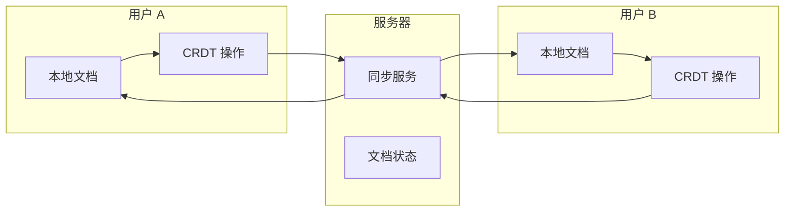
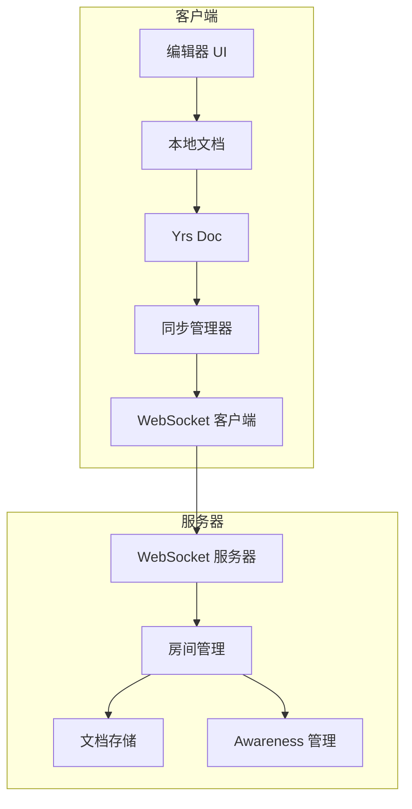

# 协作编辑指南

ModuForge-RS 通过集成 Yrs (Yjs 的 Rust 实现) 提供强大的实时协作编辑功能。本指南将详细介绍如何实现多用户实时协作编辑。

## 概述

协作编辑允许多个用户同时编辑同一文档，所有更改会实时同步到所有参与者。ModuForge-RS 使用 CRDT (Conflict-free Replicated Data Type) 技术确保最终一致性。

## 核心概念

### CRDT (无冲突复制数据类型)

CRDT 是一种数据结构，允许多个副本独立更新，并能自动合并更改而不产生冲突。



### Yrs 集成

Yrs 是 Yjs 的 Rust 实现，提供了高性能的 CRDT 操作：

```rust
use yrs::{Doc, Transact, Update, Text, Map, Array};

// 创建协作文档
let doc = Doc::new();

// 获取共享类型
let text = doc.get_or_insert_text("content");
let metadata = doc.get_or_insert_map("metadata");

// 执行事务
doc.transact_mut(|tr| {
    text.insert(tr, 0, "Hello, collaborative world!");
    metadata.insert(tr, "author", "Alice");
});
```

## 架构设计

### 整体架构



### 核心组件

#### 1. CollabEditor 实现

```rust
use yrs::{Doc, Transact, Update, Observable};
use tokio_tungstenite::{WebSocketStream, MaybeTlsStream};
use futures::{SinkExt, StreamExt};
use std::sync::Arc;
use parking_lot::RwLock;

pub struct CollabEditor {
    // 核心文档
    doc: Arc<Doc>,
    // ModuForge 状态
    state: Arc<RwLock<State>>,
    // WebSocket 连接
    ws: Option<Arc<RwLock<WebSocketStream<MaybeTlsStream<TcpStream>>>>>,
    // Awareness (用户光标/选择)
    awareness: Arc<Awareness>,
    // 文档 ID
    doc_id: String,
    // 用户信息
    user: UserInfo,
}

impl CollabEditor {
    /// 创建新的协作编辑器
    pub async fn new(config: CollabConfig) -> ForgeResult<Self> {
        let doc = Arc::new(Doc::new());

        // 初始化 ModuForge 状态
        let mf_doc = Node::new("doc", vec![]);
        let state = Arc::new(RwLock::new(
            State::create(mf_doc, config.schema, config.plugins)
        ));

        // 创建 Awareness
        let awareness = Arc::new(Awareness::new(doc.clone()));

        Ok(Self {
            doc,
            state,
            ws: None,
            awareness,
            doc_id: config.doc_id,
            user: config.user,
        })
    }

    /// 连接到协作服务器
    pub async fn connect(&mut self, url: &str) -> ForgeResult<()> {
        // 建立 WebSocket 连接
        let (ws_stream, _) = connect_async(url).await?;
        let ws = Arc::new(RwLock::new(ws_stream));
        self.ws = Some(ws.clone());

        // 启动同步循环
        self.start_sync_loop(ws).await?;

        // 发送初始同步请求
        self.request_initial_sync().await?;

        Ok(())
    }
}
```

#### 2. 同步管理

```rust
impl CollabEditor {
    /// 启动同步循环
    async fn start_sync_loop(
        &self,
        ws: Arc<RwLock<WebSocketStream<MaybeTlsStream<TcpStream>>>>
    ) -> ForgeResult<()> {
        let doc = self.doc.clone();
        let awareness = self.awareness.clone();

        // 处理本地更新
        let ws_send = ws.clone();
        doc.observe_update_v1(move |_, event| {
            let update = event.update.clone();
            let ws_send = ws_send.clone();

            tokio::spawn(async move {
                let msg = CollabMessage::Update {
                    doc_id: self.doc_id.clone(),
                    update: update.encode_v1(),
                };

                if let Ok(mut ws) = ws_send.write() {
                    ws.send(Message::Binary(bincode::serialize(&msg).unwrap()))
                        .await
                        .ok();
                }
            });
        });

        // 处理远程更新
        let doc_recv = doc.clone();
        tokio::spawn(async move {
            loop {
                if let Ok(mut ws) = ws.write() {
                    if let Some(Ok(msg)) = ws.next().await {
                        match msg {
                            Message::Binary(data) => {
                                if let Ok(collab_msg) = bincode::deserialize::<CollabMessage>(&data) {
                                    handle_collab_message(collab_msg, &doc_recv, &awareness).await;
                                }
                            }
                            _ => {}
                        }
                    }
                } else {
                    break;
                }
            }
        });

        Ok(())
    }

    /// 处理协作消息
    async fn handle_collab_message(
        msg: CollabMessage,
        doc: &Doc,
        awareness: &Awareness
    ) {
        match msg {
            CollabMessage::Update { update, .. } => {
                // 应用远程更新
                doc.transact_mut(|tr| {
                    tr.apply_update(Update::decode_v1(&update).unwrap());
                });
            }
            CollabMessage::Awareness { update } => {
                // 更新 Awareness（光标位置等）
                awareness.apply_update(update);
            }
            CollabMessage::SyncStep1 { state_vector } => {
                // 同步步骤 1：接收状态向量
                let update = doc.encode_state_as_update_v1(&state_vector);
                // 发送缺失的更新...
            }
            CollabMessage::SyncStep2 { update } => {
                // 同步步骤 2：应用缺失的更新
                doc.transact_mut(|tr| {
                    tr.apply_update(Update::decode_v1(&update).unwrap());
                });
            }
        }
    }
}
```

#### 3. 文档操作同步

```rust
#[async_trait]
impl EditorTrait for CollabEditor {
    async fn command(&mut self, command: Arc<dyn Command>) -> ForgeResult<()> {
        // 在 Yrs 文档上执行操作
        self.doc.transact_mut(|tr| {
            match command.as_ref() {
                InsertText { text, position } => {
                    let ytext = self.doc.get_or_insert_text("content");
                    ytext.insert(tr, *position as u32, text);
                }
                DeleteRange { start, end } => {
                    let ytext = self.doc.get_or_insert_text("content");
                    ytext.delete(tr, *start as u32, (*end - *start) as u32);
                }
                UpdateNode { node_id, attrs } => {
                    let nodes_map = self.doc.get_or_insert_map("nodes");
                    if let Some(node) = nodes_map.get(tr, node_id) {
                        // 更新节点属性
                        for (key, value) in attrs {
                            node.insert(tr, key, value);
                        }
                    }
                }
                _ => {}
            }
        });

        // 同时更新 ModuForge 状态
        let mut state = self.state.write();
        let tr = state.tr();
        command.execute(&mut tr)?;
        *state = state.apply(tr)?;

        Ok(())
    }

    async fn doc(&self) -> Arc<NodePool> {
        // 从 Yrs 文档构建 ModuForge 文档
        self.build_mf_doc_from_yrs()
    }

    async fn get_state(&self) -> Arc<State> {
        Arc::new(self.state.read().clone())
    }
}
```

## 服务器实现

### WebSocket 服务器

```rust
use warp::{ws::WebSocket, Filter};
use dashmap::DashMap;
use std::sync::Arc;

/// 文档房间
pub struct DocumentRoom {
    doc_id: String,
    doc: Arc<Doc>,
    connections: DashMap<String, WebSocket>,
    awareness: Arc<Awareness>,
}

/// 协作服务器
pub struct CollabServer {
    rooms: Arc<DashMap<String, Arc<DocumentRoom>>>,
}

impl CollabServer {
    pub fn new() -> Self {
        Self {
            rooms: Arc::new(DashMap::new()),
        }
    }

    /// 启动服务器
    pub async fn start(&self, port: u16) {
        let rooms = self.rooms.clone();

        let ws_route = warp::path!("collab" / String)
            .and(warp::ws())
            .map(move |doc_id: String, ws: warp::ws::Ws| {
                let rooms = rooms.clone();
                ws.on_upgrade(move |socket| {
                    handle_connection(socket, doc_id, rooms)
                })
            });

        warp::serve(ws_route)
            .run(([0, 0, 0, 0], port))
            .await;
    }
}

/// 处理客户端连接
async fn handle_connection(
    socket: WebSocket,
    doc_id: String,
    rooms: Arc<DashMap<String, Arc<DocumentRoom>>>
) {
    // 获取或创建房间
    let room = rooms.entry(doc_id.clone())
        .or_insert_with(|| {
            Arc::new(DocumentRoom {
                doc_id: doc_id.clone(),
                doc: Arc::new(Doc::new()),
                connections: DashMap::new(),
                awareness: Arc::new(Awareness::new()),
            })
        })
        .clone();

    // 生成客户端 ID
    let client_id = uuid::Uuid::new_v4().to_string();

    // 添加到连接列表
    room.connections.insert(client_id.clone(), socket);

    // 发送初始同步
    send_initial_sync(&room, &client_id).await;

    // 处理客户端消息
    handle_client_messages(room, client_id).await;
}
```

### 同步协议

```rust
/// 协作消息类型
#[derive(Serialize, Deserialize, Debug)]
pub enum CollabMessage {
    /// 文档更新
    Update {
        doc_id: String,
        update: Vec<u8>,
    },
    /// Awareness 更新（光标、选择等）
    Awareness {
        update: Vec<u8>,
    },
    /// 同步步骤 1：发送状态向量
    SyncStep1 {
        state_vector: Vec<u8>,
    },
    /// 同步步骤 2：发送缺失的更新
    SyncStep2 {
        update: Vec<u8>,
    },
    /// 请求初始同步
    RequestSync,
    /// 用户加入
    UserJoined {
        user: UserInfo,
    },
    /// 用户离开
    UserLeft {
        user_id: String,
    },
}

/// 处理客户端消息
async fn handle_client_messages(
    room: Arc<DocumentRoom>,
    client_id: String
) {
    if let Some(mut socket) = room.connections.get_mut(&client_id) {
        while let Some(Ok(msg)) = socket.next().await {
            if let Ok(data) = msg.to_bytes() {
                if let Ok(collab_msg) = bincode::deserialize::<CollabMessage>(&data) {
                    match collab_msg {
                        CollabMessage::Update { update, .. } => {
                            // 应用更新到服务器文档
                            room.doc.transact_mut(|tr| {
                                tr.apply_update(Update::decode_v1(&update).unwrap());
                            });

                            // 广播给其他客户端
                            broadcast_update(&room, &client_id, update).await;
                        }
                        CollabMessage::Awareness { update } => {
                            // 更新 Awareness
                            room.awareness.apply_update(update.clone());

                            // 广播 Awareness 更新
                            broadcast_awareness(&room, &client_id, update).await;
                        }
                        CollabMessage::RequestSync => {
                            // 发送完整同步
                            send_full_sync(&room, &client_id).await;
                        }
                        _ => {}
                    }
                }
            }
        }
    }

    // 客户端断开连接
    room.connections.remove(&client_id);
    broadcast_user_left(&room, &client_id).await;
}
```

## Awareness 系统

Awareness 用于同步非文档数据，如用户光标位置、选择状态、用户信息等。

### 用户状态管理

```rust
use yrs_warp::awareness::{Awareness, AwarenessUpdate};

#[derive(Serialize, Deserialize, Clone)]
pub struct UserState {
    pub id: String,
    pub name: String,
    pub color: String,
    pub cursor: Option<CursorPosition>,
    pub selection: Option<Selection>,
}

#[derive(Serialize, Deserialize, Clone)]
pub struct CursorPosition {
    pub index: usize,
    pub line: usize,
    pub column: usize,
}

impl CollabEditor {
    /// 更新本地光标位置
    pub fn update_cursor(&mut self, position: CursorPosition) {
        let mut state = self.user.state.clone();
        state.cursor = Some(position);

        // 更新 Awareness
        self.awareness.set_local_state(serde_json::to_string(&state).unwrap());
    }

    /// 获取所有用户状态
    pub fn get_all_users(&self) -> Vec<UserState> {
        self.awareness.clients()
            .into_iter()
            .filter_map(|client_id| {
                self.awareness.get_state(client_id)
                    .and_then(|state| serde_json::from_str(&state).ok())
            })
            .collect()
    }
}
```

### 前端集成

```typescript
// src/hooks/useCollaboration.ts
import * as Y from 'yjs';
import { WebsocketProvider } from 'y-websocket';
import { useEffect, useState } from 'react';

export function useCollaboration(docId: string, userId: string) {
  const [doc] = useState(() => new Y.Doc());
  const [provider, setProvider] = useState<WebsocketProvider | null>(null);
  const [users, setUsers] = useState<Map<string, UserState>>(new Map());

  useEffect(() => {
    // 连接到协作服务器
    const wsProvider = new WebsocketProvider(
      'ws://localhost:3030',
      docId,
      doc
    );

    // 设置用户信息
    wsProvider.awareness.setLocalStateField('user', {
      id: userId,
      name: 'User Name',
      color: generateUserColor(),
    });

    // 监听 Awareness 更新
    wsProvider.awareness.on('change', () => {
      const states = new Map<string, UserState>();
      wsProvider.awareness.getStates().forEach((state, clientId) => {
        if (state.user) {
          states.set(clientId.toString(), state.user);
        }
      });
      setUsers(states);
    });

    setProvider(wsProvider);

    return () => {
      wsProvider.destroy();
    };
  }, [docId, userId]);

  return { doc, provider, users };
}
```

## 冲突解决

CRDT 自动处理大多数冲突，但某些情况需要特殊处理：

### 1. 意图保留

```rust
/// 保留用户意图的合并策略
pub struct IntentPreservingMerge;

impl MergeStrategy for IntentPreservingMerge {
    fn merge(&self, local: &Update, remote: &Update) -> Update {
        // 分析操作意图
        let local_intent = analyze_intent(local);
        let remote_intent = analyze_intent(remote);

        match (local_intent, remote_intent) {
            (Intent::Format, Intent::Insert) => {
                // 格式化不应覆盖插入
                merge_with_priority(remote, local)
            }
            (Intent::Delete, Intent::Update) => {
                // 删除优先于更新
                merge_with_priority(local, remote)
            }
            _ => {
                // 默认 CRDT 合并
                default_merge(local, remote)
            }
        }
    }
}
```

### 2. 语义冲突检测

```rust
/// 检测语义冲突
pub fn detect_semantic_conflicts(
    local: &Transaction,
    remote: &Transaction
) -> Vec<Conflict> {
    let mut conflicts = Vec::new();

    // 检查是否修改了相同的节点属性
    for (node_id, local_changes) in local.node_changes() {
        if let Some(remote_changes) = remote.node_changes().get(node_id) {
            for (attr, local_value) in local_changes {
                if let Some(remote_value) = remote_changes.get(attr) {
                    if local_value != remote_value {
                        conflicts.push(Conflict::AttributeConflict {
                            node_id: node_id.clone(),
                            attribute: attr.clone(),
                            local_value: local_value.clone(),
                            remote_value: remote_value.clone(),
                        });
                    }
                }
            }
        }
    }

    conflicts
}
```

## 性能优化

### 1. 增量同步

```rust
/// 增量同步管理器
pub struct IncrementalSync {
    last_sync_vector: StateVector,
    pending_updates: Vec<Update>,
}

impl IncrementalSync {
    /// 计算增量更新
    pub fn compute_delta(&mut self, doc: &Doc) -> Vec<u8> {
        let current_vector = doc.state_vector();
        let delta = doc.encode_state_as_update_v1(&self.last_sync_vector);
        self.last_sync_vector = current_vector;
        delta
    }

    /// 批量发送待处理更新
    pub async fn flush_pending(&mut self, ws: &mut WebSocket) -> Result<()> {
        if !self.pending_updates.is_empty() {
            let batch = self.pending_updates.drain(..).collect::<Vec<_>>();
            let msg = CollabMessage::BatchUpdate { updates: batch };
            ws.send(Message::Binary(bincode::serialize(&msg)?)).await?;
        }
        Ok(())
    }
}
```

### 2. 压缩和快照

```rust
/// 文档快照管理
pub struct SnapshotManager {
    snapshots: BTreeMap<u64, Vec<u8>>,
    snapshot_interval: Duration,
}

impl SnapshotManager {
    /// 创建快照
    pub fn create_snapshot(&mut self, doc: &Doc) -> u64 {
        let timestamp = SystemTime::now()
            .duration_since(UNIX_EPOCH)
            .unwrap()
            .as_secs();

        let snapshot = doc.encode_state_as_update_v1(&StateVector::default());
        self.snapshots.insert(timestamp, snapshot);

        // 清理旧快照
        self.cleanup_old_snapshots();

        timestamp
    }

    /// 从快照恢复
    pub fn restore_from_snapshot(
        &self,
        timestamp: u64,
        updates_since: Vec<Update>
    ) -> Result<Doc> {
        let snapshot = self.snapshots
            .get(&timestamp)
            .ok_or("Snapshot not found")?;

        let doc = Doc::new();
        doc.transact_mut(|tr| {
            // 应用快照
            tr.apply_update(Update::decode_v1(snapshot)?);

            // 应用快照后的更新
            for update in updates_since {
                tr.apply_update(update);
            }
        });

        Ok(doc)
    }
}
```

### 3. 懒加载和分片

```rust
/// 分片文档管理
pub struct ShardedDocument {
    shards: HashMap<String, Arc<Doc>>,
    shard_size: usize,
}

impl ShardedDocument {
    /// 加载特定分片
    pub async fn load_shard(&mut self, shard_id: &str) -> Arc<Doc> {
        if let Some(shard) = self.shards.get(shard_id) {
            return shard.clone();
        }

        // 从服务器加载分片
        let shard = self.fetch_shard_from_server(shard_id).await;
        self.shards.insert(shard_id.to_string(), Arc::new(shard));
        self.shards.get(shard_id).unwrap().clone()
    }

    /// 获取可见分片
    pub fn get_visible_shards(&self, viewport: Range<usize>) -> Vec<String> {
        let start_shard = viewport.start / self.shard_size;
        let end_shard = viewport.end / self.shard_size;

        (start_shard..=end_shard)
            .map(|i| format!("shard_{}", i))
            .collect()
    }
}
```

## 安全性

### 1. 权限控制

```rust
/// 权限管理
#[derive(Clone)]
pub struct Permission {
    pub can_read: bool,
    pub can_write: bool,
    pub can_delete: bool,
    pub can_share: bool,
}

impl CollabEditor {
    /// 检查操作权限
    fn check_permission(&self, operation: &Operation) -> Result<()> {
        let permission = self.user.permission.clone();

        match operation {
            Operation::Insert(_) | Operation::Update(_) => {
                if !permission.can_write {
                    return Err(Error::PermissionDenied("写入权限不足"));
                }
            }
            Operation::Delete(_) => {
                if !permission.can_delete {
                    return Err(Error::PermissionDenied("删除权限不足"));
                }
            }
            Operation::Read(_) => {
                if !permission.can_read {
                    return Err(Error::PermissionDenied("读取权限不足"));
                }
            }
        }

        Ok(())
    }
}
```

### 2. 加密传输

```rust
use ring::aead::{Aad, LessSafeKey, Nonce, UnboundKey, AES_256_GCM};

/// 加密协作消息
pub struct EncryptedCollaboration {
    key: LessSafeKey,
}

impl EncryptedCollaboration {
    /// 加密消息
    pub fn encrypt(&self, msg: &CollabMessage) -> Result<Vec<u8>> {
        let data = bincode::serialize(msg)?;
        let nonce = Nonce::try_assume_unique_for_key(&self.generate_nonce())?;

        let mut encrypted = data.clone();
        self.key.seal_in_place_append_tag(
            nonce,
            Aad::empty(),
            &mut encrypted
        )?;

        Ok(encrypted)
    }

    /// 解密消息
    pub fn decrypt(&self, encrypted: &[u8]) -> Result<CollabMessage> {
        let nonce = Nonce::try_assume_unique_for_key(&self.generate_nonce())?;

        let mut decrypted = encrypted.to_vec();
        self.key.open_in_place(
            nonce,
            Aad::empty(),
            &mut decrypted
        )?;

        Ok(bincode::deserialize(&decrypted)?)
    }
}
```

## 离线支持

### 离线编辑和同步

```rust
/// 离线支持
pub struct OfflineSupport {
    local_updates: Vec<Update>,
    last_online_vector: StateVector,
}

impl OfflineSupport {
    /// 记录离线更新
    pub fn record_offline_update(&mut self, update: Update) {
        self.local_updates.push(update);
    }

    /// 同步离线更新
    pub async fn sync_offline_updates(
        &mut self,
        ws: &mut WebSocket,
        doc: &Doc
    ) -> Result<()> {
        // 获取服务器状态
        let server_vector = self.request_state_vector(ws).await?;

        // 发送离线期间的本地更新
        for update in &self.local_updates {
            ws.send(Message::Binary(
                bincode::serialize(&CollabMessage::Update {
                    doc_id: doc.client_id.to_string(),
                    update: update.encode_v1(),
                })?
            )).await?;
        }

        // 接收服务器更新
        let server_updates = doc.encode_state_as_update_v1(&self.last_online_vector);
        doc.transact_mut(|tr| {
            tr.apply_update(Update::decode_v1(&server_updates)?);
        });

        // 清理已同步的更新
        self.local_updates.clear();
        self.last_online_vector = doc.state_vector();

        Ok(())
    }
}
```

## 测试

### 单元测试

```rust
#[cfg(test)]
mod tests {
    use super::*;

    #[tokio::test]
    async fn test_collaborative_editing() {
        // 创建两个编辑器
        let mut editor1 = CollabEditor::new(CollabConfig {
            doc_id: "test-doc".to_string(),
            user: UserInfo::new("user1"),
            ..Default::default()
        }).await.unwrap();

        let mut editor2 = CollabEditor::new(CollabConfig {
            doc_id: "test-doc".to_string(),
            user: UserInfo::new("user2"),
            ..Default::default()
        }).await.unwrap();

        // 模拟协作编辑
        editor1.insert_text("Hello ", 0).await.unwrap();
        editor2.insert_text("World!", 6).await.unwrap();

        // 同步更新
        let update1 = editor1.doc.encode_state_as_update_v1(&StateVector::default());
        let update2 = editor2.doc.encode_state_as_update_v1(&StateVector::default());

        editor1.apply_update(update2).await.unwrap();
        editor2.apply_update(update1).await.unwrap();

        // 验证结果
        assert_eq!(editor1.get_text().await, "Hello World!");
        assert_eq!(editor2.get_text().await, "Hello World!");
    }

    #[tokio::test]
    async fn test_conflict_resolution() {
        let mut editor1 = create_test_editor("user1").await;
        let mut editor2 = create_test_editor("user2").await;

        // 同时修改相同位置
        editor1.insert_text("A", 0).await.unwrap();
        editor2.insert_text("B", 0).await.unwrap();

        // 同步并验证 CRDT 解决冲突
        sync_editors(&mut editor1, &mut editor2).await;

        let text1 = editor1.get_text().await;
        let text2 = editor2.get_text().await;

        // 两个编辑器应该有相同的结果
        assert_eq!(text1, text2);
        // 结果应该包含两个字符
        assert!(text1.contains('A') && text1.contains('B'));
    }
}
```

## 最佳实践

### 1. 连接管理

- 实现自动重连机制
- 使用心跳检测连接状态
- 优雅处理网络中断

### 2. 状态同步

- 定期创建快照减少同步数据量
- 使用增量更新而非全量同步
- 实现智能冲突解决策略

### 3. 用户体验

- 显示其他用户的光标和选择
- 提供离线编辑支持
- 实现平滑的协作动画

### 4. 性能优化

- 对大文档使用分片加载
- 批量发送小更新
- 使用 Web Workers 处理 CRDT 操作

## 故障排除

### 常见问题

1. **同步延迟高**
   - 检查网络延迟
   - 优化更新批处理策略
   - 考虑使用区域服务器

2. **内存使用过高**
   - 实施文档分片
   - 定期清理历史记录
   - 使用快照压缩历史

3. **冲突频繁**
   - 优化锁定粒度
   - 实现操作转换
   - 提供冲突可视化

## 相关资源

- [Yrs 文档](https://docs.rs/yrs)
- [CRDT 原理](https://crdt.tech)
- [Tauri 集成指南](./tauri-integration.md)
- [示例项目](../examples/collaborative-editor.md)

## 下一步

- [性能优化指南](./performance.md) - 优化协作性能
- [安全最佳实践](./security.md) - 保护协作会话
- [部署指南](./deployment.md) - 部署协作服务器