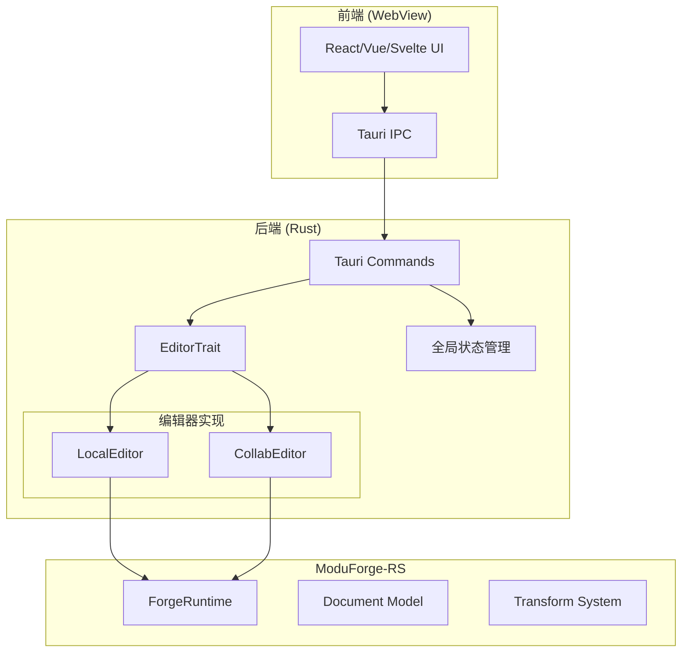

# Tauri 集成指南

ModuForge-RS 提供了与 Tauri 桌面应用框架的完美集成，让你能够创建功能强大的桌面文档编辑器。本指南将详细介绍如何在 Tauri 应用中集成 ModuForge-RS。

## 概述

Tauri 是一个用于构建轻量级桌面应用的框架，使用 Rust 作为后端，HTML/JS/CSS 作为前端。ModuForge-RS 的 Rust 实现使其成为 Tauri 应用的理想选择。

## 架构设计

### 整体架构



### 核心组件

#### 1. EditorTrait 抽象

定义统一的编辑器接口，支持不同的编辑模式：

```rust
use async_trait::async_trait;
use mf_core::{Command, ForgeResult};
use mf_model::NodePool;
use mf_state::State;
use std::sync::Arc;

#[async_trait]
pub trait EditorTrait: Send + Sync {
    /// 获取当前文档
    async fn doc(&self) -> Arc<NodePool>;

    /// 获取当前状态
    async fn get_state(&self) -> Arc<State>;

    /// 执行命令
    async fn command(&mut self, command: Arc<dyn Command>) -> ForgeResult<()>;

    /// 获取选择状态
    async fn get_selection(&self) -> Option<Selection>;

    /// 设置选择状态
    async fn set_selection(&mut self, selection: Selection) -> ForgeResult<()>;
}
```

#### 2. 全局状态管理

使用 TypeMap 和 DashMap 管理多窗口编辑器状态：

```rust
use dashmap::DashMap;
use typemap::concurrent::TypeMap;
use once_cell::sync::Lazy;

pub static GLOBAL_STATE: Lazy<TypeMap> = Lazy::new(TypeMap::new);
pub static EDITORS: Lazy<DashMap<String, Box<dyn EditorTrait>>> =
    Lazy::new(DashMap::new);

pub struct ContextHelper;

impl ContextHelper {
    /// 创建新编辑器
    pub async fn create_editor(window_id: String, config: EditorConfig)
        -> ForgeResult<()>
    {
        let editor: Box<dyn EditorTrait> = match config.mode {
            EditorMode::Local => Box::new(LocalEditor::new(config).await?),
            EditorMode::Collaborative => Box::new(CollabEditor::new(config).await?),
        };

        EDITORS.insert(window_id, editor);
        Ok(())
    }

    /// 获取编辑器
    pub fn get_editor(window_id: &str) -> Option<Box<dyn EditorTrait>> {
        EDITORS.get(window_id).map(|e| e.clone())
    }
}
```

## 项目设置

### 1. 创建 Tauri 项目

```bash
# 创建新的 Tauri 项目
npm create tauri-app@latest moduforge-editor
cd moduforge-editor

# 选择你喜欢的前端框架（React/Vue/Svelte）
```

### 2. 添加 ModuForge-RS 依赖

编辑 `src-tauri/Cargo.toml`：

```toml
[dependencies]
# Tauri 核心
tauri = { version = "1", features = ["shell-open"] }
serde = { version = "1", features = ["derive"] }
serde_json = "1"

# ModuForge-RS
mf-core = { path = "../../../crates/core" }
mf-model = { path = "../../../crates/model" }
mf-state = { path = "../../../crates/state" }
mf-transform = { path = "../../../crates/transform" }

# 异步支持
tokio = { version = "1", features = ["full"] }
async-trait = "0.1"

# 状态管理
dashmap = "5"
typemap = "0.4"
once_cell = "1"

# 协作（可选）
yrs = { version = "0.17", optional = true }
```

### 3. 项目结构

```
src-tauri/
├── src/
│   ├── main.rs           # Tauri 入口
│   ├── commands.rs        # Tauri 命令
│   ├── editor/
│   │   ├── mod.rs         # EditorTrait 定义
│   │   ├── local.rs       # 本地编辑器
│   │   └── collab.rs      # 协作编辑器
│   ├── state/
│   │   ├── mod.rs         # 状态管理
│   │   └── context.rs     # 上下文助手
│   └── utils/
│       └── mod.rs         # 工具函数
```

## Tauri 命令实现

### 基础命令

```rust
use tauri::command;
use crate::editor::EditorTrait;
use crate::state::ContextHelper;

/// 创建新文档
#[command]
pub async fn new_document(window: String, title: String) -> Result<String, String> {
    let config = EditorConfig {
        mode: EditorMode::Local,
        title,
        ..Default::default()
    };

    ContextHelper::create_editor(window.clone(), config)
        .await
        .map_err(|e| e.to_string())?;

    Ok(format!("Document created for window {}", window))
}

/// 打开文档
#[command]
pub async fn open_document(
    window: String,
    path: String
) -> Result<String, String> {
    let content = tokio::fs::read_to_string(&path)
        .await
        .map_err(|e| e.to_string())?;

    let config = EditorConfig {
        mode: EditorMode::Local,
        initial_content: Some(content),
        file_path: Some(path),
        ..Default::default()
    };

    ContextHelper::create_editor(window, config)
        .await
        .map_err(|e| e.to_string())?;

    Ok("Document opened successfully".to_string())
}

/// 保存文档
#[command]
pub async fn save_document(window: String) -> Result<String, String> {
    let editor = ContextHelper::get_editor(&window)
        .ok_or("Editor not found")?;

    let doc = editor.doc().await;
    let content = doc.to_markdown(); // 或其他序列化格式

    // 获取文件路径并保存
    if let Some(path) = editor.get_file_path() {
        tokio::fs::write(&path, content)
            .await
            .map_err(|e| e.to_string())?;
    }

    Ok("Document saved".to_string())
}
```

### 编辑操作命令

```rust
/// 插入文本
#[command]
pub async fn insert_text(
    window: String,
    text: String,
    position: Option<usize>
) -> Result<(), String> {
    let mut editor = ContextHelper::get_editor_mut(&window)
        .ok_or("Editor not found")?;

    let command = InsertTextCommand {
        text,
        position: position.unwrap_or(0),
    };

    editor.command(Arc::new(command))
        .await
        .map_err(|e| e.to_string())?;

    Ok(())
}

/// 删除内容
#[command]
pub async fn delete_content(
    window: String,
    start: usize,
    end: usize
) -> Result<(), String> {
    let mut editor = ContextHelper::get_editor_mut(&window)
        .ok_or("Editor not found")?;

    let command = DeleteCommand { start, end };

    editor.command(Arc::new(command))
        .await
        .map_err(|e| e.to_string())?;

    Ok(())
}

/// 撤销操作
#[command]
pub async fn undo(window: String) -> Result<(), String> {
    let mut editor = ContextHelper::get_editor_mut(&window)
        .ok_or("Editor not found")?;

    editor.undo()
        .await
        .map_err(|e| e.to_string())?;

    Ok(())
}

/// 重做操作
#[command]
pub async fn redo(window: String) -> Result<(), String> {
    let mut editor = ContextHelper::get_editor_mut(&window)
        .ok_or("Editor not found")?;

    editor.redo()
        .await
        .map_err(|e| e.to_string())?;

    Ok(())
}
```

### 窗口管理命令

```rust
/// 创建新窗口
#[command]
pub async fn create_window(
    app_handle: tauri::AppHandle,
    title: String
) -> Result<String, String> {
    let window_id = format!("editor-{}", uuid::Uuid::new_v4());

    let window = tauri::WindowBuilder::new(
        &app_handle,
        &window_id,
        tauri::WindowUrl::App("index.html".into())
    )
    .title(title)
    .inner_size(1024.0, 768.0)
    .build()
    .map_err(|e| e.to_string())?;

    Ok(window_id)
}

/// 关闭窗口
#[command]
pub async fn close_window(window: String) -> Result<(), String> {
    // 清理编辑器状态
    ContextHelper::remove_editor(&window);
    Ok(())
}

/// 获取窗口状态
#[command]
pub async fn get_window_state(window: String) -> Result<WindowState, String> {
    let editor = ContextHelper::get_editor(&window)
        .ok_or("Editor not found")?;

    let state = editor.get_state().await;
    let doc = editor.doc().await;

    Ok(WindowState {
        has_changes: state.has_unsaved_changes(),
        word_count: doc.word_count(),
        char_count: doc.char_count(),
        file_path: editor.get_file_path(),
    })
}
```

## 前端集成

### React 示例

```typescript
// src/hooks/useEditor.ts
import { invoke } from '@tauri-apps/api/tauri';
import { appWindow } from '@tauri-apps/api/window';
import { useEffect, useState } from 'react';

export function useEditor() {
  const [windowId] = useState(() => appWindow.label);
  const [content, setContent] = useState('');
  const [hasChanges, setHasChanges] = useState(false);

  // 创建新文档
  const newDocument = async (title: string) => {
    await invoke('new_document', { window: windowId, title });
    setContent('');
    setHasChanges(false);
  };

  // 打开文档
  const openDocument = async (path: string) => {
    const result = await invoke<string>('open_document', {
      window: windowId,
      path
    });
    setContent(result);
    setHasChanges(false);
  };

  // 保存文档
  const saveDocument = async () => {
    await invoke('save_document', { window: windowId });
    setHasChanges(false);
  };

  // 插入文本
  const insertText = async (text: string, position?: number) => {
    await invoke('insert_text', {
      window: windowId,
      text,
      position
    });
    setHasChanges(true);
  };

  // 撤销/重做
  const undo = async () => invoke('undo', { window: windowId });
  const redo = async () => invoke('redo', { window: windowId });

  return {
    content,
    hasChanges,
    newDocument,
    openDocument,
    saveDocument,
    insertText,
    undo,
    redo,
  };
}
```

### Vue 示例

```vue
<!-- src/components/Editor.vue -->
<template>
  <div class="editor">
    <div class="toolbar">
      <button @click="newDocument">新建</button>
      <button @click="openDocument">打开</button>
      <button @click="saveDocument" :disabled="!hasChanges">保存</button>
      <button @click="undo">撤销</button>
      <button @click="redo">重做</button>
    </div>
    <div class="content" ref="editorContent">
      <!-- 编辑器内容 -->
    </div>
  </div>
</template>

<script setup lang="ts">
import { ref, onMounted } from 'vue';
import { invoke } from '@tauri-apps/api/tauri';
import { appWindow } from '@tauri-apps/api/window';

const windowId = appWindow.label;
const hasChanges = ref(false);

const newDocument = async () => {
  await invoke('new_document', {
    window: windowId,
    title: 'Untitled'
  });
  hasChanges.value = false;
};

const openDocument = async () => {
  // 使用 Tauri 文件对话框
  const { open } = await import('@tauri-apps/api/dialog');
  const selected = await open({
    multiple: false,
    filters: [{
      name: 'Markdown',
      extensions: ['md', 'markdown']
    }]
  });

  if (selected) {
    await invoke('open_document', {
      window: windowId,
      path: selected
    });
    hasChanges.value = false;
  }
};

const saveDocument = async () => {
  await invoke('save_document', { window: windowId });
  hasChanges.value = false;
};

const undo = async () => invoke('undo', { window: windowId });
const redo = async () => invoke('redo', { window: windowId });
</script>
```

## 高级功能

### 1. 实时协作

```rust
// src-tauri/src/editor/collab.rs
use yrs::{Doc, Transact, Update};
use tokio_tungstenite::WebSocketStream;

pub struct CollabEditor {
    doc: Arc<Doc>,
    ws: Option<WebSocketStream<MaybeTlsStream<TcpStream>>>,
    awareness: Arc<Awareness>,
}

impl CollabEditor {
    pub async fn connect(&mut self, url: &str) -> ForgeResult<()> {
        let ws = connect_async(url).await?;
        self.ws = Some(ws);

        // 启动同步任务
        self.start_sync().await?;
        Ok(())
    }

    async fn start_sync(&self) -> ForgeResult<()> {
        let doc = self.doc.clone();
        let ws = self.ws.clone();

        tokio::spawn(async move {
            // 处理本地更新
            doc.observe_update_v1(move |_, event| {
                if let Some(ws) = &ws {
                    // 发送更新到服务器
                    ws.send(Message::Binary(event.update)).await;
                }
            });

            // 处理远程更新
            while let Some(msg) = ws.next().await {
                if let Ok(Message::Binary(data)) = msg {
                    doc.transact_mut(|tr| {
                        tr.apply_update(Update::decode_v1(&data)?);
                    });
                }
            }
        });

        Ok(())
    }
}
```

### 2. 插件系统集成

```rust
// src-tauri/src/plugins/mod.rs
use mf_state::{Plugin, Transaction};

pub struct AutoSavePlugin {
    interval: Duration,
    last_save: Instant,
}

#[async_trait]
impl Plugin for AutoSavePlugin {
    async fn append_transaction(
        &mut self,
        tr: &Transaction,
        _old_state: &State,
        _new_state: &State,
    ) -> Option<Transaction> {
        if self.last_save.elapsed() > self.interval {
            // 触发自动保存
            tauri::async_runtime::spawn(async move {
                invoke("auto_save", {});
            });
            self.last_save = Instant::now();
        }
        None
    }
}
```

### 3. 主题和自定义

```rust
#[derive(Serialize, Deserialize)]
pub struct EditorTheme {
    pub background: String,
    pub foreground: String,
    pub selection: String,
    pub cursor: String,
    pub line_numbers: String,
}

#[command]
pub async fn set_theme(window: String, theme: EditorTheme) -> Result<(), String> {
    let editor = ContextHelper::get_editor_mut(&window)
        .ok_or("Editor not found")?;

    editor.set_theme(theme)
        .await
        .map_err(|e| e.to_string())?;

    Ok(())
}
```

## 性能优化

### 1. 懒加载大文档

```rust
pub struct LazyDocument {
    chunks: Vec<Arc<NodeChunk>>,
    loaded_chunks: DashSet<usize>,
}

impl LazyDocument {
    pub async fn load_chunk(&self, index: usize) -> Arc<NodeChunk> {
        if !self.loaded_chunks.contains(&index) {
            // 从磁盘或网络加载块
            let chunk = self.load_from_source(index).await;
            self.loaded_chunks.insert(index);
        }
        self.chunks[index].clone()
    }
}
```

### 2. 虚拟滚动

```typescript
// 前端虚拟滚动实现
import { VirtualList } from '@tanstack/react-virtual';

function DocumentView() {
  const virtualizer = useVirtualizer({
    count: lineCount,
    getScrollElement: () => scrollContainerRef.current,
    estimateSize: () => 24, // 行高
    overscan: 5,
  });

  return (
    <div ref={scrollContainerRef} className="scroll-container">
      <div style={{ height: virtualizer.getTotalSize() }}>
        {virtualizer.getVirtualItems().map(virtualRow => (
          <Line
            key={virtualRow.index}
            index={virtualRow.index}
            style={{
              position: 'absolute',
              top: 0,
              left: 0,
              width: '100%',
              transform: `translateY(${virtualRow.start}px)`,
            }}
          />
        ))}
      </div>
    </div>
  );
}
```

## 错误处理

### Rust 侧

```rust
#[derive(Debug, Serialize)]
pub struct EditorError {
    pub code: String,
    pub message: String,
    pub details: Option<String>,
}

impl From<ForgeError> for EditorError {
    fn from(err: ForgeError) -> Self {
        EditorError {
            code: err.code(),
            message: err.to_string(),
            details: err.details(),
        }
    }
}

#[command]
pub async fn safe_command(window: String) -> Result<String, EditorError> {
    ContextHelper::get_editor(&window)
        .ok_or(EditorError {
            code: "EDITOR_NOT_FOUND".to_string(),
            message: "Editor not found for window".to_string(),
            details: Some(window),
        })?;

    // 执行操作...
    Ok("Success".to_string())
}
```

### 前端侧

```typescript
// 错误处理
async function executeCommand() {
  try {
    const result = await invoke('safe_command', { window: windowId });
    console.log('Success:', result);
  } catch (error) {
    if (error.code === 'EDITOR_NOT_FOUND') {
      // 处理特定错误
      await createNewEditor();
    } else {
      // 通用错误处理
      console.error('Command failed:', error.message);
      showErrorNotification(error.message);
    }
  }
}
```

## 测试

### 单元测试

```rust
#[cfg(test)]
mod tests {
    use super::*;

    #[tokio::test]
    async fn test_create_editor() {
        let config = EditorConfig::default();
        let editor = LocalEditor::new(config).await.unwrap();

        let doc = editor.doc().await;
        assert_eq!(doc.node_count(), 1); // Root node
    }

    #[tokio::test]
    async fn test_command_execution() {
        let mut editor = LocalEditor::new(EditorConfig::default())
            .await
            .unwrap();

        let command = InsertTextCommand {
            text: "Hello".to_string(),
            position: 0,
        };

        editor.command(Arc::new(command)).await.unwrap();

        let doc = editor.doc().await;
        assert!(doc.to_string().contains("Hello"));
    }
}
```

### 集成测试

```rust
// tests/integration_test.rs
use tauri::test::{mock_builder, MockRuntime};

#[test]
fn test_tauri_commands() {
    let app = mock_builder()
        .invoke_handler(tauri::generate_handler![
            new_document,
            save_document,
            insert_text,
        ])
        .build(tauri::generate_context!())
        .expect("Failed to build app");

    // 测试命令
    let window = app.get_window("main").unwrap();

    // 模拟命令调用
    block_on(async {
        let result = new_document("main".to_string(), "Test".to_string())
            .await
            .unwrap();
        assert!(result.contains("created"));
    });
}
```

## 部署

### 构建配置

```toml
# tauri.conf.json
{
  "build": {
    "beforeBuildCommand": "npm run build",
    "beforeDevCommand": "npm run dev",
    "devPath": "http://localhost:3000",
    "distDir": "../dist"
  },
  "package": {
    "productName": "ModuForge Editor",
    "version": "1.0.0"
  },
  "tauri": {
    "allowlist": {
      "fs": {
        "all": true,
        "scope": ["$DOCUMENT", "$DOWNLOAD"]
      },
      "dialog": {
        "all": true
      },
      "shell": {
        "open": true
      }
    },
    "bundle": {
      "active": true,
      "category": "Productivity",
      "icon": ["icons/icon.ico"],
      "identifier": "com.moduforge.editor",
      "targets": ["msi", "app", "dmg", "deb", "rpm"]
    }
  }
}
```

### 打包发布

```bash
# 开发环境
npm run tauri dev

# 构建发布版本
npm run tauri build

# 生成特定平台包
npm run tauri build -- --target x86_64-pc-windows-msvc
npm run tauri build -- --target x86_64-apple-darwin
npm run tauri build -- --target x86_64-unknown-linux-gnu
```

## 最佳实践

### 1. 状态管理

- 使用全局状态管理器管理多窗口状态
- 实现窗口间的状态同步机制
- 避免在前端存储大量文档数据

### 2. 性能优化

- 使用虚拟滚动处理大文档
- 实现增量更新减少数据传输
- 使用 Web Workers 处理复杂计算

### 3. 错误处理

- 在 Rust 侧提供详细的错误信息
- 前端实现优雅的错误恢复机制
- 记录错误日志便于调试

### 4. 用户体验

- 提供自动保存功能
- 实现撤销/重做功能
- 支持多窗口和多标签页

## 相关资源

- [Tauri 官方文档](https://tauri.app)
- [ModuForge-RS API 文档](../api/overview.md)
- [示例项目](../examples/tauri-desktop-app.md)
- [协作编辑指南](./collaborative-editing.md)

## 下一步

- [协作编辑功能](./collaborative-editing.md) - 实现实时协作
- [插件开发](./plugins.md) - 创建自定义插件
- [性能优化](./performance.md) - 优化大文档处理