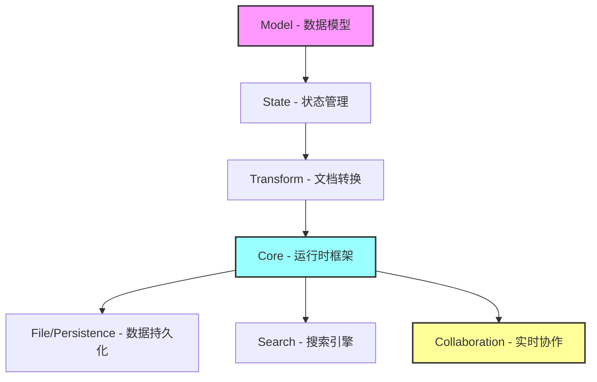

---
# https://vitepress.dev/reference/default-theme-home-page
layout: home

hero:
  name: "ModuForge-RS"
  text: "高性能文档编辑器框架"
  tagline: "基于 Rust 构建的现代化、可扩展的文档编辑器框架，支持实时协作和插件系统"
  image:
    src: /logo.svg
    alt: ModuForge
  actions:
    - theme: brand
      text: 快速开始
      link: /guide/quick-start
    - theme: alt
      text: 查看示例
      link: /examples/basic-editor
    - theme: alt
      text: GitHub
      link: https://github.com/moduforge/moduforge-rs

features:
  - icon: 🚀
    title: 高性能
    details: 基于 Rust 构建，采用不可变数据结构和零拷贝技术，提供极致的性能体验
    link: /guide/performance

  - icon: 🔄
    title: 实时协作
    details: 内置 CRDT 支持，无冲突的多人实时协作编辑，自动冲突解决
    link: /guide/collaboration

  - icon: 🧩
    title: 插件系统
    details: 强大的插件架构，支持自定义节点、标记、命令和中间件
    link: /guide/plugins

  - icon: 📦
    title: 模块化设计
    details: 11 个专用 crate，清晰的分层架构，按需引入所需功能
    link: /guide/architecture

  - icon: 🔐
    title: 类型安全
    details: 完全的 Rust 类型系统保证，编译时验证，运行时零开销
    link: /guide/core-concepts

  - icon: 💾
    title: 持久化支持
    details: 双格式文件系统，SQLite 数据库支持，自动数据恢复
    link: /crates/file

  - icon: 🔍
    title: 全文搜索
    details: 内置高性能搜索引擎，支持中文分词，结构化查询
    link: /crates/search

  - icon: ⚡
    title: 异步运行时
    details: 多种运行时模式，支持同步、异步和 Actor 模型
    link: /crates/core

  - icon: 🎨
    title: 灵活架构
    details: Phase 4 泛型架构，支持自定义数据容器和 Schema 系统
    link: /guide/architecture#phase-4
---

## 快速体验

<div class="code-example">

```rust
use mf_core::{ForgeRuntimeBuilder, RuntimeType};
use mf_model::{Schema, Node};
use mf_state::State;

#[tokio::main]
async fn main() {
    // 创建运行时
    let runtime = ForgeRuntimeBuilder::new()
        .runtime_type(RuntimeType::Async)
        .build()
        .await
        .unwrap();

    // 创建文档
    let schema = Schema::default();
    let doc = Node::new("doc", vec![
        Node::new("paragraph", vec![
            Node::text("Hello, ModuForge!")
        ])
    ]);

    // 创建状态
    let state = State::create(doc, schema, vec![]);

    // 应用到运行时
    runtime.apply_state(state).await;

    println!("编辑器已准备就绪！");
}
```

</div>

## 核心架构



## 谁在使用

ModuForge-RS 适用于：

- 📝 **富文本编辑器** - 构建功能完整的富文本编辑器
- 📄 **文档协作平台** - 多人实时协作的文档编辑系统
- 💻 **代码编辑器** - 语法高亮、智能提示的代码编辑器
- 📊 **知识管理系统** - 结构化文档的管理和检索
- 🎯 **专业编辑器** - Markdown、LaTeX 等专业格式编辑器

## 开始使用

<div class="tip custom-block">

### 添加依赖

```toml
[dependencies]
mf_core = "0.7.0"
mf_model = "0.7.0"
mf_state = "0.7.0"
mf_transform = "0.7.0"
```

查看[快速开始指南](/guide/quick-start)了解更多详情。

</div>

<style>
.code-example {
  margin: 2rem 0;
  border-radius: 8px;
  overflow: hidden;
}

:root {
  --vp-home-hero-name-color: transparent;
  --vp-home-hero-name-background: -webkit-linear-gradient(120deg, #bd34fe 30%, #41d1ff);
}
</style>