# Mermaid 图表测试页面

这是一个用于测试 Mermaid 图表在 VitePress 中显示效果的页面。

## 流程图测试

### 基本流程图
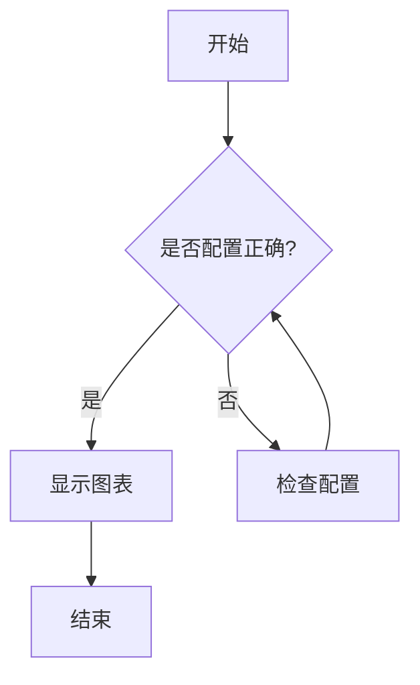

### 复杂流程图
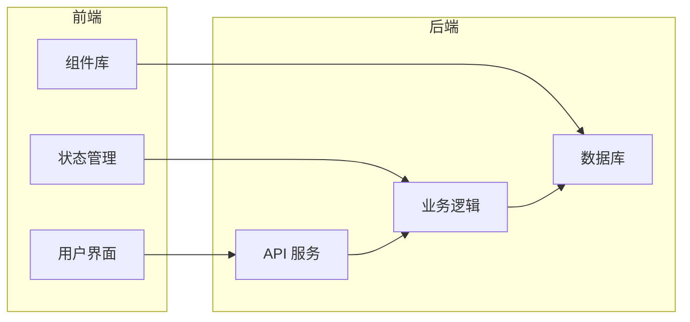

## 序列图测试

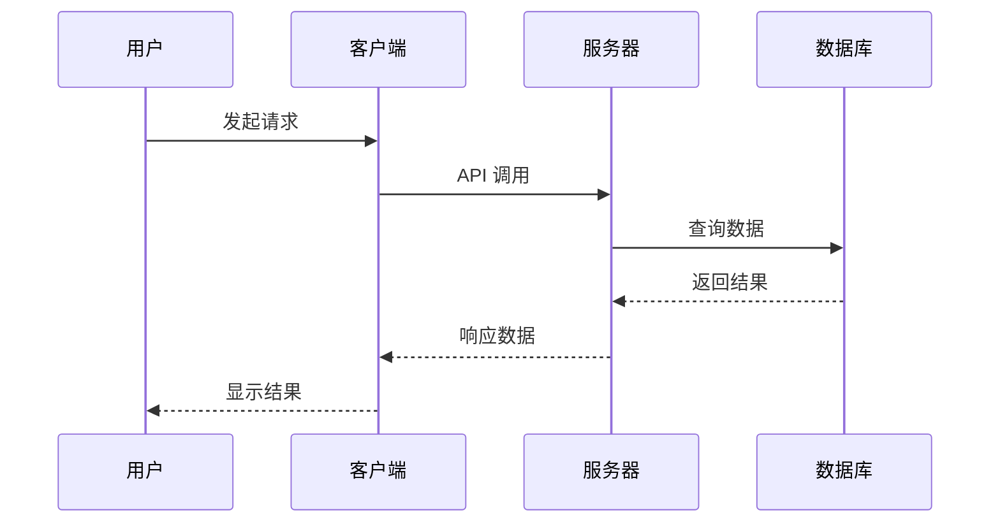

## 类图测试

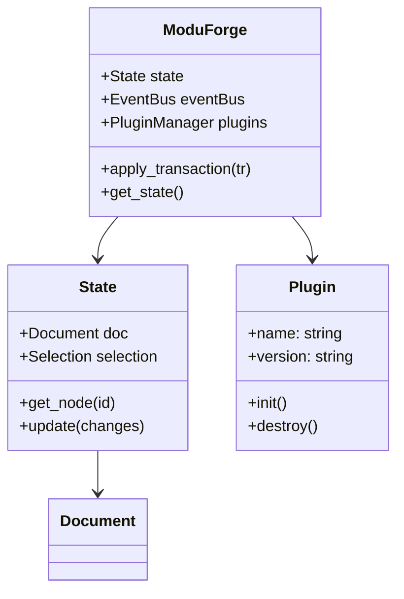

## 甘特图测试

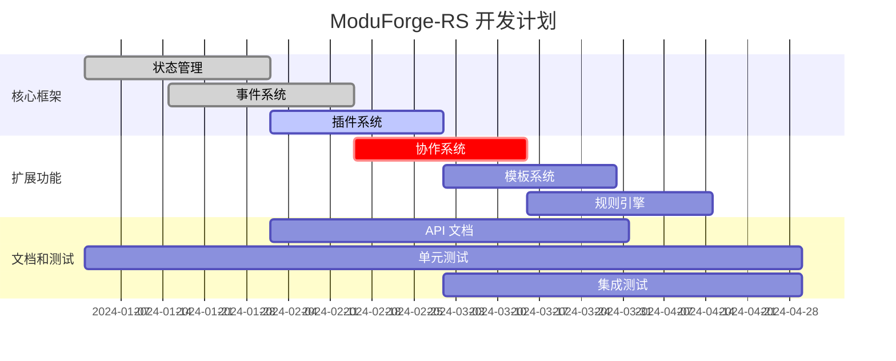

## 状态图测试

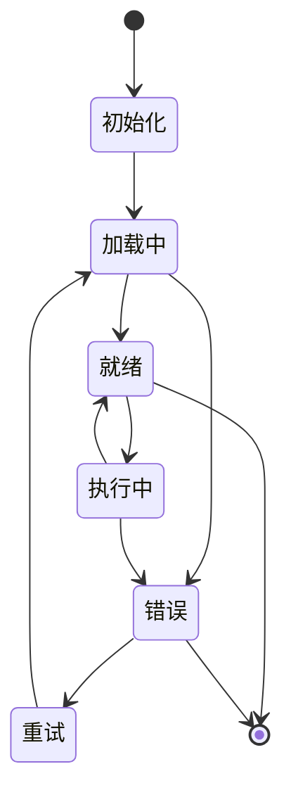

## 饼图测试

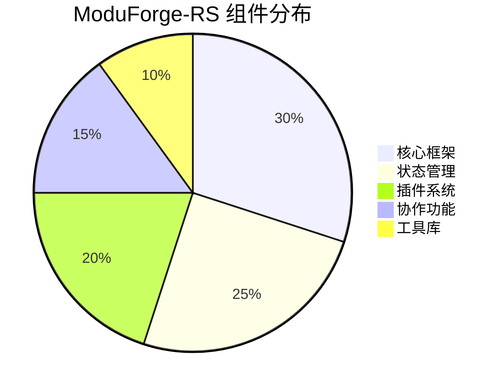

## Git 图测试

```mermaid
gitgraph:
    options:
    {
        "mainBranchName": "main"
    }
    commit
    commit
    branch feature/collaboration
    checkout feature/collaboration
    commit
    commit
    checkout main
    commit
    merge feature/collaboration
    commit
    branch feature/rules-engine
    checkout feature/rules-engine
    commit
    commit
    checkout main
    merge feature/rules-engine
```

## 实体关系图测试

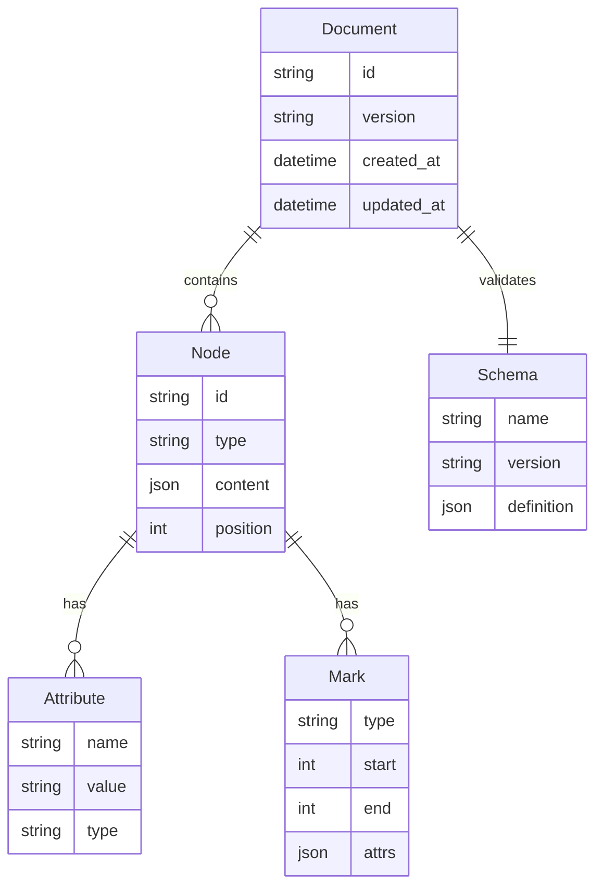

## 用户旅程图测试

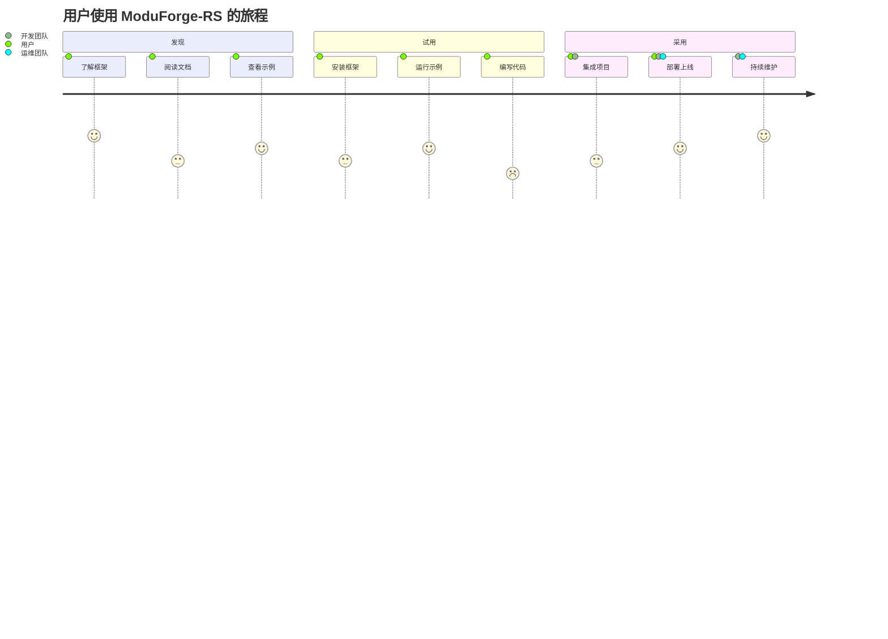

## 象限图测试

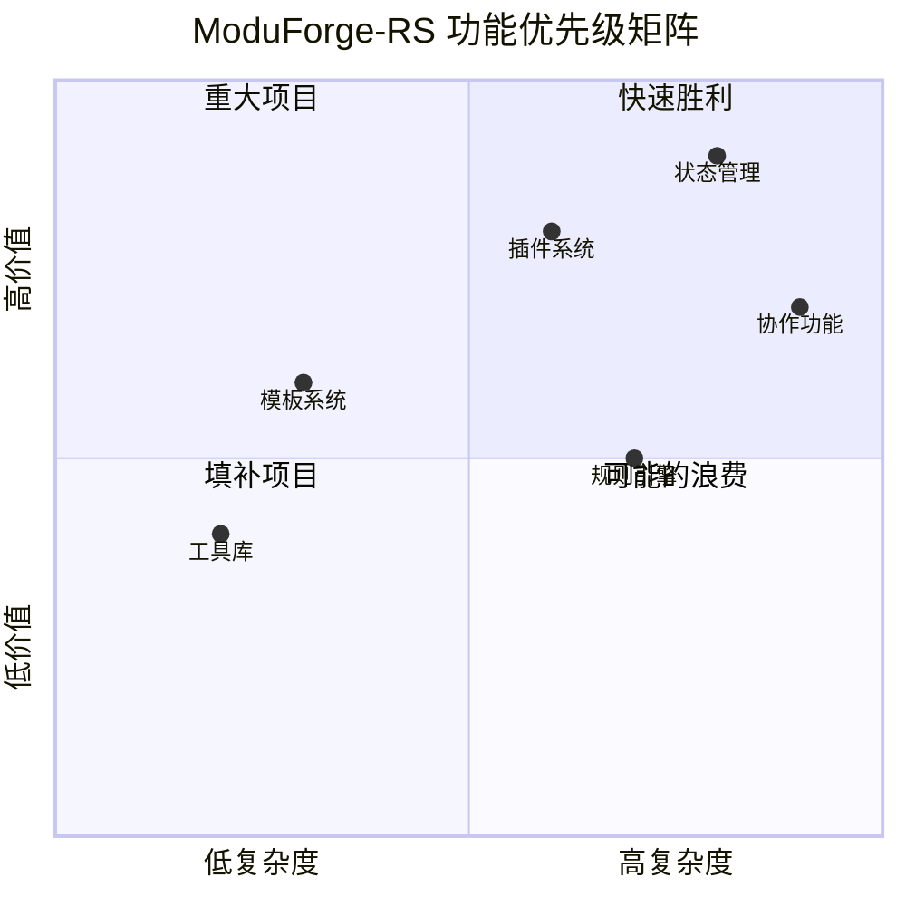

## 时间线图测试

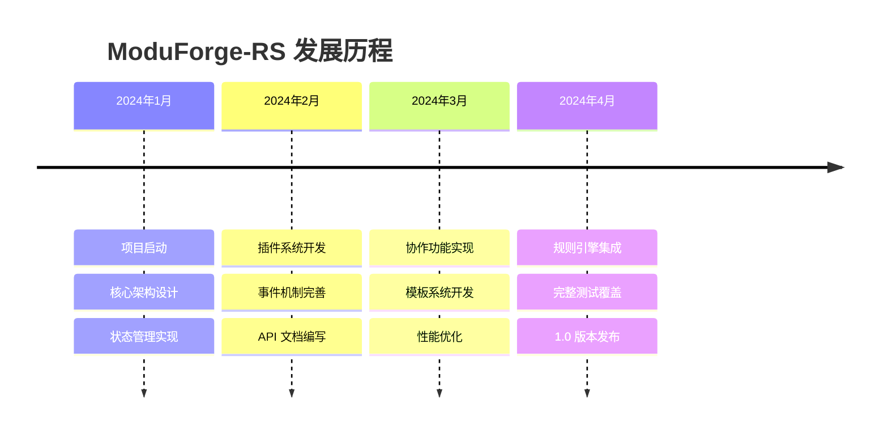

---

## 测试说明

如果你能看到上述所有图表正常显示，说明 Mermaid 配置已经成功！

### 特性验证清单

- ✅ 流程图 (Flowchart)
- ✅ 序列图 (Sequence Diagram)  
- ✅ 类图 (Class Diagram)
- ✅ 甘特图 (Gantt Chart)
- ✅ 状态图 (State Diagram)
- ✅ 饼图 (Pie Chart)
- ✅ Git 图 (Git Graph)
- ✅ 实体关系图 (ER Diagram)
- ✅ 用户旅程图 (User Journey)
- ✅ 象限图 (Quadrant Chart)
- ✅ 时间线图 (Timeline)

### 样式特性

- 🎨 自定义主题色彩
- 📱 响应式设计
- 🌙 暗色模式支持
- ✨ 悬停动画效果
- 🖼️ 边框和阴影
- 📐 居中对齐
- 🎯 打印友好 