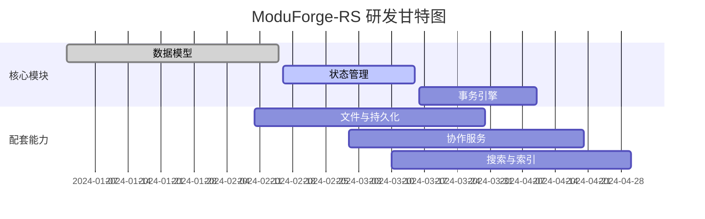
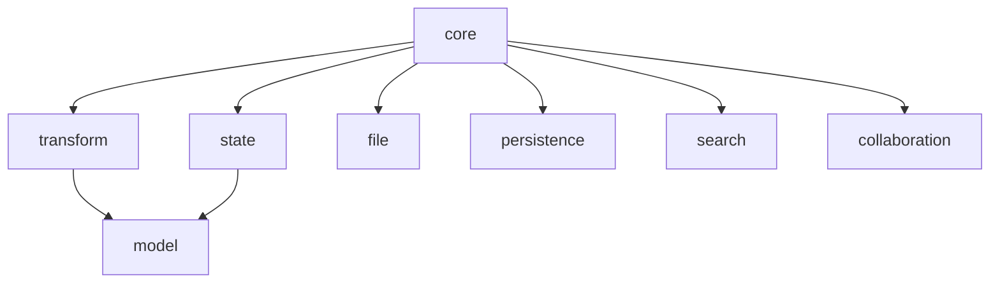
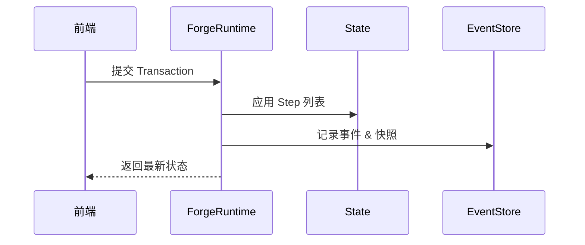

# Mermaid 测试页

该文件保留几个常用 Mermaid 图示例，便于在文档站点中调试主题样式。

## 架构甘特图

```mermaid
gantt
    title ModuForge-RS 研发甘特图
    dateFormat  YYYY-MM-DD
    section 核心模块
    数据模型        :done,    des1, 2024-01-01,2024-02-15
    状态管理        :active,  des2, 2024-02-16,2024-03-15
    事务引擎        :         des3, 2024-03-16,2024-04-10
    section 配套能力
    文件与持久化    :         des4, 2024-02-10,2024-03-30
    协作服务        :         des5, 2024-03-01,2024-04-20
    搜索与索引      :         des6, 2024-03-10,2024-04-30
```

## 组件依赖关系

```mermaid
graph TD
    CORE[core]
    STATE[state]
    TRANSFORM[transform]
    MODEL[model]
    FILE[file]
    PERSIST[persistence]
    SEARCH[search]
    COLLAB[collaboration]

    CORE --> STATE
    CORE --> TRANSFORM
    TRANSFORM --> MODEL
    STATE --> MODEL
    CORE --> FILE
    CORE --> PERSIST
    CORE --> SEARCH
    CORE --> COLLAB
```

## 流程示意

```mermaid
sequenceDiagram
    participant UI as 前端
    participant RT as ForgeRuntime
    participant ST as State
    participant ES as EventStore

    UI->>RT: 提交 Transaction
    RT->>ST: 应用 Step 列表
    RT->>ES: 记录事件 & 快照
    RT-->>UI: 返回最新状态
```
